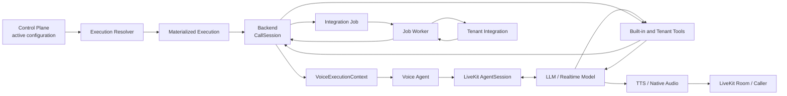
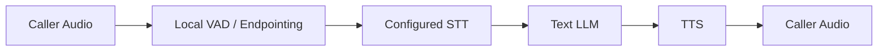
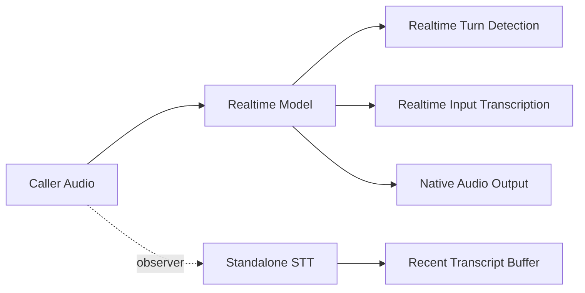
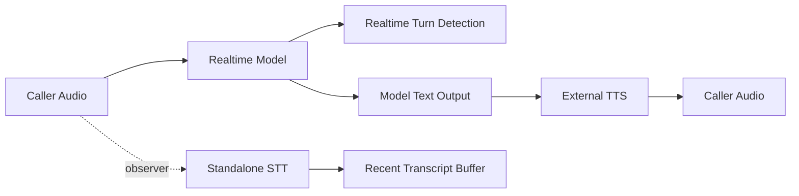
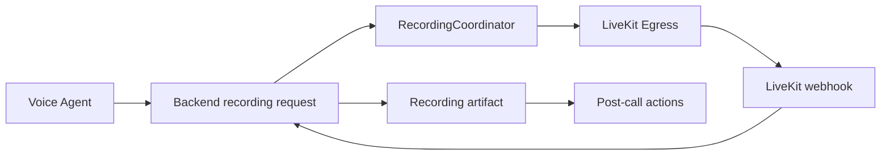
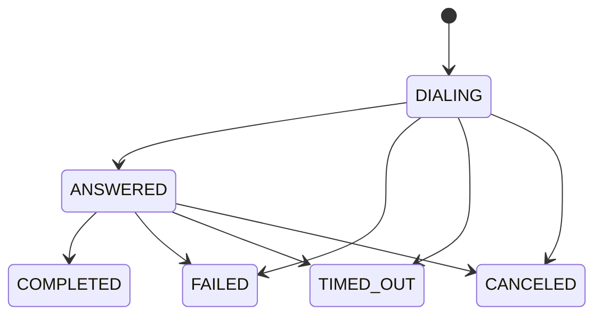
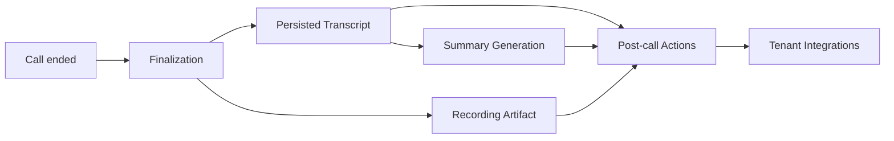
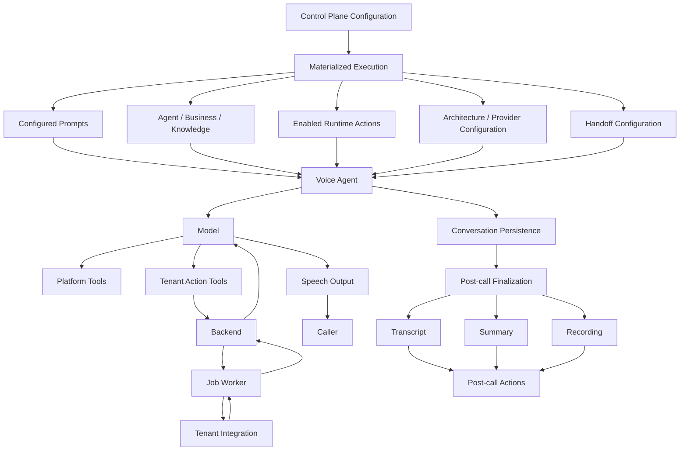

# Model Runtime Architecture

## 1. Purpose

This document describes the runtime architecture through which the Voice Agent receives model instructions, context, tools, conversation state, and operation results.

Its purpose is to define:

- what the model can see;
- what the model can invoke;
- what remains runtime-only;
- how tenant actions are materialized and executed;
- how conversation, speech, handoff, recording, and post-call processing interact;
- where behavioral responsibility belongs when an observed failure occurs.

This document is descriptive rather than prescriptive.

Prompt ownership and prompt-design rules are defined separately in `PROMPT_ARCHITECTURE.md`.

The source of truth for a running call is the materialized execution associated with that call together with the deployed runtime implementation.

---

# 2. Runtime Authority

A running call does not continuously read mutable Control Plane configuration.

Before execution, Control Plane resolves the effective tenant state and materializes the semantic configuration required by the call into an execution snapshot.

Conceptually:

```text
Control Plane configuration
        ↓
Execution resolution
        ↓
Materialized execution
        ↓
CallSession
        ↓
VoiceExecutionContext
        ↓
Voice Agent
```

The materialized execution freezes semantic call configuration such as:

- selected architecture;
- prompt resources;
- agent and business identity;
- Knowledge;
- enabled actions;
- action definitions and execution plans;
- provider configuration;
- integration bindings;
- handoff configuration.

Secrets are not embedded into the model-facing execution snapshot.

Provider secrets and other sensitive integration material may be resolved later by runtime services using the execution identity and snapshot bindings.

This separation allows a call to execute against a stable semantic configuration even if tenant configuration changes while the call is already running.

---

# 3. End-to-End Architecture



The model is therefore not directly connected to tenant integrations.

Tenant operations pass through the capability runtime and Worker execution path.

---

# 4. Model-Facing Surface

The model interacts with four conceptually different surfaces:

```text
Model
├── Instructions and model-visible context
├── Conversation history
├── Callable tools
└── Tool results
```

A separate set of runtime state exists outside the model.

```text
Runtime-only state
├── execution identity
├── provider secrets
├── action bindings
├── canonical business mappings
├── HTTP execution plans
├── caller metadata
├── handoff state
├── recording state
└── Backend persistence
```

The distinction is important because a behavior cannot be repaired reliably at the prompt layer when its source of truth belongs to runtime-only state.

---

# 5. Instructions and Context

## 5.1 Configured instruction layers

The core configured instruction stack is:

```text
System
↓
Profile
↓
Interaction
↓
Tenant
```

These layers define behavioral instructions.

Their ownership rules are specified in `PROMPT_ARCHITECTURE.md`.

---

## 5.2 Configured model context

The core declarative context includes:

```text
Agent context
Business context
Knowledge
Dynamic context
```

These contain facts and values rather than behavioral workflow definitions.

---

## 5.3 Runtime-owned additions

The Voice Agent may also inject runtime-owned instruction or context fragments during final instruction assembly.

Current runtime-owned additions include behavior related to:

- localization;
- recent-transcript usage when that capability is available.

These additions are not separate tenant prompt layers.

They are platform/runtime behavior and should not be duplicated into Tenant prompts merely because they appear in the final model instruction string.

---

# 6. Conversation State

LiveKit `AgentSession` maintains the active model conversation.

The model sees conversational state including:

- finalized user turns;
- assistant turns;
- tool calls;
- tool results.

Conversation state is distinct from structured backend business state.

The current runtime does not maintain a persistent mutable reservation object such as:

```text
CurrentGuest
CurrentStay
CurrentReservation
```

that is automatically populated and reused by all actions.

Instead, each runtime action invocation receives its own arguments.

The model may reuse information already known from conversation history, but if another action requires that information, the model must supply it again as that action's arguments.

For example:

```text
Caller
    ↓
"My reservation is under Novák, 4–6 October."
    ↓
conversation state
    ↓
reservation.lookup(
    guest_name="Novák",
    check_in="...",
    check_out="..."
)
    ↓
tool result enters conversation
    ↓
later action
    ↓
reservation.modify(
    booked_name="Novák",
    original_start_date="...",
    original_end_date="...",
    ...
)
```

The later action does not automatically consume a structured state object produced by `reservation.lookup`.

---

# 7. Dynamic Context

Dynamic context contains ephemeral model-visible values computed for a call.

It is currently assembled when the Voice Agent is constructed.

Current examples include:

```text
Current local date
Current local time
Caller SIP phone number, when available
```

Dynamic context is not a continuously updated state store.

Action results do not become Dynamic context.

For example:

```text
reservation.lookup
        ↓
tool result
        ↓
conversation state
```

not:

```text
reservation.lookup
        ↓
Dynamic context mutation
```

No special Dynamic-context path exists for reservation lookup.

---

# 8. Tool Surface

Tools are supplied separately from the instruction string.

The effective tool surface is built from two sources:

```text
Platform tools
+
Materialized tenant runtime actions
```

Platform tools currently include capabilities such as:

- calculator;
- call termination;
- recent transcript inspection when supported by the selected architecture;
- human handoff when destinations are configured.

Tenant runtime actions are generated from active action configuration.

Tool availability is therefore runtime state.

A prompt must not assume that a tenant action exists merely because such an action exists somewhere in Control Plane configuration.

---

# 9. Tenant Action Architecture

## 9.1 Action lifecycle

The generic action pipeline is:

```mermaid
flowchart LR
    AD["ActionsDefinition"] --> AA["ActionsAvailability"]
    AA --> ER["Execution Resolution"]
    ER --> EX["Materialized Action"]
    EX --> FT["Model Function Tool"]

    FT --> ARGS["Model Arguments"]
    ARGS --> BE["Backend Invocation"]
    BE --> JW["Job Worker"]

    JW --> VAL["Schema Validation"]
    VAL --> BIND["Bindings / Normalization"]
    BIND --> POL["Constraints / Policy"]
    POL --> MAP["HTTP Request Mapping"]
    MAP --> INT["Tenant Integration"]

    INT --> RESP["Response Decode / Mapping"]
    RESP --> SR["Semantic Result"]
    SR --> BE
    BE --> FT
    FT --> MODEL["Model Conversation"]
```



Only actions with runtime phase are exposed as in-call model tools.

Post-call actions use a separate finalization path.

---

# 10. Action Definition Fields

## 10.1 `description`

The action description is model-visible.

It becomes the description of the generated function tool and should explain the semantic purpose of the capability.

It should not attempt to reproduce the complete business workflow.

---

## 10.2 `agent_input_schema`

`agent_input_schema` is model-visible.

It defines the function parameters available to the model, including:

- required fields;
- types;
- formats;
- enums;
- basic validation constraints;
- field descriptions.

The same schema is also enforced by runtime execution.

It is therefore the canonical source for action arguments.

Prompt instructions should not manually duplicate it.

---

## 10.3 `bindings`

Bindings are runtime-only.

They map model-facing input fields into canonical business field paths.

Conceptually:

```text
guest_name
    ↓
guest.name
```

or:

```text
start_date
    ↓
stay.check_in
```

Canonical fields allow runtime constraints and execution mappings to operate on common semantic field names without exposing those implementation details to the model.

Bindings do not create persistent business state between invocations.

---

## 10.4 `input_constraints`

Input constraints are runtime-only.

They enforce deterministic business-independent or domain-level validation on bound values.

Current reservation actions use date-range constraints, including whether the start date may be in the past.

---

## 10.5 `business_policy`

Business policy is runtime-enforced.

Current policy capabilities include:

- caller-phone requirements;
- final-confirmation requirements.

A caller-phone requirement refers to caller metadata available to runtime and should not be confused with an action argument representing a guest contact phone number.

These may be different values.

---

## 10.6 `execution`

Execution configuration is runtime-only.

It defines the integration operation, including:

- integration key;
- HTTP method;
- path and query configuration;
- headers;
- request codec;
- request mapping;
- response codec;
- response mapping;
- timeout;
- accepted statuses.

The model does not construct this HTTP request directly.

---

## 10.7 `result_schema`

A configured result schema validates mapped integration response data before it is accepted as a successful semantic result.

It is part of runtime result handling rather than model instruction logic.

---

## 10.8 `announcement`

`announcement` exists as part of the typed action definition.

The current runtime does not automatically use this field as:

- the function description; or
- an automatically spoken message before invocation.

Unless a runtime consumer is introduced, its presence in configuration should not be interpreted as deterministic spoken behavior.

---

# 11. Action Result Semantics

Successful Worker execution produces a semantic result.

The semantic result is returned to the Voice Agent and then to the model as a normal tool result.

Conceptually:

```text
Tenant HTTP response
        ↓
decode / mapping
        ↓
semantic_result
        ↓
tool result
        ↓
model conversation
```

When a successful action produces no semantic response data, the model receives a submitted-style result instead of fabricated business data.

Failures remain runtime failures and are surfaced with an error condition rather than converted into successful operation results.

The model must distinguish:

```text
operation submitted
```

from:

```text
business outcome confirmed
```

whenever the integration semantics make that distinction relevant.

---

# 12. Current Penzión Grand Runtime Actions

The following section describes the supplied current tenant action definitions.

Actual exposure during a particular call additionally depends on active `ActionsAvailability` and the call's materialized execution.

---

## 12.1 `reservation.availability`

Purpose:

```text
Check current room availability for a requested stay,
room type, and room count.
```

Model-facing required inputs:

```text
start_date
end_date
room_count
room_type
```

Configured room types:

```text
2
3
4
```

Canonical bindings:

```text
start_date → stay.check_in
end_date   → stay.check_out
room_type  → allocation.room_type
room_count → allocation.room_count
```

The start date may not be in the past.

Runtime requires caller phone metadata.

Execution uses the tenant integration:

```text
integration: check_availability
method: POST
```

The integration response is decoded as text and returned as the semantic action result.

Current availability therefore comes from the integration result and must not be inferred from static room information or Knowledge.

---

## 12.2 `reservation.lookup`

Purpose:

```text
Verify the existence of an existing reservation
using guest name and stay dates.
```

Model-facing required inputs:

```text
guest_name
check_in
check_out
```

Canonical bindings:

```text
guest_name → guest.name
check_in   → stay.check_in
check_out  → stay.check_out
```

Historical dates are valid for this action.

The operation does not require caller phone metadata.

Execution uses:

```text
integration: lookup
method: POST
```

Request semantics are based on:

```text
guest.name
stay.check_in
stay.check_out
```

The integration response is decoded as text and returned to the model as the action result.

`reservation.lookup` is an ordinary runtime action.

It does not:

- update Dynamic context;
- populate a shared reservation state object;
- automatically supply arguments to later actions;
- create a generic runtime dependency for modification or cancellation.

Whether a conversational workflow should perform lookup before another reservation operation is therefore a separate semantic/business-flow concern unless an explicit runtime constraint is introduced.

---

## 12.3 `reservation.create`

Purpose:

```text
Submit a new reservation request.
```

Model-facing required inputs:

```text
guest_name
start_date
end_date
phone
room_type
room_count
```

Optional phone metadata:

```text
phone_country
```

`phone_country` is used when a provided national-format number requires country context for normalization.

Canonical bindings include:

```text
guest_name → guest.name
phone      → guest.phone
start_date → stay.check_in
end_date   → stay.check_out
room_type  → allocation.room_type
room_count → allocation.room_count
```

The stay start date may not be in the past.

Runtime also requires the caller's SIP phone metadata.

The caller's phone metadata and the guest contact phone argument are separate concepts.

Execution uses:

```text
integration: create_request
method: POST
```

The current action has no mapped semantic response body.

Successful execution therefore represents successful submission of the configured request, not an independently fabricated reservation result.

---

## 12.4 `reservation.modify`

Purpose:

```text
Submit a modification request for an existing reservation.
```

Model-facing required inputs:

```text
booked_name
phone
original_start_date
original_end_date
modification
```

Optional:

```text
phone_country
```

Canonical bindings include:

```text
booked_name         → guest.name
phone               → guest.phone
original_start_date → stay.check_in
original_end_date   → stay.check_out
modification        → notes
```

Historical original dates are allowed.

Runtime requires caller phone metadata.

Execution uses:

```text
integration: modification_request
method: POST
```

The current execution definition has no mapped semantic response body.

The action is independently validated from its own arguments.

A previous `reservation.lookup` result is not automatically consumed by runtime.

---

## 12.5 `reservation.cancel`

Purpose:

```text
Submit cancellation of an existing reservation.
```

Model-facing required inputs:

```text
booked_name
original_start_date
original_end_date
notes
```

Canonical bindings:

```text
booked_name         → guest.name
original_start_date → stay.check_in
original_end_date   → stay.check_out
notes                → notes
```

Historical dates are allowed.

Runtime requires caller phone metadata.

Execution uses:

```text
integration: cancel_request
method: POST
```

The current execution definition has no mapped semantic response body.

Like modification, cancellation is independently validated from its own arguments.

---

# 13. Penzión Grand Tenant Semantics

Tenant-specific conversational semantics remain separate from action execution mechanics.

One current example is the single-room mapping.

Conceptually:

```text
Caller-facing request:
single room

Canonical inventory operation:
double-room inventory

Caller-facing terminology:
single room
```

This mapping is currently an LLM-enforced Tenant semantic invariant.

It is not implemented as a generic platform reservation rule.

It may later be migrated into structured inventory/product configuration without changing the generic action architecture.

---

# 14. Built-In Runtime Tools

## 14.1 Calculator

The calculator is a platform capability.

It performs deterministic numeric calculation and does not depend on tenant integration configuration.

---

## 14.2 `end_call`

Call termination is exposed as a model capability.

The model may decide that conversational intent warrants termination.

Actual room deletion and durable call terminalization are runtime behavior.

A prompt therefore owns the semantic decision of when conversation is complete, while runtime owns how the call is actually closed.

---

## 14.3 `get_recent_transcript`

This capability exists in Realtime and Half-cascade architectures.

It exposes recent finalized segments produced by the standalone observer STT.

The current buffer stores up to twenty finalized segments.

The tool returns a recent subset of that buffer.

Its purpose is to provide an alternative transcription source when the primary realtime transcript is uncertain, particularly for values such as:

- names;
- spelling;
- identifiers.

The helper transcript does not become the primary conversation turn stream.

---

## 14.4 Human handoff

A human-handoff tool is exposed only when the materialized execution contains handoff destinations.

The model decides when conversational intent requires a configured handoff.

Backend owns the authoritative handoff state and call transitions.

---

# 15. Voice Execution Architectures

The Voice Agent currently supports three execution architectures.

---

## 15.1 Cascade



The configured STT is the primary transcription source.

Turn completion depends on the configured STT commit strategy.

Current strategies include:

```text
local_vad
provider_vad
stt
```

Cascade may also use configured preemptive generation behavior.

No recent-transcript helper is required because the configured standalone STT already drives the primary conversation.

---

## 15.2 Realtime



Realtime turn detection and realtime transcription are authoritative for the primary model conversation.

A standalone STT operates in a non-primary observer role.

Its finalized transcripts populate the recent-transcript buffer without creating additional user turns.

---

## 15.3 Half-cascade



Half-cascade uses the Realtime model for input turn processing and text generation, but external TTS for speech output.

Like Realtime, its standalone STT is an observer rather than the primary user-turn source.

---

# 16. STT and Turn Ownership

The primary transcription path depends on architecture.

```text
Cascade
→ standalone configured STT is primary

Realtime
→ Realtime transcription is primary

Half-cascade
→ Realtime transcription is primary
```

In Realtime and Half-cascade, standalone STT events are deliberately prevented from entering the primary LiveKit turn stream.

This prevents the same caller utterance from being committed twice.

The observer STT exists only to provide an independent transcript source for explicit inspection.

---

# 17. Cascade Endpointing

With local-VAD commit:

```text
local VAD detects speech end
        ↓
STT stream flush
        ↓
final transcript / provider end event
        ↓
user turn closes
```

With provider-native endpointing, the provider's STT/end-of-speech behavior drives commit without application-level local flush semantics.

Turn detection and STT commit are runtime configuration concerns.

They should not be compensated for through conversational prompt rules when the actual failure is endpointing or transcription timing.

---

# 18. Call Startup

The current startup sequence is conceptually:

```text
participant connected
        ↓
AgentSession started
        ↓
Backend session observations
        ↓
configured greeting
        ↓
wait for greeting playout
        ↓
recording start request
        ↓
normal conversation
```

The opening greeting is non-interruptible.

Both TTS-backed and Realtime-generated greeting paths disable interruptions for the greeting and wait until playout completes.

Normal conversation then uses the interruption policy configured for the selected architecture.

Greeting behavior is runtime behavior rather than a prompt invariant.

---

# 19. Recording

When call recording is enabled, the Voice Agent explicitly requests recording after greeting playout.

Backend owns recording coordination.

The recording pipeline is:



Recording uses LiveKit room-composite audio Egress.

The normal current start path therefore does not include the opening greeting.

Caller audio that occurs before Egress starts may also be outside the recording.

Recording-start failure marks recording as failed but does not itself terminate the active call.

Recording lifecycle is deterministic runtime behavior and should not be implemented through model instructions.

---

# 20. Inactivity

All current session factories configure:

```text
user_away_timeout = 6 seconds
```

When the LiveKit user state becomes `away`, Voice Agent initiates the inactivity flow.

The current flow includes:

```text
away detected
        ↓
check-in behavior
        ↓
19-second room-deletion timer
```

Returning to a non-away state cancels the pending inactivity timer.

Inactivity is aware of handoff state.

The inactivity mechanism is suppressed while handoff is in:

```text
DIALING
ANSWERED
COMPLETED
```

After:

```text
FAILED
TIMED_OUT
CANCELED
```

inactivity may resume when the caller remains away and the call is still eligible for normal inactivity handling.

The timeout logic is runtime behavior.

---

# 21. Handoff Lifecycle

Backend owns authoritative persisted handoff state.

The state machine is:



Voice Agent's `HandoffController` observes the LiveKit room and SIP participants and requests state transitions.

Backend validates and serializes those transitions.

Backend state is authoritative when concurrent observations race.

After Backend confirms `COMPLETED`, Voice Agent relinquishes the conversation.

The AI conversation can therefore terminate while the underlying telephone call remains connected between the caller and the human destination.

---

# 22. Call Termination

A call may terminate through several mechanisms.

### Model-driven

```text
end_call tool
human handoff request
```

The model owns the semantic decision to request these operations.

### Runtime-driven

```text
caller disconnect
inactivity timeout
session shutdown
provider/session failure
job failure
handoff completion lifecycle
```

Voice Agent drains pending conversation persistence and reports terminal observations.

Backend owns the durable `CallSession` state transition.

Prompt instructions must not attempt to reproduce deterministic terminalization mechanics.

---

# 23. Conversation Persistence

Voice Agent persists non-empty user and assistant conversation items to Backend.

Persisted conversation data includes interruption information where available.

This persistence is distinct from the model's live conversation context.

Backend persistence supports downstream call lifecycle and post-call processing; it is not separately reinjected into the model as an additional prompt context during the same call.

---

# 24. Post-Call Processing

Post-call actions are not model tools.

They execute after call completion through Backend finalization and Job Worker.

Conceptually:



Post-call actions may declare artifact dependencies such as:

```text
transcript
summary
recording
```

Execution waits until required artifacts are available.

---

# 25. Current Penzión Grand Post-Call Actions

## 25.1 `post_call.transcript`

Inputs:

```text
summary
transcript
```

The current integration payload contains information including:

```text
caller identifier
transcript summary
raw transcript
conversation identifier
call start time
```

Execution uses the `post_call_actions` integration.

This action is never presented to the in-call model.

---

## 25.2 `post_call.recording`

Input:

```text
call recording
```

The recording is represented for the action as encoded recording content and sent through the `post_call_actions` integration.

This action is also outside the in-call model tool surface.

---

# 26. Responsibility Boundaries

The architecture separates semantic behavior from deterministic implementation.

```text
Prompt / model
    conversational and semantic decisions

Tool schema
    model-facing operation contract

Typed configuration
    deterministic tenant/platform configuration

Voice Agent runtime
    session orchestration and model/tool wiring

Backend
    call lifecycle and authoritative state

Job Worker
    validation, binding, policy, integration execution

Tenant integration
    external business-system truth

LiveKit / providers
    media, transcription, synthesis, room and SIP behavior
```

A failure should be repaired at the layer that owns the violated invariant.

---

# 27. Failure Ownership Guide

| Observed behavior | First architectural owner to inspect |
|---|---|
| Agent asks multiple unrelated questions in one turn | Interaction instructions |
| Agent gives unnecessarily long spoken answers | Interaction instructions |
| Agent claims an operation exists when no tool is available | System instruction and generated tool surface |
| Runtime action is missing entirely | `ActionsDefinition`, `ActionsAvailability`, materialized execution |
| Tool description causes incorrect model choice | Action `description` |
| Tool requires the wrong model arguments | `agent_input_schema` |
| Model supplies an argument but runtime maps it incorrectly | Action `bindings` |
| Phone normalization fails | Canonical normalization / runtime binding |
| Invalid date range is accepted or rejected incorrectly | `input_constraints` |
| Caller-phone requirement behaves incorrectly | `business_policy` / caller metadata |
| Final confirmation behaves incorrectly | `business_policy` and capability invocation runtime |
| HTTP payload sent to integration is wrong | Action `execution` request mapping |
| Integration returns the wrong business answer | Tenant integration / external PMS |
| Availability is fabricated without calling the available action | Profile/System instructions and action description |
| Availability tool itself returns incorrect data | Integration, response mapping, external PMS |
| Existing reservation lookup cannot find a reservation | Lookup arguments → bindings → request mapping → integration |
| Lookup returns correct data but model misunderstands it | Model-visible result semantics / action description / prompt |
| Lookup is expected to persist reservation fields automatically | Architecture assumption is incorrect; no persistent reservation state currently exists |
| Modify/cancel fails because arguments from lookup were not reused | Model conversation/tool contract unless runtime state is intentionally introduced |
| Guest name is transcribed incorrectly in Cascade | Primary STT |
| Guest name is transcribed incorrectly in Realtime | Realtime transcription; recent-transcript observer may provide comparison |
| Model does not use `get_recent_transcript` when appropriate | Runtime guidance / tool description / prompt behavior |
| Duplicate user turns appear in Realtime | STT role / observer suppression / turn pipeline |
| Agent responds before caller is finished | VAD / endpointing / STT commit / turn detection |
| Opening can be interrupted unexpectedly | Greeting runtime |
| Normal barge-in behaves incorrectly | Session/provider interruption configuration |
| Recording begins at the wrong point | Voice Agent startup order / Backend recording / Egress |
| Recording artifact is missing post-call | Recording lifecycle / finalization |
| Inactivity fires during handoff | Inactivity handler / HandoffController state |
| Handoff state becomes inconsistent | Backend handoff transitions first, then Voice Agent observation |
| Agent ends after a short acknowledgement such as “dobre” | Interaction instructions |
| Room stays alive after deterministic timeout | Runtime termination / LiveKit room lifecycle |
| Single-room request maps to wrong canonical room product | Tenant semantic mapping unless migrated to structured configuration |
| Post-call transcript payload is wrong | Finalization artifact production / post-call execution mapping |
| Post-call recording is sent incorrectly | Recording artifact / post-call execution mapping |

---

# 28. Prompt vs Runtime Decision Rule

A model-visible behavioral problem does not imply that the correct fix is a prompt change.

Before changing instructions, determine whether the violated invariant belongs to:

```text
runtime
schema
typed configuration
action definition
integration mapping
external business system
speech pipeline
prompt
```

Prompt changes are appropriate when the model itself must make a semantic or conversational decision.

Prompt changes are not the preferred solution when deterministic runtime code can guarantee the required behavior.

---

# 29. Relationship to `PROMPT_ARCHITECTURE.md`

`PROMPT_ARCHITECTURE.md` defines how model instructions should be structured.

This document defines the runtime environment in which those instructions operate.

Conceptually:

```text
PROMPT_ARCHITECTURE.md
        ↓
How should model behavior be instructed?

MODEL_RUNTIME.md
        ↓
What does the model actually receive and what does runtime enforce?
```

Neither document replaces the other.

For example:

```text
"Do not invent availability"
```

is a model-level invariant.

But:

```text
Which HTTP integration is queried?
How are dates mapped?
What does the integration return?
```

belong to the runtime action architecture.

Likewise:

```text
"End the conversation only when intent indicates closure"
```

is an Interaction-level semantic rule.

But:

```text
How is the room deleted?
How is Backend terminalized?
```

are runtime concerns.

---

# 30. Architectural Constraints

The runtime architecture should preserve the following separation:

```text
Model instructions
    do not become a second runtime implementation

Action schemas
    remain the canonical model-facing operation contract

Bindings and execution plans
    remain outside the model

Tool results
    remain conversation state rather than implicit Dynamic-context mutation

Tenant integrations
    remain authoritative for external business operations

Backend
    remains authoritative for durable call and handoff state

Voice Agent
    remains responsible for session orchestration

Prompt layers
    remain responsible only for behavior requiring model reasoning
```

Maintaining these boundaries is necessary for predictable behavior, testability, and correct failure attribution.

---

# 31. Current Architecture Summary



The defining property of the system is that model reasoning, deterministic runtime behavior, and external business-system truth remain separate layers with explicit ownership.
