# `docs/control-plane/ARCHITECTURE.md`

# Control Plane Architecture

> Status: **target architecture**
>
> This document describes the intended target architecture of the Control Plane.
> It is the architectural source of truth for the Control Plane domain model,
> service boundaries, application services, and execution materialization model.
>
> HTTP contracts, DTOs, concurrency headers, idempotency, auth scopes, and error
> payloads are intentionally documented outside this file in `CONTRACTS.md` and
> `INVARIANTS.md`.

---

## Table of Contents

* [1. Purpose](#1-purpose)
* [2. Scope of this document](#2-scope-of-this-document)
* [3. Architectural principles](#3-architectural-principles)
* [4. High-level overview](#4-high-level-overview)
* [5. Layered architecture](#5-layered-architecture)
* [6. Top-level domains](#6-top-level-domains)

  * [6.1 System](#61-system)
  * [6.2 Platform](#62-platform)
  * [6.3 Tenant](#63-tenant)
  * [6.4 Managed Resource domains](#64-managed-resource-domains)
* [7. Core building blocks](#7-core-building-blocks)

  * [7.1 VersionedComponent](#71-versionedcomponent)
  * [7.2 LiveComponent](#72-livecomponent)
  * [7.3 ManagedResource](#73-managedresource)
  * [7.4 Catalog](#74-catalog)
  * [7.5 Registry](#75-registry)
  * [7.6 Repository](#76-repository)
  * [7.7 Configuration aggregates and semantic views](#77-configuration-aggregates-and-semantic-views)
* [8. Inventory by building block and scope](#8-inventory-by-building-block-and-scope)
* [9. Reference model](#9-reference-model)
* [10. Application services](#10-application-services)

  * [10.1 SystemConfigurationService](#101-systemconfigurationservice)
  * [10.2 PlatformConfigurationService](#102-platformconfigurationservice)
  * [10.3 TenantConfigurationService](#103-tenantconfigurationservice)
  * [10.4 CredentialService](#104-credentialservice)
  * [10.5 ProviderService](#105-providerservice)
  * [10.6 TelephonyService](#106-telephonyservice)
  * [10.7 IntegrationService](#107-integrationservice)
  * [10.8 ExecutionMaterializationService](#108-executionmaterializationservice)
* [11. Execution model](#11-execution-model)
* [12. Out of scope for this document](#12-out-of-scope-for-this-document)

---

## 1. Purpose

The Control Plane is the authoritative service for:

* semantic configuration management,
* managed runtime resources,
* execution-time state resolution,
* immutable execution snapshot creation,
* and consumer-specific execution materialization.

Its job is **not** to expose low-level persistence internals to runtime consumers.
Instead, it provides:

* **high-level semantic configuration services** for operators,
* **low-level expert management services** for individual objects,
* and **internal execution materialization services** for runtime consumers.

---

## 2. Scope of this document

This document defines:

* the internal architecture of the Control Plane,
* top-level domains and their responsibilities,
* core domain building blocks,
* repositories,
* application services,
* execution materialization.

This document does **not** define:

* HTTP endpoint mapping,
* request/response DTOs,
* ETag / `If-Match`,
* idempotency headers,
* auth scopes,
* error payloads,
* OpenAPI.

Those belong in `CONTRACTS.md`.
Non-negotiable behavioral rules belong in `INVARIANTS.md`.

---

## 3. Architectural principles

1. **Semantic API first**
   External consumers should interact with semantic resources and semantic use
   cases, not internal component machinery.

2. **High-level configuration is primary**
   Normal operator workflows should use high-level configuration services:
   `SystemConfiguration`, `PlatformConfiguration`, `TenantConfiguration`.

3. **Low-level object management is secondary**
   Low-level component and resource APIs exist for advanced workflows, inspection,
   rollback, and expert operations.

4. **Execution consumers get projections, not internals**
   Backend, Voice Agent, and Worker receive only execution-scoped projections and
   late-bound materials required for their jobs.

5. **Versioned and live state are different primitives**
   Draft/publish/revision semantics are different from immediate live updates and
   must remain explicit in the model.

6. **Managed resources own their own lifecycle**
   Credentials, provider connections, deployments, telephony objects, and
   integrations are not “just configuration values”; they are independent managed
   resources.

7. **Catalogs and registries are not the same**
   Catalogs are operator-managed lists of allowed semantic entries. Registries are
   code-defined sets of supported implementation kinds and definitions.

8. **Execution snapshots are immutable**
   Effective runtime state is frozen into an immutable execution snapshot and must
   never be silently re-resolved later.

9. **Secrets are late-bound**
   Execution snapshots must not embed secrets. Secret-bearing runtime material is
   materialized separately and only when needed.

---

## 4. High-level overview

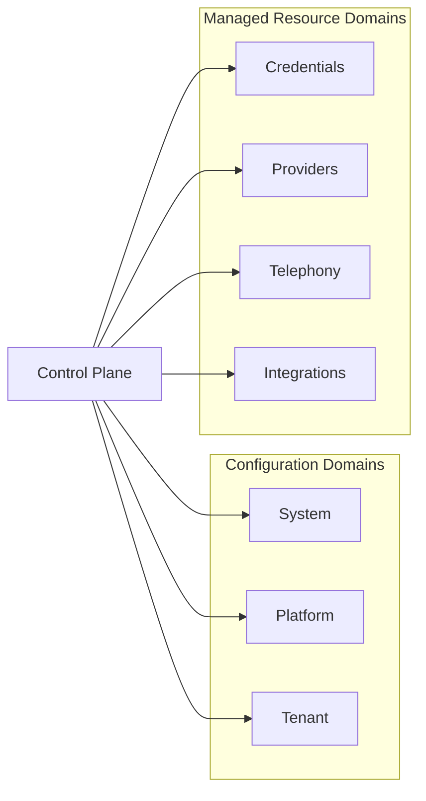

At the broadest level, the Control Plane has two families of responsibility:

* **configuration domains**

  * `System`
  * `Platform`
  * `Tenant`

* **managed resource domains**

  * `Credentials`
  * `Providers`
  * `Telephony`
  * `Integrations`

Configuration domains define the semantic shape of behavior.
Managed resource domains define the operational resources referenced by that behavior.

---

## 5. Layered architecture

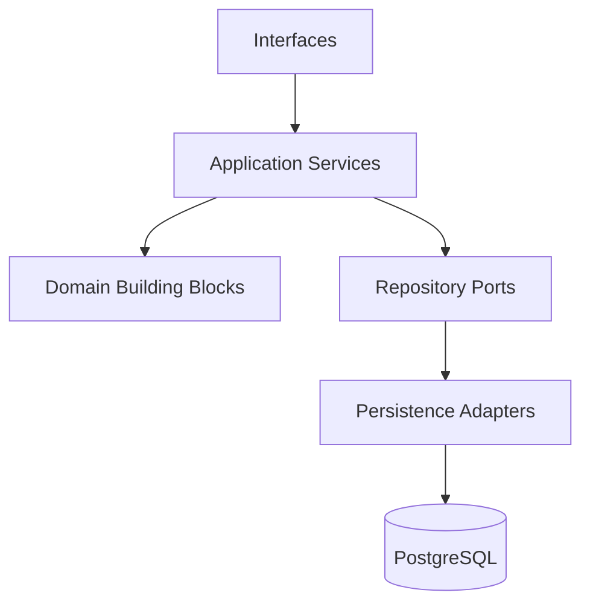

### Layer responsibilities

#### Interfaces

Thin adapters that expose the architecture through HTTP or internal service
surfaces. They should not contain domain orchestration or persistence logic.

#### Application Services

Use-case orchestration layer. Application services coordinate repositories,
catalogs, registries, and domain objects. They own transactions and return
application-level results.

#### Domain Building Blocks

The stable architectural primitives of the Control Plane:

* `VersionedComponent`
* `LiveComponent`
* `ManagedResource`
* `Catalog`
* `Registry`

#### Repository Ports

Persistence-facing ports used by application services. They hide database details
and operate on domain objects.

#### Persistence Adapters

Concrete implementations of repository ports.

---

## 6. Top-level domains

---

### 6.1 System

The `System` domain contains **system-wide runtime defaults and policies**.

These are global settings that:

* do not belong to any tenant,
* do not belong to platform prompt/catalog authoring,
* are activated immediately when changed,
* represent current effective defaults and policies.

Current system-level objects:

* `STTDefaults`
* `LLMDefaults`
* `TTSDefaults`
* `RealtimeDefaults`
* `Policies`

The current architecture models them as **LiveComponents** under `SystemScope`.

This is intentional even if their internal structure is complex.
For example, `STTDefaults` is not a single scalar; it is a structured aggregate of
runtime parameters such as endpointing, VAD, interruption behavior, and similar
runtime tuning fields. Even so, it still behaves as “one current live value”.

---

### 6.2 Platform

The `Platform` domain contains shared cross-tenant semantic configuration managed
by the operator.

It has two main responsibilities:

1. **shared versioned prompts**
2. **operator-managed catalogs**

Platform currently includes:

#### Versioned components

* `SystemPrompt`
* `ProfilePrompt`
* `InteractionPrompt`

#### Catalogs

* `ProfileCatalog`
* `InteractionModeCatalog`

The platform domain is the place where the operator defines reusable shared
semantic building blocks, such as available profiles and interaction modes.

---

### 6.3 Tenant

The `Tenant` domain contains tenant-specific semantic configuration.

It combines:

* versioned semantic content,
* live selections and overrides,
* and configuration that determines how a tenant wants the runtime to behave.

Current tenant responsibilities:

#### Versioned components

* `TenantPrompt`
* `KnowledgePrompt / RAG`
* `AgentPersonality`
* `BusinessInfo`
* `ActionsDefinition`

#### Live components

* `Architecture`
* `ProfileReference`
* `RuntimeOverrides`
* `ActionsAvailability`

### Notes on tenant concepts

#### `AgentPersonality`

Represents the agent’s identity, such as name, greeting, and conversation scope.
This is what the runtime consumes as the assistant’s semantic identity.

#### `Knowledge`

Currently implemented as one versioned knowledge prompt.
In the future this can evolve into multiple prompts and/or RAG-backed knowledge
sources. The architecture already reserves that direction.

#### `Actions`

`Actions` is a semantic aggregate, not a separate primitive.
It is formed from:

* `ActionsDefinition` (versioned semantic definition)
* `ActionsAvailability` (live availability / enablement)

From the runtime point of view, this aggregate produces:

* runtime conversation capabilities,
* post-call actions.

#### `Architecture`

A live selection of runtime architecture mode.
It must resolve through `ArchitectureRegistry`, e.g. `cascade`, `realtime`,
and later `half-cascade`.

#### `ProfileReference`

A live reference from tenant configuration into the platform `ProfileCatalog`.

---

### 6.4 Managed Resource domains

Managed resources are operational objects with their own lifecycle and identity.

They are grouped into four domains:

#### Credentials

* `Credential`

#### Providers

* `ProviderConnection`
* `ModelDeployment`

#### Telephony

* `PhoneNumberAssignment`
* `HandoffDestination`

#### Integrations

* `IntegrationConnection`

These are not stored as versioned or live components because they have their own
resource lifecycle semantics and operational invariants.

---

## 7. Core building blocks

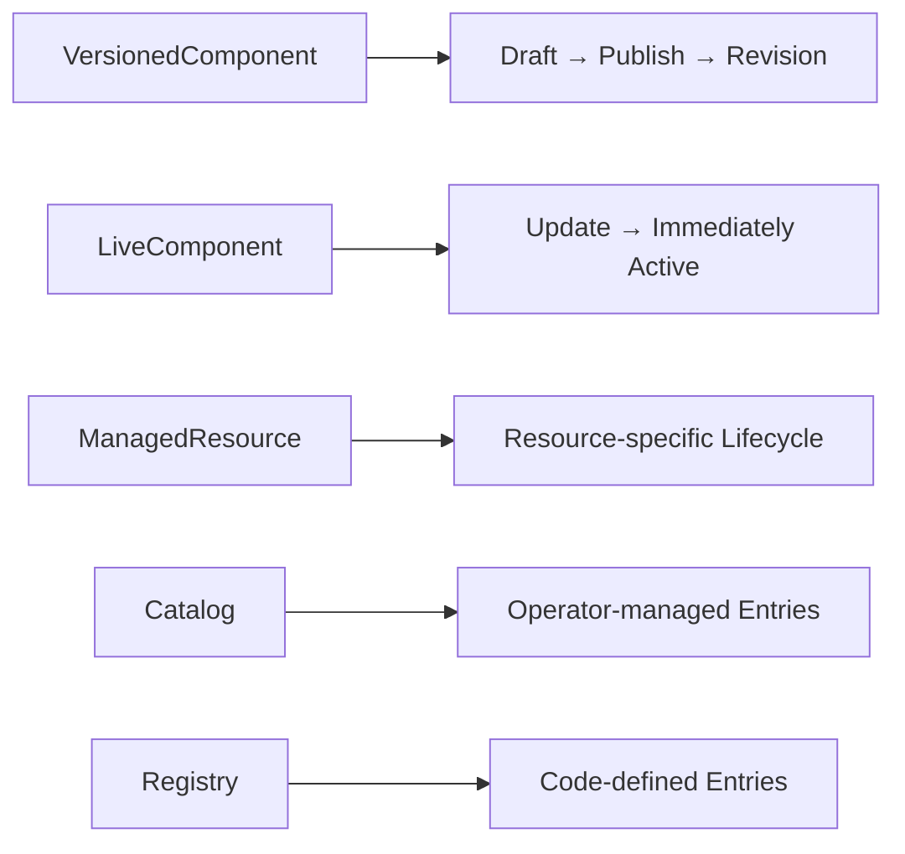

---

### 7.1 VersionedComponent

A `VersionedComponent` is a configuration object with draft/publish/history
semantics.

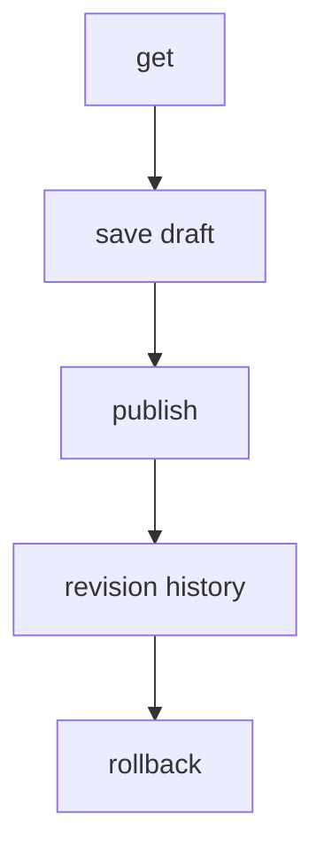

#### Identity

A versioned component is identified by:

* `kind`
* `scope`

Together these form a stable component address.

#### State

A versioned component has:

* current draft,
* active revision,
* revision history,
* schema version.

#### Properties

* draft is mutable,
* published revisions are immutable,
* optimistic concurrency is supported,
* changes do not become active until publish.

#### Current inventory

##### Platform scope

* `SystemPrompt`

##### Profile scope (platform domain)

* `ProfilePrompt`

##### Interaction mode scope (platform domain)

* `InteractionPrompt`

##### Tenant scope

* `TenantPrompt`
* `KnowledgePrompt / RAG`
* `AgentPersonality`
* `BusinessInfo`
* `ActionsDefinition`

---

### 7.2 LiveComponent

A `LiveComponent` is a configuration object that has exactly one current value
and becomes effective immediately when updated.

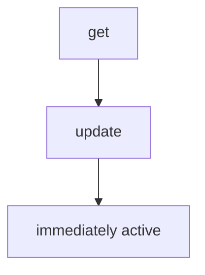

#### Identity

A live component is identified by:

* `kind`
* `scope`

#### State

A live component has:

* current value,
* generation,
* updated metadata.

#### Properties

* single current value,
* immediate activation,
* optimistic concurrency,
* no draft,
* no revisions,
* no publish step.

#### Current inventory

##### System scope

* `STTDefaults`
* `LLMDefaults`
* `TTSDefaults`
* `RealtimeDefaults`
* `Policies`

##### Tenant scope

* `ProfileReference`
* `Architecture`
* `RuntimeOverrides`
* `ActionsAvailability`

---

### 7.3 ManagedResource

A `ManagedResource` is an independently addressable operational object with its
own lifecycle, identity, timestamps, and invariants.

#### Identity

A managed resource has:

* resource ID / reference,
* stable key or name where applicable,
* generation,
* created / updated metadata.

#### Properties

* owns its own lifecycle,
* supports resource-specific operations,
* may reference other resources,
* not modeled as a versioned or live component.

#### Current inventory by scope

##### Platform or tenant scope

* `Credential`

##### Platform scope

* `ProviderConnection`
* `ModelDeployment`

##### Tenant scope

* `PhoneNumberAssignment`
* `HandoffDestination`
* `IntegrationConnection`

#### Lifecycle examples

* `Credential`
  `create → rotate → revoke`

* `ProviderConnection`
  `create → update → enable/disable`

* `ModelDeployment`
  `create → update → enable/disable`

* `PhoneNumberAssignment`
  `create → update/enable/disable`
  (in practice usually create + enable/disable)

* `HandoffDestination`
  `create → update → enable/disable`

* `IntegrationConnection`
  `create → update → validate → enable/disable`

---

### 7.4 Catalog

A `Catalog` is an operator-managed collection of allowed semantic entries.

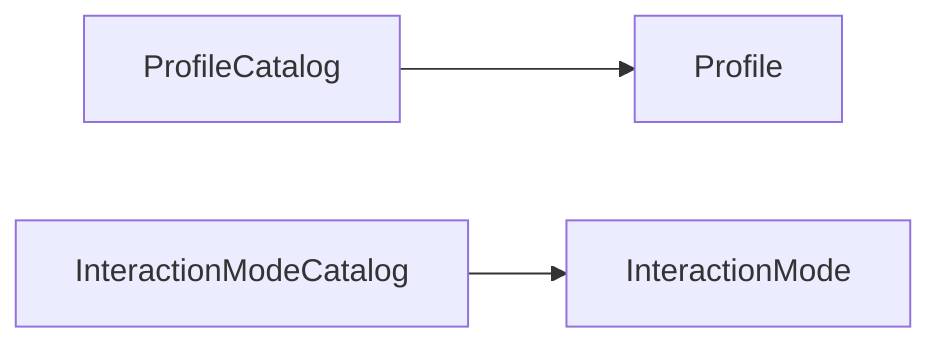

#### Purpose

Catalogs exist for:

* discovery,
* metadata,
* validation of references.

#### Properties

* entries are addressable by stable key,
* entries are referenced by configuration,
* catalogs do not define lifecycle of attached versioned prompts,
* catalogs are operator-managed rather than code-defined.

#### Current catalogs

##### `ProfileCatalog`

Contains `Profile` entries with:

* `key`
* `name`
* `description`
* `status`

Each profile also owns a `ProfilePrompt` versioned component under
`ProfileScope(profile_key)`.

##### `InteractionModeCatalog`

Contains `InteractionMode` entries with:

* `key`
* `name`
* `description`
* `status`

Each interaction mode also owns an `InteractionPrompt` versioned component under
`InteractionModeScope(mode_key)`.

---

### 7.5 Registry

A `Registry` is a code-defined, read-only source of supported implementation kinds,
component definitions, and validation metadata.

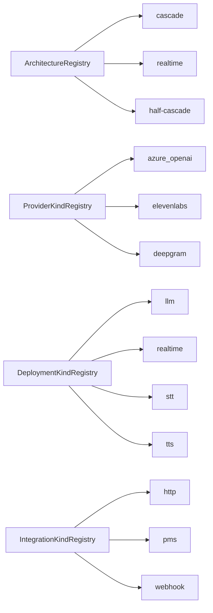

#### Properties

* entry identity is a stable key,
* owned by code / implementation,
* read-only for operators,
* no draft/publish lifecycle,
* used for validation and discovery.

#### Important registries

##### `ArchitectureRegistry`

Allowed architecture modes:

* `cascade`
* `realtime`
* `half-cascade` (planned / reserved)

##### `ComponentDefinitionRegistry`

Defines metadata for component kinds, for example:

* key
* schema
* schema version
* allowed scopes
* value type
* validation rules

##### `ProviderKindRegistry`

Supported provider families, e.g.:

* `azure_openai`
* `elevenlabs`
* `deepgram`

##### `DeploymentKindRegistry`

Supported deployment families:

* `llm`
* `realtime`
* `stt`
* `tts`

##### `IntegrationKindRegistry`

Supported integration families, e.g.:

* `http`
* `pms`
* `webhook`

---

### 7.6 Repository

A repository is a persistence port used by application services.

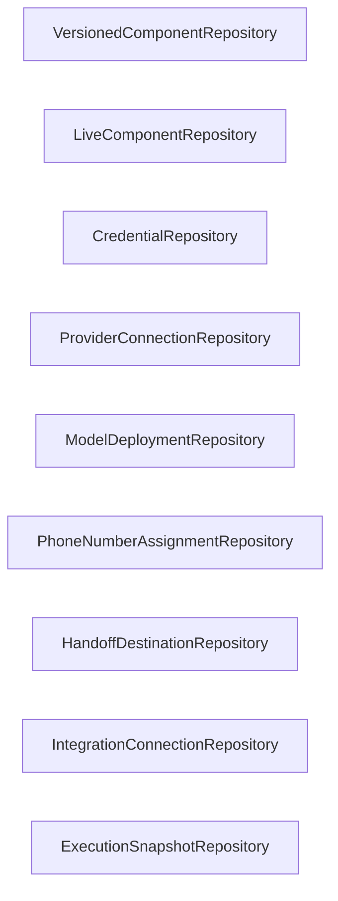

#### Purpose

Repositories:

* load domain state,
* persist domain state,
* query domain state.

#### Properties

* hide persistence details,
* do not define business lifecycle semantics,
* do not expose HTTP semantics,
* operate on domain objects,
* are implementation-replaceable.

#### Current repository families

##### Configuration repositories

* `VersionedComponentRepository`
* `LiveComponentRepository`

##### Managed resource repositories

* `CredentialRepository`
* `ProviderConnectionRepository`
* `ModelDeploymentRepository`
* `PhoneNumberAssignmentRepository`
* `HandoffDestinationRepository`
* `IntegrationConnectionRepository`

##### Execution repository

* `ExecutionSnapshotRepository`

---

### 7.7 Configuration aggregates and semantic views

Not everything in the architecture is a new primitive.

The following are **semantic aggregates / views**, not additional fundamental
building blocks:

* `SystemConfiguration`
* `PlatformConfiguration`
* `TenantConfiguration`
* runtime execution contexts
* runtime material DTOs

This is important: the architecture does **not** introduce a separate generic
“DesiredState” building block.

Instead:

* high-level configuration objects are **semantic aggregates** over components,
  catalogs, and resources;
* execution contexts are **consumer-specific projections** of resolved effective
  state.

This keeps the number of architectural primitives small and explicit.

---

## 8. Inventory by building block and scope

### Versioned components

| Scope                | Components                                                                                       |
|----------------------|--------------------------------------------------------------------------------------------------|
| PlatformScope        | `SystemPrompt`                                                                                   |
| ProfileScope         | `ProfilePrompt`                                                                                  |
| InteractionModeScope | `InteractionPrompt`                                                                              |
| TenantScope          | `TenantPrompt`, `KnowledgePrompt / RAG`, `AgentPersonality`, `BusinessInfo`, `ActionsDefinition` |

### Live components

| Scope       | Components                                                                    |
|-------------|-------------------------------------------------------------------------------|
| SystemScope | `STTDefaults`, `LLMDefaults`, `TTSDefaults`, `RealtimeDefaults`, `Policies`   |
| TenantScope | `ProfileReference`, `Architecture`, `RuntimeOverrides`, `ActionsAvailability` |

### Managed resources

| Scope                | Resources                                                              |
|----------------------|------------------------------------------------------------------------|
| Platform/TenantScope | `Credential`                                                           |
| PlatformScope        | `ProviderConnection`, `ModelDeployment`                                |
| TenantScope          | `PhoneNumberAssignment`, `HandoffDestination`, `IntegrationConnection` |

### Catalogs

| Domain   | Catalogs                                   |
|----------|--------------------------------------------|
| Platform | `ProfileCatalog`, `InteractionModeCatalog` |

### Registries

| Type           | Registries                                                                                          |
|----------------|-----------------------------------------------------------------------------------------------------|
| Implementation | `ArchitectureRegistry`, `ProviderKindRegistry`, `DeploymentKindRegistry`, `IntegrationKindRegistry` |
| Definition     | `ComponentDefinitionRegistry`                                                                       |

---

## 9. Reference model

The Control Plane contains explicit references between semantic domains and
resource domains.

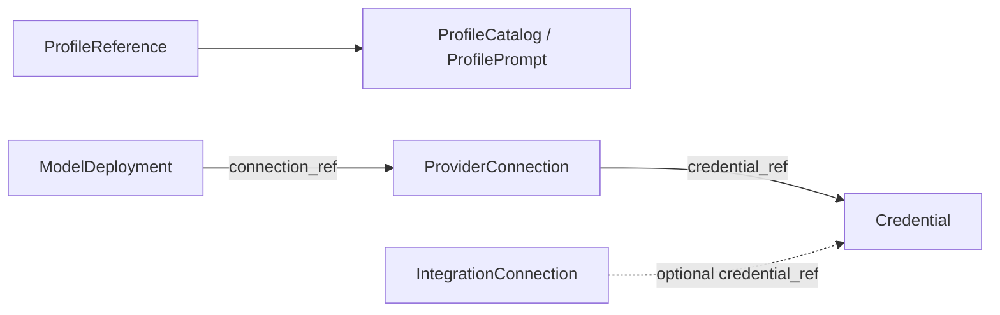

### Important reference patterns

#### Tenant → Platform

* `ProfileReference` points from tenant live configuration to a platform profile.

#### Provider graph

* `ProviderConnection` references a `Credential`.
* `ModelDeployment` references a `ProviderConnection`.

#### Integration graph

* `IntegrationConnection` may reference a tenant-scoped `Credential`.

### Architectural rule

A reference expresses **dependency**, not ownership.

That means:

* referenced objects are validated,
* referenced objects are not re-owned,
* references must be resolved during plan/apply/materialization according to the
  consuming use case.

---

## 10. Application services

Application services execute semantic use cases.

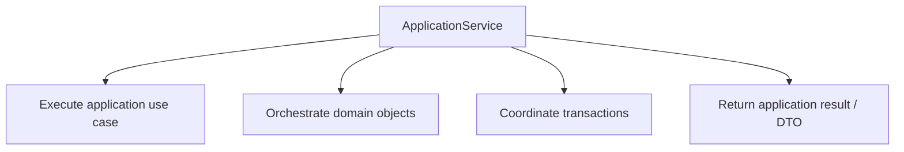

### General properties of application services

* no persistence details,
* no HTTP details,
* orchestrate domain objects,
* use repositories, catalogs, registries,
* return semantic application results.

---

### 10.1 SystemConfigurationService

Manages system-wide live configuration.

#### Manages

* `STTDefaults`
* `LLMDefaults`
* `TTSDefaults`
* `RealtimeDefaults`
* `Policies`

#### Uses

* `LiveComponentRepository`
* `ComponentDefinitionRegistry`

#### Responsibilities

* read current system configuration,
* validate desired changes,
* compute diff,
* apply live updates.

#### Resulting semantic aggregate

`SystemConfiguration` is a semantic view over system-scoped live components.

#### Architectural note

Even though these objects may be structurally rich, they remain live components
because their behavior is “single current value, immediate activation”.

---

### 10.2 PlatformConfigurationService

Manages platform-wide shared semantic configuration.

#### Manages

##### Versioned

* `SystemPrompt`
* `ProfilePrompt`
* `InteractionPrompt`

##### Catalogs

* `ProfileCatalog`
* `InteractionModeCatalog`

#### Uses

* `VersionedComponentRepository`
* profile repository / catalog persistence
* interaction mode repository / catalog persistence
* `ComponentDefinitionRegistry`

#### Responsibilities

* return complete platform configuration,
* plan changes across prompts and catalogs,
* apply catalog state changes immediately,
* save prompt changes as drafts,
* publish versioned prompt changes.

#### Important split

Platform configuration mixes **two different subfamilies**:

1. **catalog state**

   * operator-managed entries such as profiles and interaction modes,
   * immediately applied on update.

2. **versioned prompt state**

   * prompt content attached to platform / profile / interaction mode scopes,
   * saved as drafts and activated only through publish.

---

### 10.3 TenantConfigurationService

Manages tenant-specific semantic configuration.

#### Manages

##### Versioned

* `TenantPrompt`
* `Knowledge`
* `AgentPersonality`
* `BusinessInfo`
* `ActionsDefinition`

##### Live

* `Architecture`
* `ProfileReference`
* `RuntimeOverrides`
* `ActionsAvailability`

#### Uses

* `VersionedComponentRepository`
* `LiveComponentRepository`
* `ProfileCatalog`
* `ArchitectureRegistry`
* `ComponentDefinitionRegistry`

#### Responsibilities

* return complete tenant configuration,
* validate references and semantic consistency,
* plan desired configuration changes,
* apply live changes immediately,
* save versioned changes as drafts,
* publish versioned tenant components.

#### Internal composition

`TenantConfiguration` is a semantic aggregate over:

* tenant versioned semantic content,
* live selections / overrides,
* cross-domain references.

#### Important validation themes

The service is responsible for semantic validation such as:

* referenced profile exists,
* selected architecture exists,
* action availability is compatible with actions definition,
* runtime overrides are resolvable.

---

### 10.4 CredentialService

Manages credentials as independent managed resources.

#### Manages

* `Credential`

#### Uses

* `CredentialRepository`
* `SecretProtector`

#### Responsibilities

* create credentials,
* list / get credentials,
* rotate credential secrets,
* revoke credentials.

#### Architectural role

This service owns the lifecycle of secrets as managed resources.

The Control Plane treats credential metadata and credential secret material
differently:

* metadata belongs to resource management,
* secret material is protected and never treated as ordinary configuration.

---

### 10.5 ProviderService

Manages provider infrastructure resources.

#### Manages

* `ProviderConnection`
* `ModelDeployment`

#### Uses

* `ProviderConnectionRepository`
* `ModelDeploymentRepository`
* `CredentialRepository`
* `ProviderKindRegistry`
* `DeploymentKindRegistry`

#### Responsibilities

##### Provider connections

* create / update / list / get,
* enable / disable,
* validate provider connection usability.

##### Model deployments

* create / update / list / get,
* enable / disable,
* validate deployment usability.

#### Dependency graph

* a provider connection depends on a usable credential,
* a model deployment depends on a provider connection,
* deployment kind must exist in `DeploymentKindRegistry`.

#### Architectural role

This service is the bridge between semantic runtime configuration and concrete
provider infrastructure.

---

### 10.6 TelephonyService

Manages telephony resources.

#### Manages

* `PhoneNumberAssignment`
* `HandoffDestination`

#### Uses

* `PhoneNumberAssignmentRepository`
* `HandoffDestinationRepository`

#### Responsibilities

##### Phone number assignments

* create / list / get,
* enable / disable,
* resolve inbound phone number to tenant route.

##### Handoff destinations

* create / update / list / get,
* enable / disable.

#### Architectural role

Telephony is modeled as a resource domain rather than embedded tenant component
state. This is important because inbound routing and handoff destinations have
operational identity and lifecycle.

---

### 10.7 IntegrationService

Manages tenant integration resources.

#### Manages

* `IntegrationConnection`

#### Uses

* `IntegrationConnectionRepository`
* `CredentialRepository`
* `IntegrationKindRegistry`

#### Responsibilities

* create / update / list / get,
* enable / disable,
* validate integration connection usability.

#### Architectural role

Integration definitions are modeled as managed resources because they carry:

* independent identity,
* integration-specific config,
* optional credential linkage,
* operational validation lifecycle.

---

### 10.8 ExecutionMaterializationService

This is the most important internal runtime service in the Control Plane.

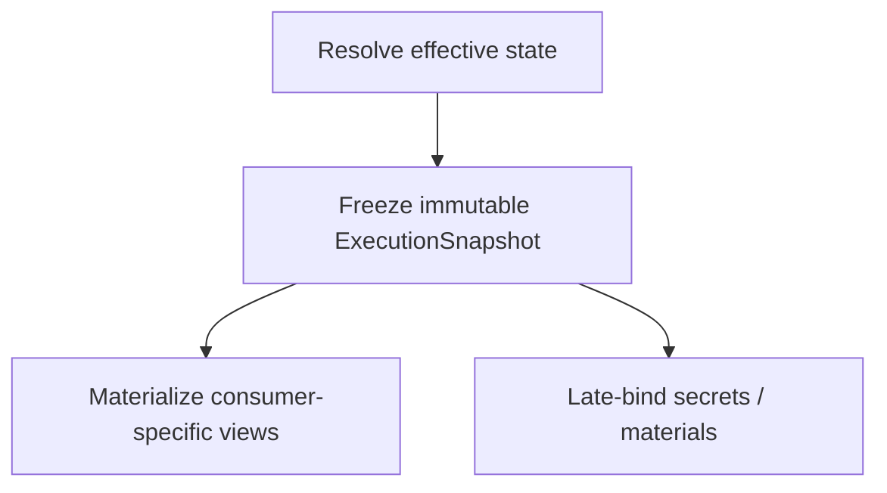

#### Purpose

* resolve effective state for execution,
* freeze it into immutable `ExecutionSnapshot`,
* return consumer-specific execution views and materials.

#### Uses

* configuration repositories,
* managed resource repositories,
* catalogs / registries,
* `ExecutionSnapshotRepository`,
* `SecretProtector`.

#### Responsibilities

1. resolve effective execution state,
2. validate required references,
3. freeze one immutable execution snapshot,
4. derive:

   * `BackendExecutionContext`
   * `VoiceExecutionContext`
   * `WorkerExecutionContext`
5. materialize late-bound secret-bearing runtime material:

   * `RuntimeSecretMaterial`
   * `IntegrationExecutionMaterial`
   * `HandoffExecutionMaterial`

#### Architectural role

This service decouples runtime consumers from configuration lifecycles and
resource graphs.

Runtime consumers never need to know:

* component kinds,
* component addresses,
* drafts,
* revisions,
* provider graphs,
* credential graphs,
* raw snapshot persistence format.

---

## 11. Execution model

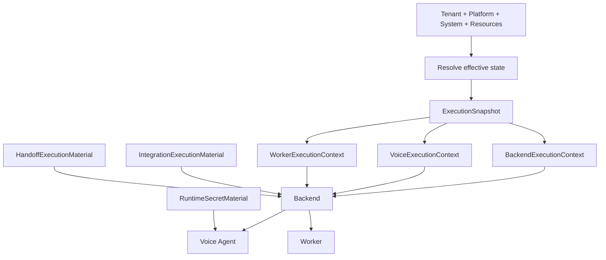

### Execution flow

1. A consumer requests execution creation for a tenant.
2. `ExecutionMaterializationService` resolves the full effective state.
3. The effective state is frozen into an immutable `ExecutionSnapshot`.
4. Consumer-specific execution views are derived from that snapshot.
5. Backend distributes appropriate downstream projections to runtime consumers.
6. Secrets and secret-bearing runtime material are materialized late, only when
   needed.

### Execution consumers

#### Backend

Receives a backend-oriented execution view that contains what it needs to start
and orchestrate execution.

#### Voice Agent

Receives a voice-oriented runtime view containing:

* locale / timezone,
* agent identity,
* prompts,
* architecture,
* runtime defaults / overrides,
* runtime-available actions,
* semantic handoff information.

#### Worker

Receives a worker-oriented execution view containing:

* action identity,
* action phase (`runtime` or `post_call`),
* execution definition / plan,
* optional integration semantic linkage.

### Late-bound materials

#### `RuntimeSecretMaterial`

Used for runtime slots that require protected secrets.

#### `IntegrationExecutionMaterial`

Used when integration execution needs resolved connection config and secret-bearing
material.

#### `HandoffExecutionMaterial`

Used when handoff execution needs resolved destination data.

### Execution invariants represented by the architecture

* snapshot is immutable,
* snapshot contains no secrets,
* all consumer contexts are derived from the same snapshot,
* an existing snapshot is never silently re-resolved,
* references are validated during materialization,
* each consumer receives only its required projection,
* late-bound material must belong to the same snapshot tenant / context.

---

## 12. Out of scope for this document

The following are intentionally **not** specified here and must be documented in
`CONTRACTS.md` and `INVARIANTS.md`:

### Contracts

* HTTP namespaces
* endpoint mapping
* request / response DTOs
* internal execution DTOs
* OpenAPI source of truth

### HTTP behavior

* `ETag` / `If-Match`
* idempotency
* pagination
* filtering / listing contracts

### Security

* auth model
* scopes / principals
* management vs internal auth boundaries

### Error model

* status codes
* structured error response schema
* validation issue payloads

### Guarantees

* atomicity and transactional guarantees
* idempotency replay semantics
* external validation boundaries

---

## Appendix: concise architecture summary

The Control Plane architecture is built from a deliberately small set of
fundamental primitives:

* `VersionedComponent`
* `LiveComponent`
* `ManagedResource`
* `Catalog`
* `Registry`

On top of them, it exposes semantic aggregates and use cases through application
services:

* `SystemConfigurationService`
* `PlatformConfigurationService`
* `TenantConfigurationService`
* `CredentialService`
* `ProviderService`
* `TelephonyService`
* `IntegrationService`
* `ExecutionMaterializationService`

The runtime model is centered on:

* resolving effective state,
* freezing immutable execution snapshots,
* projecting only the necessary execution context for each consumer,
* and materializing secrets late.

This keeps the architecture:

* explicit,
* bounded,
* semantically meaningful,
* and easier to evolve without leaking internal lifecycle machinery into
  downstream consumers.