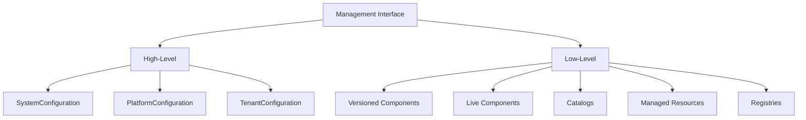
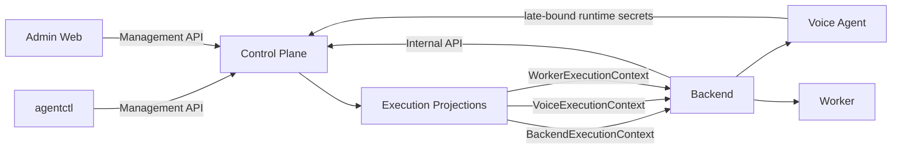

# Control Plane Contracts

> Status: **target contract**
>
> This document defines the external and internal contracts of the Control Plane:
> consumer interfaces, HTTP surfaces, endpoint mapping, request/response DTOs,
> concurrency, idempotency, authorization, errors, transactional guarantees, and
> OpenAPI ownership.
>
> Domain architecture, building blocks, repositories, application services, and
> execution materialization internals are defined in
> [`ARCHITECTURE.md`](./ARCHITECTURE.md).
>
> Non-negotiable behavioral rules should also be summarized in
> [`INVARIANTS.md`](./INVARIANTS.md).

---

## Table of Contents

- [1. Contract principles](#1-contract-principles)
- [2. Canonical naming decisions](#2-canonical-naming-decisions)
- [3. Consumers and interface topology](#3-consumers-and-interface-topology)
  - [3.1 Backend interface](#31-backend-interface)
  - [3.2 Voice Agent interface](#32-voice-agent-interface)
  - [3.3 Worker interface](#33-worker-interface)
  - [3.4 Management interface](#34-management-interface)
- [4. HTTP namespaces](#4-http-namespaces)
- [5. High-level Management API](#5-high-level-management-api)
  - [5.1 System configuration](#51-system-configuration)
  - [5.2 Platform configuration](#52-platform-configuration)
  - [5.3 Tenant configuration](#53-tenant-configuration)
- [6. Low-level Management API](#6-low-level-management-api)
  - [6.1 Versioned components](#61-versioned-components)
  - [6.2 Live components](#62-live-components)
  - [6.3 Catalogs](#63-catalogs)
  - [6.4 Credentials](#64-credentials)
  - [6.5 Providers](#65-providers)
  - [6.6 Telephony](#66-telephony)
  - [6.7 Integrations](#67-integrations)
  - [6.8 Registries](#68-registries)
- [7. Internal API](#7-internal-api)
  - [7.1 Execution creation](#71-execution-creation)
  - [7.2 Consumer projections](#72-consumer-projections)
  - [7.3 Late-bound material](#73-late-bound-material)
  - [7.4 Inbound telephony resolution](#74-inbound-telephony-resolution)
- [8. DTO primitives](#8-dto-primitives)
- [9. High-level configuration DTOs](#9-high-level-configuration-dtos)
  - [9.1 System DTOs](#91-system-dtos)
  - [9.2 Platform DTOs](#92-platform-dtos)
  - [9.3 Tenant DTOs](#93-tenant-dtos)
- [10. Low-level DTOs](#10-low-level-dtos)
  - [10.1 Versioned component DTOs](#101-versioned-component-dtos)
  - [10.2 Live component DTOs](#102-live-component-dtos)
  - [10.3 Catalog DTOs](#103-catalog-dtos)
  - [10.4 Registry DTOs](#104-registry-dtos)
  - [10.5 Credential DTOs](#105-credential-dtos)
  - [10.6 Provider DTOs](#106-provider-dtos)
  - [10.7 Telephony DTOs](#107-telephony-dtos)
  - [10.8 Integration DTOs](#108-integration-dtos)
- [11. Internal execution DTOs](#11-internal-execution-dtos)
- [12. Concurrency](#12-concurrency)
- [13. Idempotency](#13-idempotency)
- [14. Error model](#14-error-model)
- [15. Authorization](#15-authorization)
- [16. Transactional guarantees](#16-transactional-guarantees)
- [17. Secret-bearing responses](#17-secret-bearing-responses)
- [18. OpenAPI and shared contracts](#18-openapi-and-shared-contracts)
- [19. Contract evolution rules](#19-contract-evolution-rules)
- [20. Explicitly unresolved details](#20-explicitly-unresolved-details)

---

## 1. Contract principles

1. **Consumer-oriented contracts**
   - Backend, Voice Agent, and Worker receive only the data required for their work.
   - They must not depend on Control Plane persistence or component lifecycle internals.

2. **High-level management is primary**
   - Normal `agentctl` and Admin Web workflows use semantic configuration APIs.
   - Clients should not orchestrate raw component lifecycle operations to perform normal
     configuration management.

3. **Low-level management is expert/advanced**
   - Individual component history, rollback, draft manipulation, catalog entries,
     managed resources, and registries remain directly accessible when needed.

4. **Execution is represented by an opaque handle**
   - The public/internal transport concept is `execution_id`.
   - The underlying immutable `ExecutionSnapshot` is an internal persistence artifact.

5. **Concurrency is transport-level**
   - External management concurrency uses `ETag` and `If-Match`.
   - Internal draft versions, revision IDs, and resource generations do not leak into
     high-level contracts solely for concurrency control.

6. **Secrets are late-bound**
   - Secret-bearing material is never embedded into ordinary execution contexts.
   - Secret responses use dedicated late-bound internal operations.

7. **One source of truth**
   - OpenAPI is the machine-readable source of truth for the HTTP contract.
   - Shared/generated clients must be derived from it rather than independently modeled.

---

## 2. Canonical naming decisions

Some earlier design sketches used persistence-oriented names. The following names
are canonical for the target contract.

| Earlier / internal wording                                  | Canonical contract wording |
|-------------------------------------------------------------|----------------------------|
| `execution_snapshot_id`                                     | `execution_id`             |
| `snapshot_id` in consumer APIs                              | `execution_id`             |
| phone assignment generation exposed as routing detail       | `route_version`            |
| raw `ExecutionSnapshot` transport                           | not exposed                |
| provider / credential graph in runtime DTOs                 | not exposed                |
| high-level `expected_draft_version` / `expected_generation` | `ETag` + `If-Match`        |

`execution_id` may internally identify an `ExecutionSnapshot`, but clients must treat
it as an opaque execution handle.

---

## 3. Consumers and interface topology



### 3.1 Backend interface

Purpose:

- resolve inbound phone routing,
- create an execution,
- obtain consumer-specific execution projections,
- obtain late-bound integration / handoff material.

Semantic operations:

```text
resolve_phone_number(phone_number)
  → InboundRoute

create_execution(tenant_id, context?)
  → BackendExecutionContext

voice_context(execution_id)
  → VoiceExecutionContext

worker_context(execution_id, action_key)
  → WorkerExecutionContext

integration_material(execution_id, integration_key)
  → IntegrationExecutionMaterial

handoff_material(execution_id, destination_key)
  → HandoffExecutionMaterial
```

Properties:

- internal service-to-service contract,
- semantic operations only,
- opaque `execution_id`,
- no component/revision lifecycle knowledge,
- no raw provider/credential graph knowledge,
- no management operations.

---

### 3.2 Voice Agent interface

The Voice Agent receives its execution projection through Backend and may fetch
runtime secret material directly from Control Plane.

Semantic operations:

```text
get_voice_context(execution_id)
  → VoiceExecutionContext
  # delivered through Backend

runtime_secret(execution_id, slot)
  → RuntimeSecretMaterial
  # direct Control Plane call
```

Properties:

- execution-scoped,
- context immutable for the execution,
- no configuration lifecycle knowledge,
- no provider/resource graph knowledge,
- secrets late-bound,
- context delivered through Backend,
- runtime secrets may be fetched directly from Control Plane.

---

### 3.3 Worker interface

The Worker has no direct Control Plane dependency in the target topology.

Semantic operations:

```text
get_worker_context(execution_id, action_key)
  → WorkerExecutionContext
  # Backend passthrough

integration_material(execution_id, integration_key)
  → IntegrationExecutionMaterial
  # Backend passthrough
```

Properties:

- execution-scoped,
- no direct Control Plane credentials required,
- no configuration lifecycle knowledge,
- no raw integration/credential graph knowledge,
- integration secrets late-bound,
- same action model supports runtime and post-call phases.

---

### 3.4 Management interface

Consumers:

- `agentctl`
- Admin Web



#### High-level surface

Primary surface for normal management workflows.

```text
SystemConfiguration
  get
  plan
  apply

PlatformConfiguration
  get
  plan
  apply
  publish

TenantConfiguration
  get
  plan
  apply
  publish
```

High-level properties:

- shared contract for Admin Web and `agentctl`,
- configuration-oriented,
- hides component lifecycle orchestration,
- no `ComponentAddress`,
- no revision IDs / draft versions in the semantic DTO,
- no repository/resource choreography.

#### Low-level surface

Expert/advanced operations for individual objects.

```text
VersionedComponents
LiveComponents
Catalogs
ManagedResources
Registries
```

Low-level properties:

- shared contract,
- object-oriented,
- may expose lifecycle-specific metadata,
- no repository exposure,
- no execution/materialization operations.

---

## 4. HTTP namespaces

```text
/management/v1/*   # agentctl + Admin Web
/internal/v1/*     # Backend / Voice Agent / runtime consumers

/health
/ready
```

Security boundaries follow the namespace structure:

- `/management/v1/*` requires a `ManagementPrincipal`,
- `/internal/v1/*` requires a `ServicePrincipal`,
- `/health` and `/ready` follow operational policy.

There must not be a generic unscoped `/v1/*` contract in the target API.

---

## 5. High-level Management API

### 5.1 System configuration

| Method | Path                                       | Semantic operation |
|--------|--------------------------------------------|--------------------|
| `GET`  | `/management/v1/system/configuration`      | `get()`            |
| `POST` | `/management/v1/system/configuration/plan` | `plan(desired)`    |
| `PUT`  | `/management/v1/system/configuration`      | `apply(desired)`   |

Notes:

- `PUT` accepts the complete desired system configuration.
- System configuration is live; there is no publish operation.

---

### 5.2 Platform configuration

| Method | Path                                            | Semantic operation |
|--------|-------------------------------------------------|--------------------|
| `GET`  | `/management/v1/platform/configuration`         | `get()`            |
| `POST` | `/management/v1/platform/configuration/plan`    | `plan(desired)`    |
| `PUT`  | `/management/v1/platform/configuration`         | `apply(desired)`   |
| `POST` | `/management/v1/platform/configuration/publish` | `publish()`        |

Hidden orchestration:

- catalog changes are applied immediately,
- versioned prompt changes are saved as drafts,
- publish activates pending versioned prompt drafts.

---

### 5.3 Tenant configuration

| Method | Path                                                       | Semantic operation          |
|--------|------------------------------------------------------------|-----------------------------|
| `GET`  | `/management/v1/tenants/{tenant_id}/configuration`         | `get(tenant_id)`            |
| `POST` | `/management/v1/tenants/{tenant_id}/configuration/plan`    | `plan(tenant_id, desired)`  |
| `PUT`  | `/management/v1/tenants/{tenant_id}/configuration`         | `apply(tenant_id, desired)` |
| `POST` | `/management/v1/tenants/{tenant_id}/configuration/publish` | `publish(tenant_id)`        |

Hidden orchestration:

- live component changes become immediately active,
- versioned component changes become drafts,
- publish activates pending tenant versioned drafts.

`TenantConfigurationDesired` is a **complete desired document**, not a patch.

---

## 6. Low-level Management API

### 6.1 Versioned components

Scope-specific paths are used instead of a generic `{scope}/{scope_key?}` route.

Canonical bases:

```text
/management/v1/platform/components/{kind}
/management/v1/tenants/{tenant_id}/components/{kind}
/management/v1/platform/profiles/{profile_key}/components/{kind}
/management/v1/platform/interaction-modes/{mode_key}/components/{kind}
```

Operations for each base:

| Method   | Suffix                         | Meaning                         |
|----------|--------------------------------|---------------------------------|
| `GET`    | ``                             | read component summary          |
| `GET`    | `/draft`                       | read current draft              |
| `PUT`    | `/draft`                       | save/update draft               |
| `DELETE` | `/draft`                       | discard draft                   |
| `GET`    | `/active`                      | read active revision            |
| `GET`    | `/revisions`                   | list revisions                  |
| `GET`    | `/revisions/{revision_number}` | read one revision               |
| `POST`   | `/publish`                     | publish draft                   |
| `POST`   | `/rollback`                    | rollback to a previous revision |

Concurrency uses `ETag` / `If-Match`; expected draft versions are not part of the
target transport contract.

---

### 6.2 Live components

System:

```text
GET /management/v1/system/components/{kind}
PUT /management/v1/system/components/{kind}
```

Tenant:

```text
GET /management/v1/tenants/{tenant_id}/components/{kind}
PUT /management/v1/tenants/{tenant_id}/components/{kind}
```

No draft, revision, rollback, or publish endpoints exist for live components.

---

### 6.3 Catalogs

#### Profiles

```text
GET  /management/v1/platform/profiles
POST /management/v1/platform/profiles

GET  /management/v1/platform/profiles/{profile_key}
PUT  /management/v1/platform/profiles/{profile_key}

POST /management/v1/platform/profiles/{profile_key}/enable
POST /management/v1/platform/profiles/{profile_key}/disable
```

#### Interaction modes

```text
GET  /management/v1/platform/interaction-modes
POST /management/v1/platform/interaction-modes

GET  /management/v1/platform/interaction-modes/{mode_key}
PUT  /management/v1/platform/interaction-modes/{mode_key}

POST /management/v1/platform/interaction-modes/{mode_key}/enable
POST /management/v1/platform/interaction-modes/{mode_key}/disable
```

Prompt content is **not** embedded into catalog CRUD semantics:

- `ProfilePrompt` is a versioned component under `ProfileScope(profile_key)`.
- `InteractionPrompt` is a versioned component under
  `InteractionModeScope(mode_key)`.

---

### 6.4 Credentials

Credentials may be platform- or tenant-scoped, so the collection remains global and
scope is expressed in the DTO.

```text
GET  /management/v1/credentials
POST /management/v1/credentials

GET  /management/v1/credentials/{id}
POST /management/v1/credentials/{id}/rotate
POST /management/v1/credentials/{id}/revoke
```

Normal reads never expose secret material.

---

### 6.5 Providers

#### Provider connections

```text
GET  /management/v1/providers/connections
POST /management/v1/providers/connections

GET  /management/v1/providers/connections/{id}
PUT  /management/v1/providers/connections/{id}

POST /management/v1/providers/connections/{id}/enable
POST /management/v1/providers/connections/{id}/disable
POST /management/v1/providers/connections/{id}/validate
```

#### Model deployments

```text
GET  /management/v1/providers/deployments
POST /management/v1/providers/deployments

GET  /management/v1/providers/deployments/{id}
PUT  /management/v1/providers/deployments/{id}

POST /management/v1/providers/deployments/{id}/enable
POST /management/v1/providers/deployments/{id}/disable
POST /management/v1/providers/deployments/{id}/validate
```

---

### 6.6 Telephony

Tenant-owned management resources:

```text
GET  /management/v1/tenants/{tenant_id}/telephony/phone-number-assignments
POST /management/v1/tenants/{tenant_id}/telephony/phone-number-assignments

GET  /management/v1/tenants/{tenant_id}/telephony/phone-number-assignments/{id}
POST /management/v1/tenants/{tenant_id}/telephony/phone-number-assignments/{id}/enable
POST /management/v1/tenants/{tenant_id}/telephony/phone-number-assignments/{id}/disable
```

Handoff destinations:

```text
GET  /management/v1/tenants/{tenant_id}/telephony/handoff-destinations
POST /management/v1/tenants/{tenant_id}/telephony/handoff-destinations

GET  /management/v1/tenants/{tenant_id}/telephony/handoff-destinations/{id}
PUT  /management/v1/tenants/{tenant_id}/telephony/handoff-destinations/{id}

POST /management/v1/tenants/{tenant_id}/telephony/handoff-destinations/{id}/enable
POST /management/v1/tenants/{tenant_id}/telephony/handoff-destinations/{id}/disable
```

Inbound routing is not a management operation; it belongs to the Internal API.

---

### 6.7 Integrations

```text
GET  /management/v1/tenants/{tenant_id}/integrations
POST /management/v1/tenants/{tenant_id}/integrations

GET  /management/v1/tenants/{tenant_id}/integrations/{id}
PUT  /management/v1/tenants/{tenant_id}/integrations/{id}

POST /management/v1/tenants/{tenant_id}/integrations/{id}/enable
POST /management/v1/tenants/{tenant_id}/integrations/{id}/disable
POST /management/v1/tenants/{tenant_id}/integrations/{id}/validate
```

`tenant_id` is encoded in the resource path and therefore is not duplicated in
create/update request bodies.

---

### 6.8 Registries

Read-only discovery:

```text
GET /management/v1/registries/architectures
GET /management/v1/registries/components
GET /management/v1/registries/provider-kinds
GET /management/v1/registries/deployment-kinds
GET /management/v1/registries/integration-kinds
```

Registries are code-owned and have no create/update/delete endpoints.

---

## 7. Internal API

### 7.1 Execution creation

```text
POST /internal/v1/executions
```

Request:

- `CreateExecutionRequest`

Response:

- `BackendExecutionContext`

Execution creation returns an opaque `execution_id`.

---

### 7.2 Consumer projections

```text
GET /internal/v1/executions/{execution_id}/voice-context
```

Returns:

- `VoiceExecutionContext`

```text
GET /internal/v1/executions/{execution_id}/worker-context?action_key=...
```

Returns:

- `WorkerExecutionContext`

The Backend may call these operations and pass the resulting projections to the
downstream consumer.

---

### 7.3 Late-bound material

Runtime secret:

```text
POST /internal/v1/executions/{execution_id}/secrets/{slot}
```

Returns:

- `RuntimeSecretMaterial`

Integration execution material:

```text
POST /internal/v1/executions/{execution_id}/integrations/{integration_key}/material
```

Returns:

- `IntegrationExecutionMaterial`

Handoff material:

```text
POST /internal/v1/executions/{execution_id}/handoff/{destination_key}/material
```

Returns:

- `HandoffExecutionMaterial`

These operations are read-like materialization commands: they do not mutate
persistent execution state and therefore do not require `Idempotency-Key`.

---

### 7.4 Inbound telephony resolution

```text
GET /internal/v1/telephony/inbound-route?phone_number=...
```

Returns:

- `InboundRoute`

---

## 8. DTO primitives

### `ValidationIssue`

```text
ValidationIssue
├── code
├── path
└── message
```

### `ConfigurationChange`

```text
ConfigurationChange
├── path
├── operation       # create | update | clear | no-op
└── activation      # immediate | draft
```

### `ConfigurationStatus`

```text
ConfigurationStatus
├── has_drafts
└── publishable
```

These primitives are shared by high-level configuration contracts.

---

## 9. High-level configuration DTOs

### 9.1 System DTOs

#### `SystemConfiguration`

```text
SystemConfiguration
├── stt_defaults
├── llm_defaults
├── tts_defaults
├── realtime_defaults
└── policies
```

#### `SystemConfigurationDesired`

Same semantic fields, representing the complete desired state.

```text
SystemConfigurationDesired
├── stt_defaults
├── llm_defaults
├── tts_defaults
├── realtime_defaults
└── policies
```

#### `SystemConfigurationPlan`

```text
SystemConfigurationPlan
├── valid
├── changes[]
├── warnings[]
└── errors[]
```

#### `SystemConfigurationApplyResult`

```text
SystemConfigurationApplyResult
├── updated[]
├── unchanged[]
└── configuration
```

---

### 9.2 Platform DTOs

#### `PlatformConfiguration`

```text
PlatformConfiguration
├── system_prompt
│   ├── active
│   └── draft
│
├── profiles[]
│   ├── key
│   ├── name
│   ├── description
│   ├── status
│   └── prompt
│       ├── active
│       └── draft
│
├── interaction_modes[]
│   ├── key
│   ├── name
│   ├── description
│   ├── status
│   └── prompt
│       ├── active
│       └── draft
│
└── status
```

#### `PlatformConfigurationDesired`

Desired state contains semantic values only; it does not contain server-owned
`active` / `draft` lifecycle state.

```text
PlatformConfigurationDesired
├── system_prompt
│
├── profiles[]
│   ├── key
│   ├── name
│   ├── description
│   ├── status
│   └── prompt
│
└── interaction_modes[]
    ├── key
    ├── name
    ├── description
    ├── status
    └── prompt
```

#### `PlatformConfigurationPlan`

```text
PlatformConfigurationPlan
├── valid
├── catalog_changes[]
├── draft_changes[]
├── warnings[]
└── errors[]
```

#### `PlatformConfigurationApplyResult`

```text
PlatformConfigurationApplyResult
├── catalogs_updated[]
├── drafts_saved[]
├── unchanged[]
└── configuration
```

#### `PlatformConfigurationPublishResult`

```text
PlatformConfigurationPublishResult
├── published_components[]
├── unchanged_components[]
└── configuration
```

---

### 9.3 Tenant DTOs

#### `TenantConfiguration`

```text
TenantConfiguration
├── tenant_id
│
├── versioned
│   ├── tenant_prompt
│   │   ├── active
│   │   └── draft
│   ├── knowledge
│   │   ├── active
│   │   └── draft
│   ├── agent_personality
│   │   ├── active
│   │   └── draft
│   ├── business_info
│   │   ├── active
│   │   └── draft
│   └── actions_definition
│       ├── active
│       └── draft
│
├── live
│   ├── architecture
│   ├── profile_reference
│   ├── runtime_overrides
│   └── actions_availability
│
└── status
    ├── has_drafts
    └── publishable
```

#### `TenantConfigurationDesired`

Complete desired configuration document:

```text
TenantConfigurationDesired
├── tenant_prompt
├── knowledge
├── agent_personality
├── business_info
├── actions_definition
├── architecture
├── profile_reference
├── runtime_overrides
└── actions_availability
```

#### `TenantConfigurationPlan`

```text
TenantConfigurationPlan
├── valid
├── changes
│   ├── immediate[]
│   └── draft[]
├── warnings[]
└── errors[]
```

#### `TenantConfigurationApplyResult`

```text
TenantConfigurationApplyResult
├── live_updated[]
├── drafts_saved[]
├── unchanged[]
└── configuration
```

#### `TenantConfigurationPublishResult`

```text
TenantConfigurationPublishResult
├── published_components[]
├── unchanged_components[]
└── configuration
```

---

## 10. Low-level DTOs

### 10.1 Versioned component DTOs

#### `VersionedComponent`

```text
VersionedComponent
├── kind
├── scope
├── active?
│   ├── revision_number
│   ├── schema_version
│   ├── value
│   ├── created_at
│   └── created_by
└── draft?
    ├── schema_version
    ├── value
    ├── based_on_revision_number?
    ├── updated_at
    └── updated_by
```

#### `VersionedComponentDraftWrite`

```text
VersionedComponentDraftWrite
└── value
```

The client does not supply `schema_version`; current schema ownership belongs to
`ComponentDefinitionRegistry`.

#### `ComponentRevision`

```text
ComponentRevision
├── revision_number
├── schema_version
├── value
├── created_at
├── created_by
└── restored_from_revision?
```

#### `RollbackRequest`

```text
RollbackRequest
└── revision_number
```

---

### 10.2 Live component DTOs

#### `LiveComponent`

```text
LiveComponent
├── kind
├── scope
├── value
├── updated_at
└── updated_by
```

#### `LiveComponentWrite`

```text
LiveComponentWrite
└── value
```

Internal generation counters are not required in the body because concurrency is
represented by ETags.

---

### 10.3 Catalog DTOs

#### `Profile`

```text
Profile
├── key
├── name
├── description
├── status
├── created_at
└── updated_at
```

#### `ProfileCreate`

```text
ProfileCreate
├── key
├── name
└── description
```

#### `ProfileUpdate`

```text
ProfileUpdate
├── name
└── description
```

`InteractionMode`, `InteractionModeCreate`, and `InteractionModeUpdate` follow the
same shape.

---

### 10.4 Registry DTOs

#### `RegistryEntry`

```text
RegistryEntry
├── key
├── name
├── description
└── metadata
```

#### `ComponentDefinition`

```text
ComponentDefinition
├── key
├── schema_version
├── allowed_scopes[]
├── value_schema
└── metadata
```

`value_schema` may be JSON Schema and can be used by management clients for
discovery and generic editing support.

---

### 10.5 Credential DTOs

#### `Credential`

```text
Credential
├── id
├── scope
├── name
├── status
├── active_secret_version
├── created_at
├── updated_at
└── revoked_at?
```

Normal reads never include secret material.

#### `CredentialCreate`

```text
CredentialCreate
├── scope
├── name
└── secret
```

#### `CredentialRotate`

```text
CredentialRotate
└── secret
```

Revoke is an explicit command and does not require a dedicated request body.

---

### 10.6 Provider DTOs

#### `ProviderConnection`

```text
ProviderConnection
├── id
├── key
├── provider_kind
├── credential_ref
├── connection_config
├── enabled
├── created_at
└── updated_at
```

#### `ProviderConnectionCreate`

```text
ProviderConnectionCreate
├── key
├── provider_kind
├── credential_ref
└── connection_config
```

#### `ProviderConnectionUpdate`

```text
ProviderConnectionUpdate
├── credential_ref
└── connection_config
```

#### `ModelDeployment`

```text
ModelDeployment
├── id
├── key
├── connection_ref
├── deployment_kind
├── deployment_config
├── capabilities
├── enabled
├── created_at
└── updated_at
```

#### `ModelDeploymentCreate`

```text
ModelDeploymentCreate
├── key
├── connection_ref
├── deployment_kind
├── deployment_config
└── capabilities
```

#### `ModelDeploymentUpdate`

```text
ModelDeploymentUpdate
├── connection_ref
├── deployment_config
└── capabilities
```

`capabilities` should be modeled as a typed union according to `deployment_kind`.

---

### 10.7 Telephony DTOs

#### `PhoneNumberAssignment`

```text
PhoneNumberAssignment
├── id
├── tenant_id
├── phone_number
├── enabled
├── created_at
└── updated_at
```

#### `PhoneNumberAssignmentCreate`

```text
PhoneNumberAssignmentCreate
└── phone_number
```

`tenant_id` is supplied by the URL.

#### `HandoffDestination`

```text
HandoffDestination
├── id
├── tenant_id
├── key
├── description
├── phone_number
├── enabled
├── created_at
└── updated_at
```

#### `HandoffDestinationCreate`

```text
HandoffDestinationCreate
├── key
├── description
└── phone_number
```

#### `HandoffDestinationUpdate`

```text
HandoffDestinationUpdate
├── description
└── phone_number
```

---

### 10.8 Integration DTOs

#### `IntegrationConnection`

```text
IntegrationConnection
├── id
├── tenant_id
├── key
├── integration_kind
├── config
├── credential_ref?
├── enabled
├── created_at
└── updated_at
```

#### `IntegrationConnectionCreate`

```text
IntegrationConnectionCreate
├── key
├── integration_kind
├── config
└── credential_ref?
```

#### `IntegrationConnectionUpdate`

```text
IntegrationConnectionUpdate
├── config
└── credential_ref?
```

#### `IntegrationValidationResult`

```text
IntegrationValidationResult
├── valid
├── usable
├── code?
└── message?
```

---

## 11. Internal execution DTOs

Properties:

- consumer-specific,
- execution-scoped,
- no raw `ExecutionSnapshot`,
- no component lifecycle metadata,
- no provider/resource graph leakage,
- secrets appear only in late-bound material DTOs.

### `CreateExecutionRequest`

```text
CreateExecutionRequest
├── tenant_id
└── context?     # reserved for execution-specific input
```

### `BackendExecutionContext`

```text
BackendExecutionContext
├── execution_id
├── tenant_id
├── architecture
├── backend_actions
│   ├── capabilities
│   └── post_call
├── handoff
└── metadata
```

### `VoiceExecutionContext`

```text
VoiceExecutionContext
├── execution_id
├── tenant
│   ├── locale
│   └── timezone
├── agent
│   ├── name
│   ├── personality
│   └── greeting
├── architecture
├── prompts
│   ├── system
│   ├── profile
│   ├── tenant
│   └── knowledge
├── runtime
│   ├── stt
│   ├── llm
│   ├── tts
│   └── realtime
├── actions[]
└── handoff[]
```

### `WorkerExecutionContext`

```text
WorkerExecutionContext
├── execution_id
├── tenant_id
├── action
│   ├── key
│   ├── phase          # runtime | post_call
│   ├── definition
│   └── execution_plan
└── integration?
    └── semantic_key
```

### `RuntimeSecretMaterial`

```text
RuntimeSecretMaterial
├── slot
└── secret
```

### `IntegrationExecutionMaterial`

```text
IntegrationExecutionMaterial
├── integration_kind
├── config
│   ├── endpoint
│   ├── method
│   ├── headers
│   └── ...
└── secret?
```

### `HandoffExecutionMaterial`

```text
HandoffExecutionMaterial
├── destination_key
└── phone_number
```

### `InboundRoute`

```text
InboundRoute
├── tenant_id
├── phone_number
└── route_version
```

---

## 12. Concurrency

Universal management concurrency uses HTTP `ETag` and `If-Match`.

### Read

```http
GET ...
ETag: "opaque-token"
```

### Mutation

```http
If-Match: "opaque-token"
```

### Stale token

```text
412 Precondition Failed
```

### ETag semantics

The token is opaque to clients.

Internally it may represent:

| Resource                 | Internal source                        |
|--------------------------|----------------------------------------|
| Versioned component      | active revision + draft version        |
| Live component           | generation                             |
| Managed resource         | generation                             |
| Catalog entry            | generation                             |
| High-level configuration | hash/version of all contributing state |

Properties:

- opaque,
- universal,
- hides revision/generation implementation,
- usable by Admin Web and `agentctl`,
- high-level ETag covers complete configuration state,
- low-level ETag covers one object.

High-level clients must not depend on `expected_generation`,
`expected_draft_version`, or `expected_active_revision_id`.

---

## 13. Idempotency

State-changing commands that can cause duplicate side effects require:

```http
Idempotency-Key: <opaque-client-generated-key>
```

### Semantics

```text
same key + same principal + same operation + same request
  → replay the same logical result

same key + different request
  → 409 Conflict
  → code = idempotency_key_reused
```

### Retry ordering

```text
1. idempotency lookup
2. replay prior result if present
3. concurrency check
4. execute mutation
5. commit mutation + idempotency result atomically
```

Idempotency is checked before concurrency on retries so a successful request whose
response was lost does not fail against the ETag generated by its own mutation.

### Required

- configuration apply,
- configuration publish,
- managed resource create,
- managed resource update,
- credential rotate,
- credential revoke,
- enable / disable commands,
- execution creation.

### Not required

- `GET`,
- `plan`,
- `validate`,
- read-only registry calls,
- `runtime_secret`,
- `integration_material`,
- `handoff_material`.

---

## 14. Error model

All API surfaces use one structured error envelope.

### `ErrorResponse`

```text
ErrorResponse
├── code
├── message
├── issues[]?
├── details?
└── request_id
```

`issues[]` uses `ValidationIssue`.

Example:

```json
{
  "code": "configuration_invalid",
  "message": "Tenant configuration is invalid",
  "issues": [
    {
      "code": "unknown_profile",
      "path": "profile_reference",
      "message": "Profile 'hotel-v2' does not exist"
    }
  ],
  "request_id": "..."
}
```

### HTTP mapping

| Status | Meaning                                 |
|--------|-----------------------------------------|
| `400`  | malformed / invalid request protocol    |
| `401`  | authentication missing or invalid       |
| `403`  | authenticated but insufficient scope    |
| `404`  | requested resource does not exist       |
| `409`  | domain/state conflict                   |
| `412`  | stale `If-Match` / ETag                 |
| `422`  | semantic validation failure             |
| `429`  | rate limited                            |
| `503`  | required dependency/service unavailable |
| `500`  | unexpected internal failure             |

Important distinctions:

- `412` is reserved for concurrency conflict.
- `409` is a domain/state conflict.
- `422` is a submitted semantic value/reference validation failure.
- `404` is resource absence in a read/addressing operation.

---

## 15. Authorization

### Management principals

`agentctl` and Admin Web use the same semantic management contract but may use
different authenticated principals.

Minimum capabilities:

```text
configuration:read
configuration:write
configuration:publish

resources:read
resources:write

credentials:write

registries:read
```

A future RBAC layer may map roles such as `viewer`, `operator`, and
`administrator` to these permissions.

### Internal service principal

For `/internal/v1/*`, the principal contains at least:

```text
ServicePrincipal
├── sub        # backend / voice-agent
├── aud        # control-plane
├── scopes[]
├── iat
└── exp
```

The Control Plane validates:

- signature,
- audience,
- expiry,
- required scope.

### Backend scopes

```text
telephony:resolve
execution:create
execution:voice-context:read
execution:worker-context:read
integration-material:read
handoff-material:read
```

Backend must not receive management privileges.

### Voice Agent scopes

```text
runtime-secret:materialize
```

Voice Agent receives its normal execution context through Backend.

### Worker

No direct Control Plane access.

### Actor identity

Audit actor identity is derived from the authenticated principal, not from request
payloads.

---

## 16. Transactional guarantees

### Configuration

```text
System.apply        → atomic
Tenant.apply        → atomic
Tenant.publish      → atomic
Platform.apply      → atomic
Platform.publish    → atomic
```

A high-level operation is all-or-nothing.

For example, `Tenant.apply` must not leave live components updated while a draft
save fails partway through the same semantic operation.

### Managed resources

Every individual managed-resource mutation is atomic.

### Execution

`create_execution` performs atomic snapshot creation:

```text
resolve effective state
→ validate
→ persist complete immutable snapshot
→ return execution context
```

Either a complete execution is created or no execution exists.

### External validation

No database transaction is held open across external network validation calls.

### Idempotency

Mutation state and the idempotency replay record commit atomically.

---

## 17. Secret-bearing responses

Secret-bearing internal responses must not be cacheable.

At minimum:

```http
Cache-Control: no-store
Pragma: no-cache
X-Content-Type-Options: nosniff
```

Secrets are returned only by dedicated late-bound material operations.

Normal management reads must never return credential secret material.

---

## 18. OpenAPI and shared contracts

OpenAPI is the source of truth for the Control Plane HTTP contract.

Purpose:

- generate typed clients,
- validate request/response schemas,
- prevent schema drift,
- perform breaking-change detection,
- keep Python and TypeScript consumers aligned.

Primary consumers:

- `agentctl`,
- Admin Web,
- Backend,
- Voice Agent.

Rules:

- consumers must not duplicate contract DTOs manually when generated/shared
  equivalents exist,
- Control Plane domain or persistence models are not imported as transport models,
- breaking contract changes require explicit intent and consumer migration.

---

## 19. Contract evolution rules

1. The target contract takes precedence over legacy endpoint shapes.
2. Current implementation details are migration evidence, not justification for
   leaking internal concepts into new contracts.
3. New high-level operations should be added only when they represent a real
   semantic use case.
4. Low-level APIs must not become the orchestration substrate for normal workflows.
5. Internal execution DTOs may evolve independently for different consumers.
6. Secret-bearing fields must never migrate into ordinary execution or management
   DTOs.
7. A breaking OpenAPI change requires coordinated migration of all affected
   consumers.
8. Compatibility layers are temporary migration tools, not permanent architecture.

---

## 20. Explicitly unresolved details

The following are intentionally not frozen by this document yet:

1. Exact pagination envelope and cursor semantics for large list endpoints.
2. Exact `context` schema in `CreateExecutionRequest`.
3. Exact typed capability unions for each `ModelDeployment.deployment_kind`.
4. Whether catalog lifecycle uses only `enable/disable` or eventually an explicit
   archival operation.
5. Exact token format / issuer implementation for management authentication.
6. Exact retention window for idempotency replay records.
7. Exact normalization rules for all semantic keys beyond their domain-level
   constraints.

These details may be finalized during implementation without changing the
architectural contract boundaries defined above.
