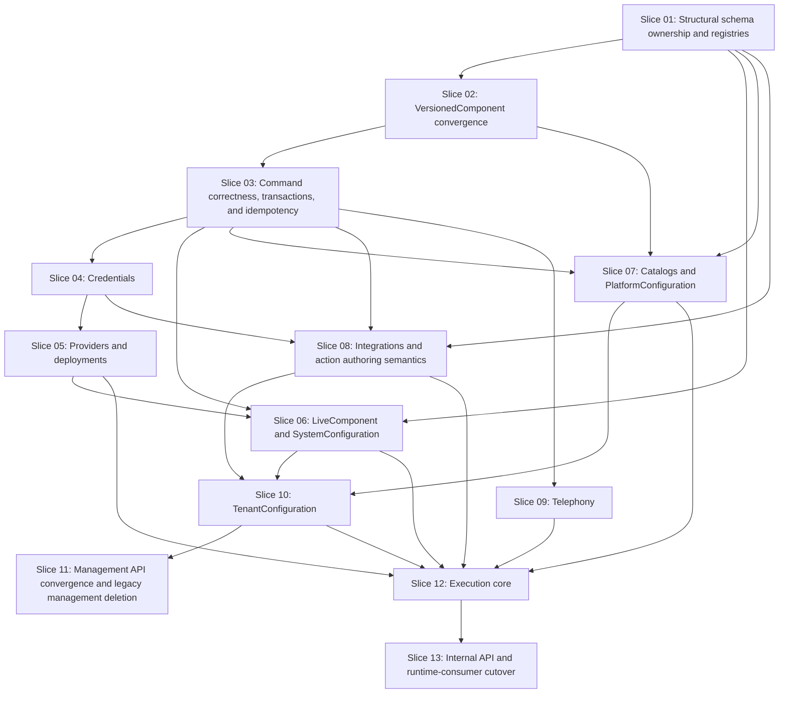

# Control Plane Refactor Plan

## 1. Purpose and authority

This document defines implementation ordering for the frozen Control Plane target. It does not define or revise architecture.

The frozen sources of truth, in precedence over legacy code and tests, are:

1. `docs/control-plane/README.md`
2. `docs/control-plane/ARCHITECTURE.md`
3. `docs/control-plane/SCHEMAS.md`
4. `docs/control-plane/CONTRACTS.md`
5. `docs/control-plane/INVARIANTS.md`

`docs/control-plane/CODEX_REPORTS/gap_analysis.md` is repository evidence and current-to-target analysis. The request named `docs/control-plane/gap_analysis.md`, but that path does not exist in the current worktree; the report above is the only current gap analysis and is treated as the planning input, not as architectural authority.

Development and Production Control Plane databases are empty. The implementation therefore replaces the pre-launch baseline schema destructively as each affected area converges. It does not backfill rows, dual-read, dual-write, alias old APIs, preserve old DTOs, or migrate historical data. Repository consumers are still migrated with their producers so every completed slice is buildable, testable, and internally coherent.

Domain and application behavior is test-driven. Each behavioral slice adds or changes the target test, demonstrates the intended failure, implements the smallest target behavior, makes the focused suite pass, and only then refactors. Infrastructure and transport slices begin with migration, integration, contract, or consumer tests as appropriate.

## 2. Refactor strategy

The refactor uses dependency-aware replacement, not a second long-lived implementation. Target domain/application behavior is introduced in coherent slices, and any current in-repository consumer affected by a mounted management contract change moves in the same slice. No legacy management writer is allowed to keep writing state that the runtime no longer consumes.

A narrow legacy runtime transport may remain temporarily until Slice 13 because Backend, Voice Agent, and Worker currently depend on the raw snapshot contract. After a configuration/resource slice makes target semantic state authoritative, that existing runtime path may only project from the same target state; it must not maintain a second legacy persistence model, dual-write state, or reintroduce semantic fields explicitly excluded by `SCHEMAS.md`. If a required legacy runtime projection cannot be derived from frozen target semantics without inventing excluded behavior, the affected runtime-consumer cutover must be pulled forward rather than adding compatibility semantics.

The order is safe because:

- exact structural schema ownership and code-owned registries precede state that validates through them;
- the existing versioned lifecycle is converged before platform/tenant high-level configuration orchestrates it;
- application-owned transaction and idempotency mechanics precede retry-sensitive resources and aggregate mutations;
- credentials precede provider and integration ownership checks;
- provider deployments precede system defaults that reference them;
- catalogs precede profile references and profile/interaction prompt orchestration;
- integration resources and static action authoring semantics precede tenant cross-object validation;
- system/platform/tenant semantic state is converged before execution resolution is frozen;
- execution core is completed before the final Internal API/runtime-consumer cutover;
- every mounted Management API change updates OpenAPI/generated clients and the affected in-repository management consumer in the same slice;
- the complete legacy Management API is removed only after all its in-repository consumers have moved;
- the target Internal API and Backend/Voice/Worker cut over atomically in Slice 13; there is no period where both old and target Internal APIs are supported contracts.

Reuse is limited to mechanics already aligned with the target: versioned draft/publish/history/rollback behavior, credential encryption and immutable secret versions, useful managed-resource validation, phone normalization, immutable repeatable-read snapshot persistence, OpenAPI generation, service/management authentication primitives, and operational health/readiness. Reuse does not preserve legacy routes, DTOs, public counters, caller-supplied actors, snapshot terminology, or legacy semantic ownership.

The legacy Control Plane outbox/NATS path is deleted when transaction ownership moves into target application commands, but only after Slice 03 re-verifies that no current repository consumer or required operational behavior depends on those events. Backend's separate Redis worker outbox is outside this deletion and remains intact.

## 3. Dependency graph

Solid edges are genuine prerequisites. Consumer cutovers happen inside the owning slice for Management API changes; the Internal API/runtime cutover is deliberately deferred until execution core is complete.



Credentials, providers, catalogs, integrations, and telephony may be implemented in parallel after their shown prerequisites. Slice numbers define the reviewed delivery sequence, but the graph distinguishes real dependency from mere convenience.

Management consumers do not wait until Slice 11 to stop using a replaced domain contract: when a mounted management surface for credentials/providers/system/platform/integrations/telephony/tenant state changes in Slices 04–10, the affected agentctl/Admin Web code and generated client move with it. Slice 11 is the final convergence/removal boundary for the complete Management API, not the first moment consumers see target semantics.

Runtime consumers intentionally remain on the existing snapshot-oriented transport until Slice 13. From the first slice that replaces semantic source state, that legacy runtime path may only derive from the converged target state and may not preserve a second legacy state model. Slice 12 builds execution core without publishing a parallel target Internal API; Slice 13 exposes the frozen Internal API and migrates Backend, Voice Agent, and Worker in one contract cutover.

## 4. Target-aligned implementation retained

| Current implementation | Decision | Why it survives | Changes still required |
|---|---|---|---|
| `domain/components/model.py`, `application/components.py`, and `infrastructure/persistence/repository.py` | Reuse mechanics | Stable address, one draft, immutable revisions, append-only history, publish/discard/rollback, and rollback provenance align | Registry-owned schema version, target scopes/DTOs, application-owned transactions, opaque ETags, principal-derived actor |
| `domain/components/registry.py` | Evolve in place | It already validates component existence, schema, and allowed scope | Exact frozen inventory, target name/metadata, read-only registry projection, no caller-selected schema version |
| `infrastructure/encryption.py`, credential version rows, and materialization decryption | Reuse mechanics | Encrypted immutable versions and late decryption align | Immutable credential scope, one active version invariant, target DTOs, ETag/idempotency, tenant/platform ownership checks |
| Provider/deployment managed-resource persistence and validators | Reuse selectively | Independent identities and provider/deployment reference graph align | Split registries, exact capability unions, platform credential rule, transaction/external-validation boundary, target routes |
| Phone normalization and uniqueness enforcement | Reuse | Normalized identity and enabled-number uniqueness align | Frozen ownership rules, target tenant routes, semantic `InboundRoute`, opaque `route_version`; remove target-silent extra tenant uniqueness unless separately approved |
| `RuntimeExecutionSnapshot`, repeatable-read materialization, canonical hash, immutable reads | Reuse persistence concept | Coherent atomic snapshot creation, immutability, and no re-resolution align | Complete frozen semantic state, opaque `execution_id`, target projections, no raw transport, target late-bound ownership checks |
| `service_auth.py` principal/JWT verification | Reuse primitives | Management and service identities are already distinct | Namespace-specific enforcement, target permissions/scopes, remove Worker CP authorization, shared errors |
| OpenAPI export and client generation scripts | Reuse tooling | They already produce machine-readable and generated contracts | Replace schema/routes, run breaking checks intentionally, regenerate Python/TypeScript clients, delete duplicates |
| `/health`, `/ready`, lifecycle dependency checks | Keep | Operational behavior is outside the semantic refactor and target-aligned | Remove NATS from readiness/lifecycle when Control Plane event machinery is deleted |

## 5. Legacy implementation scheduled for removal

| Legacy concept/surface | Replacement | Removal slice | Consumers affected |
|---|---|---:|---|
| Caller-selected `schema_version` and unrestricted legacy component registrations | `ComponentDefinitionRegistry` ownership and frozen inventory | 01 for caller schema selection; exact legacy registrations removed by owning semantic slice and final runtime cleanup in 13 | Control Plane, agentctl, Admin Web, resolver |
| Repository-owned semantic transactions | Application-service command transactions | 03 | All mutations |
| Control Plane outbox rows, event DTOs, relay, NATS publisher/config/readiness | Direct transactional commands; no target event contract | 03 after repository dependency re-check | Control Plane only; Backend Redis outbox unaffected |
| Caller-supplied actor fields | Authenticated principal actor | Owning management-domain slice; final absence verified in 11 | agentctl, Admin Web |
| Numeric expected draft/revision/generation fields | Opaque `ETag` and `If-Match` | Owning management-domain slice; final absence verified in 11 | All management clients |
| Unscoped credentials | Immutable platform/tenant credential scope | 04 | Providers, integrations, management clients |
| Hard-coded provider/deployment validation | Provider/deployment registries and frozen capability unions | 05 | System config, execution |
| Versioned system runtime defaults/policies | System `LiveComponent`s | 06; any remaining legacy runtime projection removed in 13 | Runtime resolver, management consumers |
| Implicit profile/mode scope keys | Catalog metadata plus separate prompt components | 07 | Platform and tenant configuration |
| HTTP-only integration restriction and UUID authoring references | `IntegrationKindRegistry` and tenant semantic keys | 08 | Backend, Worker, configuration clients |
| Legacy capability/post-call authoring schemas | Frozen `ActionsDefinition` authoring model | 08 | Configuration clients |
| Legacy capability/post-call component/runtime transport | `ActionsDefinition` + `ActionsAvailability` + `WorkerExecutionContext` | 10 for semantic state; 13 for runtime transport | Resolver, Backend, Worker |
| Handoff embedded in tenant component/runtime payload | `HandoffDestination` managed resource and material | 09 for authoring/state; 13 for runtime transport | Backend, Voice Agent |
| Raw phone assignment response/generation | `InboundRoute` and opaque `route_version` | 09 for semantic routing; 13 for runtime consumer transport | Backend |
| Versioned tenant architecture/profile/runtime policy state | Tenant live components | 10; any remaining legacy runtime projection removed in 13 | Resolver, management clients |
| `agent.tenant` and `knowledge.tenant` legacy semantic shapes | `AgentPersonality`, `BusinessInfo`, `Knowledge`, `TenantPrompt` | 10; any remaining legacy runtime projection removed in 13 | Resolver, Backend, Voice Agent |
| Generic `/v1/scopes/*`, `/v1/managed-resources/*`, and other legacy management `/v1/*` | Frozen `/management/v1/*` | Domain routes removed as consumers move in 04–10; all remaining legacy management routes deleted in 11 | agentctl, Admin Web, generated clients |
| Per-component orchestration as normal management flow | High-level configuration APIs | 06/07/10 by owning aggregate; final normal-workflow cleanup in 11 | agentctl, Admin Web |
| Raw `ExecutionSnapshot` DTO/routes and `/v1/runtime/*` | Internal snapshot plus `/internal/v1/executions/*` projections | 13 | Backend, Voice Agent, Worker |
| `snapshot_id` / `execution_snapshot_id` in transport and jobs | Opaque `execution_id` | 13 | Backend, Voice Agent, Worker, shared contracts |
| Backend snapshot parsing/reconstruction | Control Plane projections | 13 | Backend, Voice Agent, Worker |
| Integration/handoff material provenance IDs and generations | Frozen semantic material DTOs | 13 | Backend, Worker, Voice Agent |
| Duplicate/manual transport models | OpenAPI-generated/shared target contracts | Owning management slice and 13; final drift check in 11/13 | Python/TypeScript consumers |
| Tests whose sole assertion is a removed route/DTO/lifecycle | Target behavior and contract tests | Same slice as replacement | Whole repository |

## 6. Implementation slices

### Slice 01 — Structural frozen schema ownership and code-owned registries

**Goal**

Make the exact frozen semantic inventory structurally executable and establish the code-owned registries, without prematurely implementing every domain-specific semantic validator or changing runtime behavior.

**Target requirements**

- `SCHEMAS.md` §§1–12 and “Final frozen inventory”.
- `ARCHITECTURE.md` §§7.5 and 8.
- `CONTRACTS.md` §§6.8 and 10.4.
- `INVARIANTS.md` §§1, 2.11–2.13, 6, and 23.

**Why this slice occurs here**

Every later component/resource/configuration use case needs authoritative component kind, schema version, allowed scopes, and implementation-kind lookup. Domain-specific cross-resource validation remains with the owning later slice.

**Current-state evidence**

- `apps/control-plane-service/src/control_plane/domain/components/registry.py:12-55` provides reusable component definition/validation mechanics.
- `apps/control-plane-service/src/control_plane/domain/runtime_components.py:140-257` hard-codes architecture and registers legacy runtime components.
- `apps/control-plane-service/src/control_plane/domain/providers.py:63-85` has useful provider validation but not all frozen registries.
- `docs/control-plane/CODEX_REPORTS/gap_analysis.md` §§3–4 identifies absent catalogs/registries and incomplete schema ownership.

**In scope**

- Exact schema-version-1 structural definitions for all frozen component kinds, unknown-field rejection, and frozen scope ownership.
- `ArchitectureRegistry`, converged `ComponentDefinitionRegistry`, `ProviderKindRegistry`, `DeploymentKindRegistry`, and `IntegrationKindRegistry` as code-owned read-only data.
- Registry lookup/compatibility behavior and read-only application projections.
- Structural JSON-schema rules that are local to one value and do not require another repository/resource.
- Mark every legacy registration with its replacement slice; do not add aliases.

**Out of scope**

- Cross-resource/provider capability validation owned by Slices 05–06.
- Catalog/reference validation owned by Slice 07/10.
- Action binding/constraint/business semantics owned by Slice 08/13.
- Component persistence/lifecycle changes, catalogs, managed-resource commands, HTTP route cutover, execution resolution, `half-cascade` runtime implementation.

**TDD specification**

- Domain tests first: enumerate exact frozen component kinds/scopes/schema versions and reject structurally invalid/missing/unknown fields.
- Domain tests first: registry entries are stable/read-only; architecture/provider/deployment/integration lookup rejects unknown keys and incompatible registry-local metadata.
- Contract-model tests first: registry projections expose only frozen read-only metadata and there are no mutation use cases.
- Demonstrate failure because the current registry inventory and server-owned schema ownership are incomplete before implementation.

**Implementation changes**

- Evolve the existing component/provider registries rather than introduce a common registry base/framework.
- Add only the concrete missing registries and exact structural frozen schemas.
- Make schema version server-owned at definition lookup.
- Leave semantic validators with their owning domains instead of centralizing business rules in `ComponentDefinitionRegistry`.

**Legacy removal in this slice**

- Remove caller choice of component schema version from application input.
- Do not yet remove legacy runtime registrations still needed by the current runtime path; their semantic replacements are Slices 06, 08, and 10 and their final runtime transport cleanup is Slice 13.

**Consumer impact**

No management/runtime consumer contract changes yet.

**Data/schema impact**

No registry tables. Adjust the pre-launch baseline only if stored component schema ownership requires a structural constraint; no row transform or compatibility migration.

**OpenAPI/contract impact**

Define target registry transport models for later mounting. Do not publish a partial target Management API in this slice.

**Acceptance criteria**

- [ ] Frozen structural inventory/scope/schema tests pass and unknown fields fail.
- [ ] All five registries resolve documented keys and reject unsupported registry-local references.
- [ ] Domain-specific cross-resource validation has not been centralized into Slice 01.
- [ ] No operator registry mutation port or persistence exists.
- [ ] No new generic registry/lifecycle abstraction exists.
- [ ] Relevant current schema tests that express target behavior remain green.
- [ ] No architecture source-of-truth document changed.

**Rollback / failure boundary**

Failure affects Control Plane structural validation/discovery only; current persistence and consumers remain unchanged.

### Slice 02 — VersionedComponent convergence

**Goal**

Converge the reusable draft/publish/history lifecycle to the frozen low-level application contract while preserving its working mechanics.

**Target requirements**

- `ARCHITECTURE.md` §7.1 and §10.
- `CONTRACTS.md` §§6.1 and 10.1.
- `INVARIANTS.md` §§2, 7–9, and 18.

**Why this slice occurs here**

It requires Slice 01’s server-owned definitions and scope validation. Platform and tenant high-level services later depend on atomic multi-component operations over this converged lifecycle.

**Current-state evidence**

- `application/components.py:32-166` implements save/discard/publish/rollback/read operations.
- `infrastructure/persistence/repository.py:86-249` persists drafts, revisions, and rollback provenance.
- `interfaces/http/app.py:69-82` exposes caller schema and numeric concurrency.
- Existing unit/integration component tests protect much of the aligned lifecycle.

**In scope**

- Stable `(kind, scope)`, one draft, immutable revisions, append-only history, publish, discard, rollback provenance.
- Low-level application DTOs free of HTTP and persistence objects.
- Repository operations capable of joining a caller-owned transaction for later multi-object use cases.
- Opaque low-level ETag calculation input; HTTP binding for expert VersionedComponent routes is finalized in Slice 11.

**Out of scope**

- High-level configuration services, live components, catalogs, target route namespace, runtime consumers.

**TDD specification**

- Preserve/rewrite domain tests first for every allowed and forbidden lifecycle transition, immutability, single draft, append-only revision number, discard, rollback provenance, and scope/schema rejection.
- Application tests first prove actor is an application input derived by adapters, not a caller body field.
- Persistence tests first prove commands can share one caller-owned transaction and roll back without partial revisions.
- Demonstrate intended failures for server-owned schema version and shared transaction behavior.

**Implementation changes**

- Adapt the existing service/repository and models minimally.
- Keep internal revision/draft counters private and expose semantic revision numbers only where frozen for history.

**Legacy removal in this slice**

- Remove low-level application inputs that accept caller-selected schema version.
- Remove repository-created transactions where they prevent caller-owned atomic orchestration; do not delete legacy HTTP routes yet.

**Consumer impact**

No direct cutover. agentctl/Admin Web remain on the old adapter until Slice 11, backed by the same converged lifecycle if temporary operation is necessary.

**Data/schema impact**

Rewrite the empty-database baseline constraints/columns only as needed for target lifecycle; no historical migration.

**OpenAPI/contract impact**

Prepare frozen `VersionedComponent`, draft write, revision, and rollback DTOs; expert target HTTP routes are mounted/finalized with the complete Management surface in Slice 11.

**Acceptance criteria**

- [ ] Lifecycle and rollback provenance tests pass.
- [ ] Published revisions cannot be mutated or deleted.
- [ ] Schema version and allowed scopes come from Slice 01.
- [ ] Repository can participate in an application-owned transaction.
- [ ] No public numeric concurrency input is added.
- [ ] Existing target-aligned component tests pass.
- [ ] No architecture source-of-truth document changed.

**Rollback / failure boundary**

Failure is confined to versioned component authoring/persistence; no live or execution state has moved.

### Slice 03 — Command correctness, idempotency, and transaction ownership

**Goal**

Establish application-owned transaction/replay correctness and reusable opaque concurrency mechanics before resource and aggregate mutations, without prematurely turning this slice into the full Management HTTP cutover.

**Target requirements**

- `CONTRACTS.md` §§12–16.
- `INVARIANTS.md` §§8–9 and 18–22.

**Why this slice occurs here**

Slice 02 supplies the first complete mutation lifecycle. Every later retry-sensitive managed resource and configuration aggregate needs application-owned transactions, idempotency replay ordering, principal-derived actor identity, and opaque semantic concurrency tokens.

**Current-state evidence**

- `interfaces/http/service_auth.py:14-113` has reusable separate principal verification.
- `interfaces/http/app.py:241-287` uses ad-hoc error details and current bodies expose numeric concurrency.
- No Control Plane idempotency implementation exists.
- Current component and managed-resource services delegate semantic transaction ownership to repositories.
- `infrastructure/persistence/models.py:381-417`, `infrastructure/messaging/outbox.py`, and `infrastructure/messaging/nats.py` implement events; the planning report found no in-repository subscriber.

**In scope**

- Minimal durable replay persistence keyed by authenticated principal + operation + idempotency key, with request fingerprint and logical result.
- Required ordering: replay lookup → concurrency validation → mutation → atomic mutation+replay commit.
- Application-owned semantic transaction boundary and repository participation in caller-owned transactions.
- Principal-derived audit actor at the application boundary; caller payload actor is not an application input for new target commands.
- Reusable opaque semantic concurrency-token derivation inputs; HTTP `ETag`/`If-Match` binding is exercised by each mounted management-domain slice and finalized in Slice 11.
- Re-verify actual repository dependencies on Control Plane events; if none exist, delete Control Plane outbox/NATS mechanics and their schema/config/readiness/tests. Backend Redis worker outbox remains untouched.

**Out of scope**

- Full `/management/v1/*` namespace cutover, complete shared HTTP error/auth surface, generated-client migration, exact replay retention duration, new event architecture.

**TDD specification**

- Application/integration tests first: same request replays; changed payload conflicts; replay precedes stale concurrency validation; lost response returns committed result; mutation/replay roll back together.
- Application tests first: authenticated principal identity becomes audit actor and caller body actor is ignored/rejected by target command models.
- Persistence tests first: multiple repository mutations can share one application transaction and rollback atomically.
- Event deletion tests first: re-run repository search/contract checks proving no current Control Plane event consumer or required operational behavior depends on CP outbox/NATS before deletion; readiness remains correct afterward.
- Demonstrate intended red state for idempotency ordering and transaction ownership before implementation.

**Implementation changes**

- Add the smallest application/persistence support needed by all documented retry-sensitive commands; do not create a generic command bus, event framework, or unit-of-work abstraction.
- Store replay data in PostgreSQL within the same transaction as the mutation.
- Keep opaque token internals private; concrete HTTP ETag headers are introduced with the owning domain adapters.

**Legacy removal in this slice**

- Delete Control Plane `OutboxMessage`, event schemas, relay, NATS publisher/config/readiness wiring, and tests only if the dependency re-check confirms no required consumer/use case.
- Remove repository-owned transaction assumptions that prevent semantic application atomicity.

**Consumer impact**

No external consumer cutover. Later domain slices use these command guarantees and migrate their affected management consumers with their mounted routes.

**Data/schema impact**

Add minimal idempotency replay persistence. Drop `outbox_messages` only after the dependency re-check succeeds. No event/data migration.

**OpenAPI/contract impact**

None as an authoritative cutover. This slice prepares semantics used by later ETag/If-Match, Idempotency-Key, actor, and error bindings.

**Acceptance criteria**

- [ ] Same-request replay, changed-request conflict, replay-before-concurrency, lost-response replay, and mutation+replay atomicity tests pass.
- [ ] Application services own semantic transaction boundaries needed by later aggregates.
- [ ] Target command actor identity is principal-derived.
- [ ] No generic command/event/UoW framework was introduced.
- [ ] CP outbox/NATS is deleted only after repository evidence is re-verified; Backend Redis outbox is unchanged.
- [ ] Relevant VersionedComponent/persistence tests remain green.
- [ ] No architecture source-of-truth document changed.

**Rollback / failure boundary**

Failure affects Control Plane mutation correctness infrastructure. No target Management or Internal transport cutover occurs in this slice.

### Slice 04 — Scoped credentials

**Goal**

Converge credentials to immutable platform/tenant ownership while retaining sound encryption and immutable secret-version mechanics.

**Target requirements**

- `SCHEMAS.md` §10 “Credential” and §11 credential ownership.
- `ARCHITECTURE.md` §§7.3 and 10.4.
- `CONTRACTS.md` §§6.4, 10.5, 13, 15, and 17.
- `INVARIANTS.md` §§4, 7, 11, and 19–22.

**Why this slice occurs here**

It needs Slice 03 transaction/idempotency/principal/concurrency-token mechanics. This slice is the first mounted target management-domain surface and therefore also establishes the concrete Management HTTP auth/error/ETag bindings reused by later domain routes. Providers and integrations cannot enforce ownership until credential scope exists.

**Current-state evidence**

- `domain/managed_resources.py:69-91` and persistence rows provide resource lifecycle but no scope.
- `infrastructure/encryption.py` and credential versions provide aligned encryption/versioning.
- `application/execution_materialization.py:192-218` already decrypts late.

**In scope**

- Immutable platform or tenant scope; create/list/get/rotate/revoke.
- Exactly one active immutable secret version, encryption at rest, revoked unusable.
- Normal reads exclude secret/ciphertext/nonce/key metadata.
- ETag/If-Match, idempotent create/rotate/revoke, principal-derived audit.
- Target management credential DTOs/routes and distinct credential permission.
- Migrate any in-repository agentctl/Admin Web credential management usage in the same slice; do not leave an old credential writer targeting removed unscoped semantics.

**Out of scope**

- Provider/integration validation, runtime material, secret-store redesign, secret history API.

**TDD specification**

- Domain/application tests first: immutable scope, rotation creates one new immutable active version, retry does not duplicate, revoke blocks use without deleting references.
- Persistence tests first: encryption metadata round-trips internally; ordinary queries/DTOs never expose it; command+replay atomicity.
- HTTP contract tests first: target routes, no secret on reads, ETag/If-Match, permissions, errors, idempotency.
- Demonstrate intended failures for missing scope and retry behavior.

**Implementation changes**

- Extend existing credential models/repository/service rather than replace cryptography.
- Add scope constraints directly to the empty-database baseline.

**Legacy removal in this slice**

- Remove unscoped credential create/read DTOs and public generation/secret-version internals from target transport.

**Consumer impact**

Provider/integration internals compile against scoped credentials. Any existing agentctl/Admin Web credential management path moves to the target credential contract in this slice; unaffected management workflows remain unchanged.

**Data/schema impact**

Destructively add required immutable scope/tenant ownership and constraints. Retain credential-version encrypted columns. No backfill.

**OpenAPI/contract impact**

Mount the frozen credential management contract, update the tracked OpenAPI artifact, regenerate affected clients, and migrate the in-repository credential consumer in the same slice. Slice 11 performs the final whole-Management-API drift/remnant check.

**Acceptance criteria**

- [ ] Credential scope and ownership tests pass.
- [ ] Exactly one active immutable version survives rotation/retry.
- [ ] Revoked secrets cannot materialize.
- [ ] Normal reads and errors contain no secret storage material.
- [ ] Target route/auth/ETag/idempotency tests pass.
- [ ] Existing encryption tests remain green.
- [ ] No forbidden legacy credential contract remains on target routes.
- [ ] No architecture source-of-truth document changed.

**Rollback / failure boundary**

Failure affects credential management and later resource creation; no existing data requires recovery.

### Slice 05 — Provider connections and model deployments

**Goal**

Converge provider resources to registry-, capability-, credential-scope-, concurrency-, and idempotency-safe target behavior.

**Target requirements**

- `SCHEMAS.md` §§4, 10 “ProviderConnection”/“ModelDeployment”, and 11 runtime deployments.
- `ARCHITECTURE.md` §10.5.
- `CONTRACTS.md` §§6.5 and 10.6.
- `INVARIANTS.md` §§4, 7, 12, and 18–20.

**Why this slice occurs here**

It requires registries (01), command correctness (03), and scoped credentials (04). System defaults (06) then have valid deployment references.

**Current-state evidence**

- `domain/managed_resources.py:93-140`, persistence `models.py:207-353`, and `application/managed_resources.py:202-247,427-489` provide reusable resource mechanics.
- Existing provider registry validation is useful but not split into frozen provider/deployment registries.

**In scope**

- ProviderConnection and ModelDeployment frozen shapes/routes, stable immutable keys/kinds, enable/disable usability.
- `ProviderConnection.key` and `provider_kind` cannot change after creation.
- `ModelDeployment.key` and `deployment_kind` cannot change after creation.
- Platform-credential-only provider rule and connection/deployment reference validation.
- Exact deployment-kind capability unions and defaults capability checks.
- External `validate` operation performed without an open DB transaction and without requiring `Idempotency-Key`.
- ETag/If-Match and documented idempotency on state-changing mutations.
- Migrate affected in-repository management consumers with the mounted provider/deployment routes.

**Out of scope**

- System aggregate, tenant deployment overrides (forbidden), execution projection, new provider kinds.

**TDD specification**

- Domain/application tests first: registry kind mismatch, tenant credential rejection, revoked credential rejection, deployment reference/kind/capability validation, enabled usability.
- Domain/application tests first: immutable ProviderConnection key/provider_kind and immutable ModelDeployment key/deployment_kind.
- Application/integration tests first: external validation holds no DB transaction; `validate` does not require an Idempotency-Key.
- HTTP tests first: frozen DTOs/routes, ETags, idempotent state-changing mutations, shared errors, no update field for immutable identity/kind.
- Consumer/OpenAPI tests first for any existing management usage migrated in this slice.
- Demonstrate intended failures for scope, capability, and immutability rules.

**Implementation changes**

- Adapt existing managed-resource service/repositories to target registries and transaction ownership.
- Keep provider-specific config validation concrete per registered kind.

**Legacy removal in this slice**

- Remove target-route resource generations, caller actors, mutable key/kind update behavior, and hard-coded provider/deployment contract fields not in `SCHEMAS.md`.
- Delete old provider/deployment management route usage once affected in-repository consumers have switched.

**Consumer impact**

System configuration and execution gain target deployment references. Any current agentctl/Admin Web provider/deployment management path moves with this slice.

**Data/schema impact**

Rewrite empty provider/deployment baseline constraints to frozen fields/capabilities and immutable identity fields. No compatibility columns or transforms.

**OpenAPI/contract impact**

Mount target provider/deployment schemas/routes with typed capability unions, update tracked OpenAPI, regenerate affected clients, and migrate affected in-repository management consumers in the same slice.

**Acceptance criteria**

- [ ] Registry, ownership, reference, capability, enabled-usability, and identity immutability tests pass.
- [ ] External validation never holds a database transaction and requires no Idempotency-Key.
- [ ] ETag/idempotency/error/auth tests pass for state-changing operations.
- [ ] Affected generated clients/management consumers match the mounted target contract.
- [ ] Existing target-aligned managed-resource tests pass.
- [ ] No forbidden target DTO field remains.
- [ ] No architecture source-of-truth document changed.

**Rollback / failure boundary**

Failure affects provider authoring/validation and system references; credential data and other domains remain independent.

### Slice 06 — LiveComponent and atomic SystemConfiguration

**Goal**

Establish live lifecycle semantics and atomically manage all five frozen system defaults/policies, while keeping the existing runtime consumer path coherent until the final execution-contract cutover.

**Target requirements**

- `SCHEMAS.md` §4.
- `ARCHITECTURE.md` §§6.1, 7.2, and 10.1.
- `CONTRACTS.md` §§5.1, 6.2, 9.1, 12–13, and 16.
- `INVARIANTS.md` §§3, 9, 10.1, 18–20.

**Why this slice occurs here**

It requires structural schema definitions (01), command/transaction behavior (03), and valid deployment resources (05). Tenant live configuration later reuses the same lifecycle.

**Current-state evidence**

- `domain/runtime_components.py:208-257` registers system/runtime values as versioned components.
- `application/runtime_resolver.py:61-87` reads them through versioned resolution.
- No LiveComponent repository/service exists.

**In scope**

- One-value LiveComponent domain/repository and system/tenant allowed scopes.
- Exact STTDefaults, LLMDefaults, TTSDefaults, RealtimeDefaults, and Policies schemas/semantic validation.
- SystemConfiguration get/plan/apply; complete desired document, semantic diff, aggregate ETag, immediate atomic apply, no publish.
- Target low-level system component and high-level system routes.
- Migrate affected agentctl/Admin Web system workflows in this slice.
- Make target system live state authoritative. Until Slice 13, the existing snapshot-oriented runtime path may only derive its system portion from this target live state; it may not read or persist a parallel legacy system configuration.

**Out of scope**

- Tenant live objects, tenant aggregate, target execution projection transport, arbitrary patch semantics, version history for live state.

**TDD specification**

- Domain tests first: exactly one current value, immediate activation, optimistic concurrency, and absence of draft/history/publish/rollback.
- Schema tests first: every field/default/cross-field/deployment capability rule in `SCHEMAS.md` §4, including Policies ownership exclusions.
- Application tests first: plan never writes; semantic no-op diff; all-or-nothing multi-value apply; aggregate ETag changes for every contributing semantic change.
- Persistence tests first: rollback leaves all five values unchanged on injected failure.
- HTTP/consumer tests first: frozen get/plan/apply and low-level routes; no publish route; ETag/idempotency/errors; affected agentctl/Admin Web workflows no longer orchestrate legacy versioned system components.
- Runtime regression test first: the still-existing legacy snapshot transport derives system runtime behavior from target live state only and does not require legacy versioned system rows.
- Demonstrate red tests for immediate activation, atomic apply, and legacy-system-state independence.

**Implementation changes**

- Add concrete live persistence/service mechanics; reuse no versioned history.
- Adapt the current runtime resolver/system projection to target live values while leaving raw snapshot transport itself unchanged until Slice 13.

**Legacy removal in this slice**

- Delete versioned registrations/storage/write paths/tests for legacy system runtime defaults, cascade execution defaults, realtime execution defaults, and architecture-policy portions now owned by the five live components.
- Remove publish/draft semantics for those values and migrate affected management consumers.
- Do not create a second system-state persistence path for the remaining legacy runtime transport.

**Consumer impact**

agentctl/Admin Web system configuration flows move now. Backend/Voice/Worker transport remains unchanged but consumes runtime state ultimately derived from the target system live values.

**Data/schema impact**

Add live-component persistence and remove obsolete empty-database system runtime component storage. No dual read/write.

**OpenAPI/contract impact**

Mount system high-level and low-level live routes, update tracked OpenAPI, regenerate affected clients, and migrate affected management consumers in the same slice.

**Acceptance criteria**

- [ ] Live lifecycle tests prove no draft/history/publish/rollback.
- [ ] Exact system schema/deployment validation passes.
- [ ] System plan is side-effect free and apply is atomic/immediate.
- [ ] Aggregate ETag covers all five semantic values.
- [ ] Affected agentctl/Admin Web workflows use target SystemConfiguration semantics.
- [ ] Existing runtime snapshot path derives system behavior from target live state only.
- [ ] Legacy versioned system registrations/storage/write paths/tests are gone.
- [ ] Target-aligned provider/runtime regression tests pass.
- [ ] No architecture source-of-truth document changed.

**Rollback / failure boundary**

Failure affects system configuration and current runtime resolution. Because databases are empty, code/schema/affected consumers roll back together without data reconciliation.

### Slice 07 — Catalogs and atomic PlatformConfiguration

**Goal**

Add operator-managed profile/interaction-mode metadata while keeping `SystemPrompt`, `ProfilePrompt`, and `InteractionPrompt` independently versioned, then expose atomic platform workflows.

**Target requirements**

- `SCHEMAS.md` §§3 and 8.
- `ARCHITECTURE.md` §§6.2, 7.4, and 10.2.
- `CONTRACTS.md` §§5.2, 6.3, and 9.2.
- `INVARIANTS.md` §§5, 7, 9, and 10.2.

**Why this slice occurs here**

It requires registries/schema ownership (01), versioned lifecycle (02), and atomic command behavior (03). Tenant ProfileReference (10) depends on usable catalog entries.

**Current-state evidence**

- `domain/components/model.py:45-57` and `domain/prompt_components.py:44-58` model profile-like scope keys without catalogs.
- No catalog persistence/domain object exists.
- Admin Web and agentctl currently orchestrate individual prompts.

**In scope**

- ProfileCatalog and InteractionModeCatalog stable-key metadata, enable/disable, ETag/idempotency.
- `SystemPrompt` under `PlatformScope`.
- `ProfilePrompt` under `ProfileScope(profile_key)` and `InteractionPrompt` under `InteractionModeScope(mode_key)`, each remaining separate VersionedComponents.
- PlatformConfiguration get/plan/apply/publish with complete desired state, semantic diff, aggregate ETag, atomic catalog+draft apply, atomic pending-prompt publish across all three prompt families.
- Target low-level catalog/prompt and high-level platform routes.
- Migrate affected agentctl/Admin Web platform workflows in the same slice.

**Out of scope**

- Catalog archival (unresolved), embedding prompt writes in catalog CRUD, tenant profile selection, generic catalog base/framework.

**TDD specification**

- Domain tests first: stable keys, enabled/disabled status, catalog metadata mutation does not change prompt revisions.
- Application tests first: plan does not write; apply makes catalog metadata immediate and all three prompt families drafts; failed mixed apply rolls all back; publish is all-or-none and does not republish unchanged prompts.
- Application test first: one desired PlatformConfiguration may atomically create a new Profile/InteractionMode catalog entry and save its associated prompt draft in the same apply; validation uses the desired transactional catalog state rather than incorrectly requiring the entry to pre-exist.
- Reference tests first: profile/interaction prompt scope keys resolve to corresponding catalog entries after considering the same desired apply.
- HTTP/consumer tests first: target catalog/platform routes, aggregate/entry ETags, idempotency, errors, and affected agentctl/Admin Web high-level workflow.
- Demonstrate red separation, same-apply creation, and atomicity tests before implementation.

**Implementation changes**

- Add only two concrete catalog implementations/persistence shapes.
- Orchestrate existing VersionedComponent prompt lifecycle inside PlatformConfigurationService, including `SystemPrompt`.

**Legacy removal in this slice**

- Remove implicit “scope key alone defines a profile/mode” assumptions and any catalog metadata embedded in prompt handling.
- Remove affected management per-prompt choreography once management consumers move to PlatformConfiguration.

**Consumer impact**

Affected agentctl/Admin Web platform flows move now. TenantConfiguration gains catalog/profile validation in Slice 10. Current runtime transport may continue to project prompts from target platform state until Slice 13.

**Data/schema impact**

Add two catalog persistence responsibilities to the pre-launch baseline; retain prompt revisions separately. No prompt-history rewrite.

**OpenAPI/contract impact**

Mount frozen catalog and PlatformConfiguration routes, update tracked OpenAPI, regenerate affected clients, and migrate affected management consumers in the same slice.

**Acceptance criteria**

- [ ] Catalog and prompt lifecycle separation is proven.
- [ ] `SystemPrompt`, `ProfilePrompt`, and `InteractionPrompt` are all included in PlatformConfiguration behavior.
- [ ] Platform plan is non-mutating; apply and publish are separately atomic.
- [ ] Same-apply catalog-entry creation plus associated prompt draft succeeds atomically.
- [ ] Aggregate ETag covers catalogs plus all prompt active/draft state.
- [ ] Catalog routes do not write prompt content.
- [ ] Affected management consumers use target PlatformConfiguration semantics.
- [ ] Relevant VersionedComponent tests remain green.
- [ ] No architecture source-of-truth document changed.

**Rollback / failure boundary**

Failure affects platform authoring and profile/mode reference validation; affected API/client/UI changes roll back together.

### Slice 08 — Integrations and frozen action authoring semantics

**Goal**

Implement tenant integration resources and the exact **authoring/static validation** semantics of runtime/post-call actions without turning the Control Plane into the runtime action executor.

**Target requirements**

- `SCHEMAS.md` §§5 “ActionsDefinition”, 6 “ActionsAvailability”, 7, 10 “IntegrationConnection”, and 11 Actions/Integrations.
- `ARCHITECTURE.md` §§6.3, 6.4, 10.7, and 11.
- `CONTRACTS.md` §§6.7 and 10.8.
- `INVARIANTS.md` §§7 and 14–16.

**Why this slice occurs here**

It requires registry definitions (01), target command correctness (03), and tenant-scoped credentials (04). TenantConfiguration (10) then validates action availability and integration keys against completed authoring semantics. Runtime execution of an action remains a Worker/runtime responsibility and is exercised at the consumer cutover in Slice 13.

**Current-state evidence**

- `application/managed_resources.py:249-302` and persistence implement HTTP-only integrations with tenant in the body.
- Legacy `capabilities.tenant` and `post_call.tenant` schemas/tests split one target action model.
- Current material uses connection UUIDs and exposes resource provenance.

**In scope**

- Tenant-scoped IntegrationConnection CRUD/enable/disable/validate with immutable tenant/key, registry-specific config, optional same-tenant credential, ETag/idempotency.
- External validation outside DB transactions and without Idempotency-Key.
- Exact structural/semantic authoring validation for RuntimeActionDefinition/PostCallActionDefinition:
  - unions/required fields/exclusions;
  - binding direction and binding-target uniqueness;
  - static normalization metadata validity for canonical targets;
  - DateRangeConstraint reachability/type requirements;
  - business-policy field validity;
  - HttpSemanticExecution request/response/codec/expression structure;
  - result_schema structural validity;
  - semantic `integration_key` reference validation.
- Migrate affected management authoring consumers/routes in the same slice.

**Out of scope**

- Executing runtime tool arguments through normalization/constraints/business policy.
- Rendering/executing HTTP requests, decoding runtime responses, or validating actual runtime results.
- New expression namespaces, secret access in expressions, direct Worker CP access, TenantConfiguration mixed apply/publish, execution material endpoint.

**TDD specification**

- Domain/schema tests first cover every action union/required field/exclusion, unknown fields, binding uniqueness/direction, date-constraint reachability/type, business-policy fields, codec/expression/result-schema authoring validity, and semantic integration-key references.
- Application tests first: immutable tenant/key, unique key per tenant, integration-kind and credential ownership/usability, external validation transaction boundary.
- HTTP/consumer tests first: tenant path ownership, no tenant ID in body, frozen routes/DTOs, ETag/idempotency/errors, and affected management authoring flows.
- Explicitly assert that Control Plane authoring validation does not execute expressions, HTTP calls, runtime normalization, or result validation against real results.
- Demonstrate red tests against current HTTP-only/UUID-oriented schemas.

**Implementation changes**

- Evolve managed integration mechanics behind concrete IntegrationKindRegistry validators.
- Replace legacy action authoring schema parsing with the frozen single semantic model; reuse JSON Schema/expression parsing machinery only for static validation.
- Keep runtime processing code outside Control Plane application/domain authoring services.

**Legacy removal in this slice**

- Delete HTTP-only DB/application restriction in favor of registry validation.
- Delete legacy semantic `execution.type=http`, integration UUID authoring fields, per-action versions, availability-proof fields, and Worker technical fields from authoring schemas.
- Remove legacy capability/post-call **authoring** paths after affected management consumers move; runtime transport may temporarily project derivable target action semantics until Slice 13 but may not persist/reintroduce excluded legacy fields.

**Consumer impact**

Affected management integration/action-authoring flows move now. TenantConfiguration consumes semantic keys in Slice 10. Backend/Worker runtime execution/material contracts cut over in Slice 13.

**Data/schema impact**

Rewrite empty integration constraints/fields for tenant semantic key and registry kind. No UUID-to-key backfill.

**OpenAPI/contract impact**

Mount target tenant integration management schemas/routes and frozen action authoring schemas, update tracked OpenAPI, regenerate affected management clients, and migrate affected in-repository management consumers.

**Acceptance criteria**

- [ ] All frozen static action authoring/binding/constraint/policy/codec/expression/result-schema definition tests pass.
- [ ] Integration key/tenant/registry/credential invariants pass.
- [ ] External validation holds no transaction and requires no Idempotency-Key.
- [ ] Control Plane does not execute runtime actions as part of authoring validation.
- [ ] Target routes use ETag/idempotency/shared errors for state-changing operations.
- [ ] All excluded legacy authoring concepts are rejected.
- [ ] Affected management consumers/OpenAPI are converged.
- [ ] No architecture source-of-truth document changed.

**Rollback / failure boundary**

Failure affects integration/action authoring only; runtime action execution remains on the existing path until Slice 13.

### Slice 09 — Tenant telephony resources and semantic routing

**Goal**

Converge phone assignments and handoff destinations to frozen ownership, identity, usability, and semantic route behavior.

**Target requirements**

- `SCHEMAS.md` §10 PhoneNumberAssignment/HandoffDestination.
- `ARCHITECTURE.md` §10.6.
- `CONTRACTS.md` §§6.6, 7.4, 10.7, and 11 InboundRoute/HandoffExecutionMaterial.
- `INVARIANTS.md` §§4, 7, and 13.

**Why this slice occurs here**

It only requires target command semantics (03). It must precede execution materialization (12), which binds routes and handoffs to an execution tenant.

**Current-state evidence**

- `application/managed_resources.py:359-385` normalizes phone numbers.
- `infrastructure/persistence/models.py:291-324` enforces enabled-number uniqueness and an extra target-silent enabled-tenant uniqueness.
- `interfaces/http/app.py:396-422` exposes assignment ID/raw generation rather than InboundRoute.

**In scope**

- Tenant-scoped assignment/destination routes and frozen DTOs.
- E.164 normalization before identity comparison; one enabled assignment per normalized inbound number.
- Immutable tenant ownership and destination key; per-tenant destination-key uniqueness; enable/disable usability.
- Semantic InboundRoute with opaque route_version.
- Decide the target-silent “one enabled assignment per tenant” constraint at implementation level: omit it because no frozen invariant requires it.

**Out of scope**

- Raw assignment IDs/generations in runtime contracts, handoff in tenant configuration, carrier/SIP provisioning, historical route migration.

**TDD specification**

- Domain/persistence tests first: equivalent numbers normalize identically; enabled-number uniqueness; immutable tenant/key; destination uniqueness/usability.
- Application tests first: route resolution returns only semantic tenant/normalized number/opaque route version; disabled entries do not resolve.
- HTTP tests first: tenant ownership cannot be body-overridden; target routes, ETag/idempotency/errors.
- Demonstrate red tests for semantic route output and removal of extra tenant uniqueness.

**Implementation changes**

- Reuse normalization and resource mechanics; replace response/provenance shape.
- Generate route_version opaquely from route state without exposing assignment generation.

**Legacy removal in this slice**

- Remove target-silent one-enabled-assignment-per-tenant constraint.
- Remove handoff/assignment generations from target DTOs and tenant component authoring.

**Consumer impact**

Affected agentctl/Admin Web telephony management flows move in this slice. Backend remains on the current runtime route contract until Slice 13.

**Data/schema impact**

Rewrite empty telephony constraints to exactly frozen ownership/uniqueness. No row normalization/backfill.

**OpenAPI/contract impact**

Mount target management telephony routes, update tracked Management OpenAPI/generated clients, and migrate affected management consumers now. Define `InboundRoute` as an internal contract model, but do not expose the target Internal API until Slice 13.

**Acceptance criteria**

- [ ] Normalization, uniqueness, immutable ownership/key, and usability tests pass.
- [ ] InboundRoute exposes no assignment ID or numeric generation.
- [ ] Handoff authoring is absent from TenantConfiguration.
- [ ] Target management routes use ETag/idempotency/shared errors.
- [ ] Affected management consumers/generated clients use the target telephony contract.
- [ ] Existing target-aligned phone tests remain green.
- [ ] No forbidden legacy telephony contract remains on target paths.
- [ ] No architecture source-of-truth document changed.

**Rollback / failure boundary**

Failure affects inbound tenant resolution and handoff administration; existing call consumers have not switched until Slice 13.

### Slice 10 — Atomic TenantConfiguration and legacy semantic replacement

**Goal**

Implement the complete frozen tenant semantic aggregate with mixed live/draft apply, atomic publish, cross-object validation, and no legacy semantic ownership.

**Target requirements**

- `SCHEMAS.md` §§5–7, 11, and 12.
- `ARCHITECTURE.md` §§6.3 and 10.3.
- `CONTRACTS.md` §§5.3 and 9.3.
- `INVARIANTS.md` §§3, 7, 9, 10.3, and 14.

**Why this slice occurs here**

It requires LiveComponent mechanics/system defaults (06), catalogs/profile prompts (07), integration/action authoring semantics (08), and architecture/component registries (01). Credential ownership reaches TenantConfiguration transitively through validated IntegrationConnection; TenantConfiguration does not independently validate the provider credential graph.

**Current-state evidence**

- Current resolver consumes `agent`, `knowledge`, `capabilities`, `post_call`, architecture policy, and speech overrides as separately registered legacy components.
- No TenantConfigurationService exists.
- `agentctl/application/workspace.py:69-117` and Admin Web orchestrate low-level components.

**In scope**

- Versioned TenantPrompt, Knowledge, AgentPersonality, BusinessInfo, ActionsDefinition.
- Live Architecture, ProfileReference, RuntimeOverrides, ActionsAvailability.
- Exact frozen mappings/exclusions; locale/timezone and identity ownership; no tenant deployment/LLM overrides.
- TenantConfiguration get/plan/apply/publish, complete desired state, semantic diff, aggregate ETag.
- Cross-object validation of profile, architecture, action availability versus **effective published** ActionsDefinition, integration semantic keys, and other tenant-owned usable references frozen by the schemas.
- Atomic mixed live+draft apply and all-or-none versioned publish.
- Migrate affected agentctl/Admin Web tenant workflows in this slice.
- Make target tenant semantic state authoritative. Until Slice 13, the existing snapshot-oriented runtime path may only derive tenant state from this target semantic inventory; it may not read/persist a parallel legacy tenant configuration.

**Out of scope**

- RAG beyond Knowledge schema version 1, architecture fallback, patch semantics, handoff phone data in tenant config, tenant deployment/provider inheritance validation, target runtime projection transport.

**TDD specification**

- Schema tests first for every tenant component field, optional/null/absent behavior, unknown fields, and all legacy exclusions.
- Application tests first: plan never mutates; live changes activate immediately; versioned changes remain drafts; failed mixed apply changes nothing; publish affects only versioned drafts and is all-or-none.
- Cross-object tests first: disabled/missing profile, unknown architecture, availability unknown/missing keys, wrong-tenant/missing integration, and explicit empty STT keyterms semantics.
- Critical activation test first: if desired `ActionsDefinition` adds an action only as a draft while desired `ActionsAvailability` enables that new key, apply is invalid because live availability is validated against the effective **published** ActionsDefinition, not draft-only state. The action may be enabled only after the defining revision is published/effective.
- ETag tests first: every relevant live value and versioned active/draft semantic change contributes; irrelevant persistence metadata does not.
- HTTP/consumer tests first: affected agentctl/Admin Web tenant workflows use high-level get/plan/apply/publish and opaque aggregate ETags.
- Runtime regression test first: existing raw-snapshot transport, while it still exists, derives tenant semantics only from the target inventory and does not require removed legacy tenant component state.
- Demonstrate red tests for mixed atomicity, draft-only action availability, and legacy field rejection.

**Implementation changes**

- Add TenantConfigurationService over concrete Slice 02/06 repositories and Slice 01/07/08 registries/catalogs.
- Translate only target-relevant current runtime behavior to exact frozen ownership; do not infer unmapped legacy fields or validate tenant deployment overrides that the frozen schemas forbid.

**Legacy removal in this slice**

- Delete persistent/write/management paths for target-replaced `agent.tenant`, `knowledge.tenant`, architecture policy, speech overrides, `capabilities.tenant`, and `post_call.tenant` after affected management consumers have moved.
- Delete tenant handoff/provider/model duplication and all explicitly excluded fields.
- Any temporary legacy runtime transport representation must be projection-only from target semantic state and is deleted in Slice 13.

**Consumer impact**

agentctl/Admin Web tenant configuration moves now. Existing Backend/Voice/Worker transport remains unchanged until Slice 13 but receives behavior derived from target tenant state through the current runtime projection path.

**Data/schema impact**

Replace empty legacy tenant component storage/shapes with frozen versioned/live inventory. No translation/backfill or dual-write.

**OpenAPI/contract impact**

Mount frozen TenantConfiguration and tenant low-level live/versioned routes, update tracked Management OpenAPI/generated clients, and migrate affected management consumers in the same slice.

**Acceptance criteria**

- [ ] Exact tenant inventory and schema tests pass; excluded fields fail.
- [ ] Plan is read-only; apply and publish atomicity tests pass.
- [ ] Live versus versioned activation semantics are correct.
- [ ] `ActionsAvailability` cannot enable a key that exists only in a draft ActionsDefinition.
- [ ] Cross-object ownership/reference validation passes without introducing tenant provider/deployment overrides.
- [ ] Aggregate ETag covers complete relevant semantic state.
- [ ] Affected management consumers use target TenantConfiguration workflows.
- [ ] Existing runtime transport derives tenant state only from the frozen target inventory.
- [ ] Target-replaced legacy tenant storage/write paths/tests are gone.
- [ ] Relevant component/catalog/integration tests remain green.
- [ ] No architecture source-of-truth document changed.

**Rollback / failure boundary**

Failure affects tenant authoring and current runtime resolution; target state, affected management consumers, and current runtime projection changes roll back together.

### Slice 11 — Management API convergence and legacy management deletion

**Goal**

Verify that the frozen Management API is now the sole operator contract, complete any remaining high-level/low-level adapters, remove every remaining generic legacy management route/model, and prove OpenAPI/generated-client convergence repository-wide.

**Target requirements**

- `CONTRACTS.md` §§3.4–6, 8–10, 12–15, and 18–19.
- `INVARIANTS.md` §§17–19 and 21–23.

**Why this slice occurs here**

Slices 04–10 migrate mounted domain contracts and affected management consumers together, so no legacy management writer targets dead semantic state. After Slice 10 every frozen management capability exists; this slice is the final whole-surface convergence/deletion boundary rather than the first consumer cutover.

**Current-state evidence**

- `interfaces/http/app.py:313-321` originally mounted generic `/v1/scopes/*` and `/v1/managed-resources/*`.
- `apps/agentctl/src/agentctl/control_plane.py:45-177` originally built those routes and sent numeric expected versions.
- `apps/admin-web/src/core/configuration/control-plane.tsx:46-207` originally defined local snapshot types and per-component lifecycle choreography.
- `apps/admin-web/vite.config.ts:35-47` originally rewrote `/control-plane/*` to `/v1/*`.
- `scripts/export_control_plane_openapi.py` and generated-client tooling are reusable.

**In scope**

- Complete frozen high-level and low-level `/management/v1/*` route inventory.
- Shared `ErrorResponse`/`ValidationIssue`, request IDs, ManagementPrincipal permissions, ETag/If-Match, and required Idempotency-Key semantics across every documented mutation.
- Final OpenAPI export and breaking-contract/drift validation across all management domains.
- Final generated Python/TypeScript client regeneration.
- Verify agentctl normal workflows use high-level System/Platform/Tenant configuration APIs; low-level operations remain explicitly expert only.
- Verify Admin Web normal configuration state/actions use high-level semantic APIs and opaque ETags.
- Final proxy/config/deployment namespace convergence to `/management/v1`.

**Out of scope**

- New UX, compatibility aliases, client-side recreation of component lifecycle, target Internal API/runtime consumers.

**TDD specification**

- Whole-OpenAPI contract tests first enumerate every frozen Management path/method/schema/header/security boundary and reject any generic management `/v1/*`, numeric expected fields, or caller actors.
- Generated-client drift tests first prove checked-in Python/TypeScript clients exactly match the source OpenAPI.
- agentctl tests prove normal high-level semantic plan/apply/publish, opaque ETag forwarding, idempotency keys, and expert-only low-level use.
- Admin Web tests prove high-level reads/plans/applies/publishes, stale-ETag handling, no revision choreography in normal state, and target namespace.
- Cross-consumer tests assert shared ErrorResponse behavior.

**Implementation changes**

- Complete only missing Management adapters; do not duplicate application semantics already implemented in Slices 04–10.
- Regenerate transport clients rather than hand-maintain duplicate DTOs.
- Remove stale compatibility/routing branches rather than keep fallbacks.

**Legacy removal in this slice**

- Delete all remaining `/v1/scopes/*`, `/v1/managed-resources/*`, and other legacy management `/v1/*` routes.
- Delete remaining old generated operations, local duplicate management transport models, numeric ETag parsing, caller actor fields, and tests that only protect them.
- Delete any temporary management adapter that is no longer required after all in-repository consumers moved in earlier slices.

**Consumer impact**

agentctl/Admin Web must already be target-converged by this point; this slice proves there is no fallback path left and fixes any discovered remnant in the same change.

**Data/schema impact**

None beyond prior slices; this is final Management transport/consumer convergence.

**OpenAPI/contract impact**

The complete frozen Management API is authoritative. Checked-in OpenAPI and generated clients are regenerated/verified together and no legacy management path remains.

**Acceptance criteria**

- [ ] OpenAPI contains the complete frozen Management API and no generic management `/v1/*`.
- [ ] All protected management mutations use opaque ETag/If-Match and documented idempotency.
- [ ] agentctl and Admin Web use high-level semantic workflows normally.
- [ ] Generated Python/TypeScript clients match source OpenAPI with no manual duplicates.
- [ ] Legacy management routes, DTOs, generated operations, numeric concurrency parsing, caller actors, and locking tests are gone.
- [ ] Management auth/error/contract and both consumer suites pass.
- [ ] No compatibility routing remains.
- [ ] No architecture source-of-truth document changed.

**Rollback / failure boundary**

Failure affects operator tooling/contracts only. Since each domain consumer already moved with its owning slice, rollback is limited to final adapter/remnant cleanup rather than restoring a legacy semantic data model.

### Slice 12 — Immutable execution core and consumer projections

**Goal**

Complete execution resolution, immutable secret-free snapshot persistence, consumer projections, and late-bound materialization **inside the Control Plane** without publishing a second target Internal API before runtime consumers are ready to switch.

**Target requirements**

- `ARCHITECTURE.md` §§10.8 and 11.
- `CONTRACTS.md` §§3.1–3.3, 7, 11, 13, and 16–17 as semantic contracts to be exposed in Slice 13.
- `INVARIANTS.md` §§7, 11–16, and 19–20.

**Why this slice occurs here**

It requires all effective configuration and resource domains (05–10). Telephony, prompts/catalogs, actions/integrations, system/tenant state, and provider references must be resolvable before one coherent execution can be frozen.

**Current-state evidence**

- `domain/runtime_execution_snapshot.py:57-68`, `application/runtime_materialization.py:39-98`, and snapshot persistence already provide immutable repeatable-read creation/read.
- `application/execution_materialization.py:80-167` late-binds secrets/integration/handoff but returns provenance-heavy snapshot-oriented shapes.
- Current interfaces expose raw snapshot-oriented Internal routes.

**In scope**

- Resolve complete effective frozen system/platform/tenant/resource/action state and validate required references.
- Persist one complete immutable no-secret ExecutionSnapshot atomically.
- Internal opaque execution identity semantics and idempotent execution creation/lost-response replay at the application layer.
- Derive BackendExecutionContext, VoiceExecutionContext, and WorkerExecutionContext from the persisted snapshot only.
- Late-bind RuntimeSecretMaterial, IntegrationExecutionMaterial, and HandoffExecutionMaterial with execution/tenant/key/slot constraints.
- Projection/material application DTOs exactly match frozen semantic boundaries.
- Preserve the existing runtime consumer transport only as the current path until Slice 13; do not expose/mount a parallel target `/internal/v1/executions/*` API in this slice.

**Out of scope**

- Backend/Voice/Worker client changes, target Internal HTTP routes, target Internal OpenAPI generation, runtime action execution in Worker, secret caching, snapshot mutation/re-resolution, raw snapshot diagnostics API, Worker CP credentials.

**TDD specification**

- Domain/application tests first: one coherent resolution; missing/incompatible reference fails; snapshot immutable and contains no secret/ciphertext/key metadata; existing execution never re-resolves.
- Projection tests first: all contexts share the same opaque execution identity; each contains only its frozen fields; no ComponentAddress/revision/provider/credential graph leakage.
- Material tests first: same-execution tenant binding, disabled/revoked rejection, semantic integration/destination keys, dedicated secret/material shapes.
- Persistence tests first: resolution+insert all-or-none under repeatable read; failed validation creates no snapshot; retry creates one execution and replay record atomically.
- Regression test first: current runtime transport, while still present, remains coherent from the same target semantic source state and does not force a second resolver/persistence model.
- Demonstrate red projection/boundary/idempotency tests before implementation.

**Implementation changes**

- Evolve the existing resolver/snapshot/materialization code; add projection/material functions over persisted snapshot content.
- Keep persistence object internal and application DTOs separate.
- Do not add a second HTTP route family yet.

**Legacy removal in this slice**

- Delete obsolete resolver branches/persistence fields that are no longer needed even by the current runtime transport, provided removal does not require preserving excluded legacy semantics.
- Do not delete the current raw snapshot transport until Slice 13.

**Consumer impact**

No runtime consumer contract changes. Slice 13 is the single target Internal API + Backend/Voice/Worker cutover.

**Data/schema impact**

Retain/rewrite `execution_snapshots` as the internal immutable artifact and remove persistence fields needed only for obsolete state, not merely because names are legacy. No rename/backfill is required; transport `execution_id` may map internally to the row ID.

**OpenAPI/contract impact**

None as an authoritative Internal API cutover. Maintain target application DTO tests so Slice 13 can expose them without redesign.

**Acceptance criteria**

- [ ] Snapshot creation is atomic, immutable, complete, and secret-free.
- [ ] Retry/lost-response creates exactly one execution.
- [ ] All three projections derive from the same stored snapshot and leak no internals.
- [ ] Late-bound materials enforce execution tenant/context and frozen semantic keys.
- [ ] Existing target-aligned snapshot/encryption tests remain green.
- [ ] No parallel target Internal HTTP API has been introduced.
- [ ] No architecture source-of-truth document changed.

**Rollback / failure boundary**

Failure affects Control Plane execution internals only. Current runtime consumers remain on the existing transport contract; no alternate target Internal API has been published.

### Slice 13 — Internal API and runtime-consumer cutover

**Goal**

Expose the frozen Internal API, move Backend/Voice Agent/Worker to target execution contracts in the same repository change, implement runtime action execution semantics in the appropriate runtime/Worker boundary, and delete every remaining snapshot-oriented transport/reconstruction path.

**Target requirements**

- `CONTRACTS.md` §§2–3, 7, 11, 15, and 18–19.
- `SCHEMAS.md` §7 runtime action processing semantics.
- `INVARIANTS.md` §§15–17, 21, and 23–24.

**Why this slice occurs here**

Slice 12 provides complete execution application semantics and projections. This slice is the first and only target Internal HTTP cutover, so producer routes, OpenAPI/shared contracts, Backend, Voice Agent, Worker, service scopes, and deletion of the raw snapshot transport move together with no dual supported Internal API.

**Current-state evidence**

- `apps/backend/src/backend_core/platform/control_plane.py:26-104` calls snapshot APIs/material endpoints.
- `apps/backend/src/backend_core/runtime/execution_context.py:29-93` reconstructs Voice context from raw snapshot.
- call services create/read snapshot IDs.
- `apps/voice-agent/src/voice_agent/backend.py:105-130` calls the snapshot secret route.
- `apps/job-worker/src/job_worker/worker.py:995-1025` uses `execution_snapshot_id` through Backend and has no CP client.
- `packages/contracts/src/contracts/execution_snapshot.py`, `voice.py`, and `capability.py` expose legacy terminology.

**In scope**

- Mount frozen `/internal/v1/*` routes for execution creation, Voice/Worker projections, runtime secret material, integration material, handoff material, and inbound routing.
- ServicePrincipal scopes exactly match target: Backend semantic scopes; Voice direct CP access only for runtime-secret material; Worker no CP credentials/dependency.
- Secret-bearing responses carry required no-store/no-cache/nosniff headers.
- Export target Internal OpenAPI, regenerate/use shared clients/contracts, and delete duplicated/manual transport models.
- Backend creates executions, consumes semantic InboundRoute, consumes/passes Voice/Worker projections, and obtains semantic integration/handoff material without reconstructing Control Plane state.
- Voice Agent receives VoiceExecutionContext through Backend and calls CP directly only for RuntimeSecretMaterial.
- Worker receives WorkerExecutionContext and integration material through Backend and continues to have no Control Plane URL/client/token.
- Replace all job/session/runtime `execution_snapshot_id` transport fields with opaque `execution_id`; private persistence naming may remain if harmless.
- Runtime action execution occurs outside Control Plane authoring services and follows frozen `SCHEMAS.md` order where applicable: tool arguments → JSON Schema validation → canonical binding/normalization → input constraints → business policy → execution mapping/request → response decode/map → result_schema validation. Reuse existing runtime/Worker machinery where target-aligned; do not move this execution into Control Plane.

**Out of scope**

- New runtime behavior, provider selection redesign, Worker direct CP access, legacy API aliases, persistence-artifact deletion, new action semantics beyond frozen schemas.

**TDD specification**

- Internal HTTP/auth tests first: exact target paths/scopes/errors, Backend permissions, Voice secret-only access, Worker denied/no credential, secret-bearing response headers.
- Consumer contract tests first: Backend accepts target projection schemas and cannot parse raw snapshots; Voice startup uses passed projection; Worker jobs use execution ID/semantic action context.
- Topology tests first: Voice direct CP calls are secret-only; Worker has no CP dependency/credential; Backend passthrough does not reconstruct projections.
- Runtime action tests first in the owning runtime/Worker layer: validated/normalized `inputs`, canonical `business`, DateRangeConstraint ordering, business-policy enforcement, request mapping/codecs, response mapping, and result_schema validation; Control Plane is only the authoring/materialization source.
- End-to-end contract tests first: inbound route → execution creation → Voice/Worker projection → integration/handoff/secret material all share execution ID and tenant.
- Negative tests first: raw snapshot endpoint absent; legacy DTO import does not exist; provenance fields absent; cross-tenant material denied.
- Demonstrate intended failures across producer and all three consumer suites before implementation.

**Implementation changes**

- Add thin Internal HTTP adapters over Slice 12 application services.
- Replace clients/data flow directly with generated/shared target types.
- Remove Backend projection-building logic; Backend may pass projections through but not reinterpret raw Control Plane state.
- Keep runtime action execution in Worker/runtime code, using target action definition/context from the immutable snapshot.

**Legacy removal in this slice**

- Delete `/internal/v1/execution-snapshots/*`, `/v1/runtime/*`, raw snapshot response DTOs/shared package, `snapshot_id`/`execution_snapshot_id` transport fields, snapshot parsing/reconstruction, provenance/resource IDs/generations in material contracts, and tests locking them in.
- Delete any remaining legacy runtime projection adapter and component/resolver path retained only to serve the old raw snapshot contract.
- Delete any legacy action execution path that depends on excluded authoring fields or integration UUID semantics after the Worker/runtime target path is green.

**Consumer impact**

Backend, Voice Agent, Worker, shared/generated clients, call/job/session transport, and deployment service scopes change together.

**Data/schema impact**

ExecutionSnapshot persistence remains internal. Rename physical columns only if clarity warrants it; no compatibility column or data transform. Remove obsolete foreign keys/columns only if they exist solely for removed consumer transport and are not part of target snapshot semantics.

**OpenAPI/contract impact**

Target Internal API becomes authoritative in this slice. Regenerate all affected shared clients/contracts and delete legacy schemas/operations in the same change; no old/target Internal API coexistence is supported.

**Acceptance criteria**

- [ ] Frozen Internal API paths/DTOs/scopes/errors are mounted and target OpenAPI/generated contracts match.
- [ ] Backend uses only execution_id and target contexts/materials.
- [ ] Voice gets normal context through Backend and has only runtime-secret CP scope.
- [ ] Worker has no CP dependency/credentials and uses Backend passthrough.
- [ ] Runtime action execution follows the frozen validation/normalization/constraint/policy/mapping/result order outside Control Plane authoring services.
- [ ] All projection/material outputs derive from the same immutable snapshot.
- [ ] Secret-bearing responses include required no-store/no-cache/nosniff headers.
- [ ] No raw snapshot route/DTO/import or snapshot-oriented transport field remains.
- [ ] No legacy runtime projection/resolver path remains.
- [ ] Focused consumer/integration suites and full repository suite pass.
- [ ] No compatibility layer remains.
- [ ] No architecture source-of-truth document changed.

**Rollback / failure boundary**

Failure affects call startup and runtime action/handoff/integration execution across all runtime services. Producer contract, generated clients, Backend, Voice Agent, Worker, auth wiring, and runtime-action target path roll back together; do not restore a dual supported Internal API.

## 7. Cross-slice invariant matrix

| Target invariant / guarantee | First established in slice | Protected thereafter by |
|---|---:|---|
| VersionedComponent lifecycle | 02 | Domain/application/persistence tests; platform/tenant publish tests |
| LiveComponent lifecycle | 06 | Live repository tests; system/tenant apply tests |
| Catalog/prompt separation | 07 | Catalog and PlatformConfiguration tests |
| Registry existence/compatibility validation | 01 | Registry tests plus owning-domain validators |
| Credential immutable scope/secret isolation | 04 | Credential DTO/encryption/rotation/material tests |
| Provider credential ownership and deployment reference/capability validation | 05 | Provider/System/Execution tests |
| Catalog/profile reference validity | 07, completed for tenant usability in 10 | Platform/Tenant tests |
| Integration tenant/credential ownership and semantic-key validation | 08 | Integration/Tenant/Execution tests |
| Tenant cross-object coherence | 10 | TenantConfiguration and Execution tests |
| Execution-time reference/tenant binding | 12 | Snapshot/material tests; Slice 13 end-to-end tests |
| System.apply atomicity | 06 | Application failure-injection and HTTP tests |
| Platform.apply atomicity | 07 | Mixed catalog/draft failure-injection tests |
| Platform.publish atomicity | 07 | Multi-prompt publish rollback tests |
| Tenant.apply atomicity | 10 | Mixed live/draft failure-injection tests |
| Tenant.publish atomicity | 10 | Multi-component publish rollback tests |
| `ActionsAvailability` validated against effective published ActionsDefinition | 10 | TenantConfiguration and execution tests |
| Opaque ETag/If-Match semantics | Command token mechanics 03; first mounted target route 04 | Every later management contract suite; final whole-surface verification 11 |
| Idempotency ordering | 03 | Shared command tests plus each required mutation contract |
| Mutation+replay atomicity | 03 | Failure-injection persistence tests and execution/credential retries |
| Principal-derived audit actor | 03 application boundary; mounted management routes from 04 | Every management-domain contract; final verification 11 |
| Management auth/error contract | First mounted domain route 04; complete in 11 | Per-domain HTTP tests + whole Management OpenAPI tests |
| Snapshot immutability | 12 | Persistence/read/projection/end-to-end tests |
| No secrets in snapshot | 12 | Snapshot serialization/material tests |
| Same-snapshot projections | 12 | Projection identity tests and Slice 13 end-to-end tests |
| Late-bound tenant/context binding | 12 | Secret/integration/handoff negative authorization tests |
| Worker no direct CP dependency | Existing topology preserved; target contract fixed in 13 | Dependency/config scan and Worker topology tests |
| Management/Internal auth separation | Management side complete 11; Internal side complete 13 | Namespace/security OpenAPI and auth tests |
| Shared HTTP ErrorResponse across Management/Internal | Management complete 11; Internal complete 13 | OpenAPI/router contract suites |
| OpenAPI source-of-truth boundary | Enforced incrementally for mounted Management domains 04–10; complete Management 11; Internal 13 | Generated-client drift tests |
| Raw ExecutionSnapshot remains internal-only | 13 transport cutover | Internal OpenAPI + consumer import/topology tests |

## 8. Consumer migration matrix

| Consumer | Old dependency | Target dependency | Migration slice | Old contract deletion slice |
|---|---|---|---:|---:|
| Backend | Raw snapshots, snapshot IDs, resource graph parsing, raw phone assignment | execution_id, Backend/Voice/Worker contexts, InboundRoute, semantic materials | 13 | 13 |
| Voice Agent | Backend-reconstructed context and snapshot secret route | VoiceExecutionContext through Backend; direct RuntimeSecretMaterial only | 13 | 13 |
| Worker | execution_snapshot_id and raw integration material through Backend | WorkerExecutionContext and semantic integration material through Backend | 13 | 13 |
| agentctl | `/v1/scopes/*`, `/v1/managed-resources/*`, numeric versions, per-component normal flow | Target managed-resource routes as owning domains land; high-level System/Platform/Tenant APIs for normal workflows | 04–10 by domain; final verification 11 | Owning domain slice; all remnants 11 |
| Admin Web | Generated low-level client, `/control-plane`→`/v1`, revision choreography | Generated target management routes; high-level System/Platform/Tenant configuration APIs and opaque ETags | 04–10 by domain; final verification 11 | Owning domain slice; all remnants 11 |

## 9. Persistence transition

The pre-launch Control Plane baseline is rewritten destructively as slices land; it is not extended with migration bridges. Each slice updates migration tests so `base → head → base → head` succeeds against configured PostgreSQL before it exits.

| Responsibility | Treatment |
|---|---|
| Versioned component address/draft/revision | Retain and structurally converge; server owns schema version and application services own transactions |
| Live component current value | Add/replace versioned runtime storage in Slice 06; one row/current state per address, private generation allowed |
| Profile/interaction catalogs | Add in Slice 07; prompt revisions remain separate |
| Credential metadata/versions | Structurally rewrite metadata for immutable scope; retain encrypted immutable versions |
| Provider/deployment resources | Structurally rewrite to frozen fields/constraints and registry validation |
| Integration resources | Structurally rewrite for tenant semantic keys/kinds; no UUID authoring compatibility |
| Telephony resources | Retain normalization/resource identity; rewrite exact uniqueness/ownership constraints |
| Execution snapshots | Retain as internal immutable JSON state/hash/identity; never export persistence shape |
| Idempotency replay | Add minimal durable request fingerprint/logical result records; retention remains an operational implementation decision |
| Registries | Code only; no tables |
| Control Plane outbox | Drop in Slice 03 because no frozen use case or in-repository subscriber exists |

There are no row transforms, backfills, dual schemas, compatibility views, or old/new synchronization. If a slice changes the baseline, old empty-schema objects are dropped/replaced directly. The physical table layout is chosen only to enforce the frozen responsibilities and atomic use cases; this plan does not invent table names beyond current evidence.

## 10. OpenAPI transition

OpenAPI remains the machine-readable source of truth throughout the refactor; it is not allowed to drift for several slices while generated consumers remain stale.

Management transition is incremental and vertical:

1. Slices 04–10 mount the target management contract for the domain being converged, update the tracked OpenAPI artifact, regenerate the affected generated client, and migrate the affected in-repository agentctl/Admin Web usage in the same slice.
2. Slice 11 performs the complete Management API path/schema/security inventory, whole-client regeneration/drift check, and deletes every remaining generic legacy management route/operation/model.

Internal transition is atomic:

3. Slice 12 builds execution application semantics and projection/material DTOs without mounting a parallel target Internal API.
4. Slice 13 mounts the complete frozen `/internal/v1/*`, exports Internal OpenAPI, regenerates shared clients/contracts, switches Backend/Voice Agent/Worker, and deletes raw snapshot operations in the same change.

Before each mounted management-domain change and the final Internal cutover, contract tests prove frozen DTOs, headers, errors, and security. Breaking changes are intentional only when the affected in-repository consumer moves with them. Domain/persistence models are never exported as shared transport models. Generated Python/TypeScript contracts replace manual duplicates rather than coexist with them.

## 11. Test-suite transition

### Preserve

- Versioned draft/publish/discard/rollback and provenance behavior.
- Component schema and allowed-scope validation that matches the frozen inventory.
- Credential encryption, immutable versions, rotation/revocation mechanics.
- Target-aligned provider/deployment references and phone normalization/uniqueness.
- Repeatable-read immutable snapshot persistence and non-re-resolution.
- Late-bound decryption and separate management/service authentication.
- `/health` and PostgreSQL readiness behavior.

### Rewrite

- `apps/control-plane-service/tests/integration/test_components.py`: target scope-specific routes, ETags, principal actor, idempotency.
- `apps/control-plane-service/tests/integration/test_runtime_components.py`: split versioned and live target lifecycles/inventory.
- `apps/control-plane-service/tests/integration/test_runtime_resolution.py`: frozen effective state, no secrets, same-snapshot projections.
- `apps/control-plane-service/tests/integration/test_managed_resources.py`: tenant paths, scope ownership, opaque ETags, shared errors.
- `apps/agentctl/tests/test_workspace_core.py` and `test_did.py`: high-level plan/apply/publish and semantic managed resources.
- `apps/admin-web/tests/control-plane-client.test.ts` and `authoring-state.test.ts`: target namespace, generated high-level calls, opaque ETags.
- Backend/Voice/Worker snapshot tests: target execution contexts, topology, and semantic materials.

### Delete

- Control Plane outbox/NATS tests after Slice 03; they protect no target use case.
- Tests whose only purpose is generic `/v1/scopes/*`, `/v1/managed-resources/*`, raw ExecutionSnapshot transport, numeric expected fields, caller actors, per-component normal orchestration, versioned lifecycle for target-live values, or excluded legacy schema fields.
- Deletion occurs only in the slice that activates the target replacement named in §5.

### Add

- Exact frozen schema/unknown-field/exclusion/cross-reference tests.
- All lifecycle and high-level atomicity tests named in Slices 02, 06, 07, and 10.
- ETag/error/auth/idempotency ordering and atomic replay tests.
- Credential scope and provider/integration ownership tests.
- Catalog/prompt independence tests.
- Action static authoring/binding/constraint/policy/codec/result-schema definition tests, plus runtime/Worker execution-pipeline tests in Slice 13.
- Execution immutability, no-secret, same-snapshot projection, late-bound tenant, and consumer topology tests.
- Incremental Management OpenAPI/generated-client drift tests for Slices 04–10, complete Management drift tests in 11, and atomic Internal contract/client tests in 13.

Every deleted test is paired with a target replacement or an explicitly removed behavior. A skipped database integration/migration test is not considered validation.

## 12. Explicit implementation decisions

Decision: Rewrite the existing pre-launch Control Plane baseline migration/schema in place as each target slice lands.

Reason: Both databases are empty, and a clean baseline avoids historical backfills and compatibility migrations.

Does not change frozen architecture because: Physical migration history and table layout are not frozen; semantic persistence responsibilities are.

Decision: Store idempotency replay records in PostgreSQL with request fingerprints and serialized logical results; make retention configurable operationally only when a concrete retention value is chosen.

Reason: Atomic mutation+replay requires the same transactional store. The retention duration is explicitly unresolved.

Does not change frozen architecture because: It implements required ordering/atomicity without selecting a frozen retention policy or generic framework.

Decision: Delete Control Plane outbox/NATS machinery in Slice 03 while retaining Backend's independent Redis worker outbox, but only after Slice 03 re-verifies no current repository consumer or required operational behavior depends on CP events.

Reason: Current evidence shows Control Plane producers/relay but no in-repository subscriber, and the target defines no event use case or taxonomy; the re-check protects against stale gap-analysis evidence.

Does not change frozen architecture because: Events/transport are target-silent; deletion prevents legacy machinery from shaping target transactions.

Decision: Omit the current “at most one enabled phone assignment per tenant” constraint.

Reason: The frozen invariant is uniqueness of an enabled normalized inbound number; the extra tenant rule is unsupported target-silent behavior.

Does not change frozen architecture because: It implements exactly, and does not broaden, the frozen uniqueness requirements.

Decision: Management contract changes are vertical: when a target management domain route is mounted in Slices 04–10, OpenAPI/generated clients and the affected in-repository management consumer move in the same slice; Slice 11 is the final whole-surface cleanup/drift gate.

Reason: This prevents an old writer from continuing to mutate state that has already moved to a different target lifecycle and prevents checked-in OpenAPI/client drift.

Does not change frozen architecture because: It is implementation sequencing only; the final contract remains exactly the frozen Management API.

Decision: Do not expose a parallel target Internal API in Slice 12. Build execution core and projections first, then perform one atomic target Internal API + Backend/Voice/Worker cutover in Slice 13.

Reason: Backward compatibility is unnecessary, and supporting old plus target Internal APIs would create avoidable transport compatibility machinery.

Does not change frozen architecture because: It changes only implementation order; the final Internal API remains the frozen contract.

Decision: Until Slice 13, any still-existing legacy runtime transport may only project from the converged target semantic state and may not own a second persistence model or reintroduce fields excluded by `SCHEMAS.md`.

Reason: Runtime consumers cannot switch before execution core is complete, but configuration/resource slices must not leave consumers reading dead legacy state. A projection-only temporary path preserves repository coherence without dual-write/dual-state authority.

Does not change frozen architecture because: It is a bounded implementation-order bridge using the same target state, not a supported compatibility contract; it is deleted in Slice 13.

Decision: Static action authoring validation belongs to Control Plane; actual runtime input normalization/constraints/business policy/request execution/response mapping/result validation remains in the runtime/Worker execution boundary and is cut over in Slice 13.

Reason: `SCHEMAS.md` freezes action semantics but the architecture assigns execution to runtime consumers/Worker rather than making Control Plane an action executor.

Does not change frozen architecture because: It preserves the frozen semantic schema while respecting consumer/application-service boundaries.

Decision: Use semantic hashes over canonical target DTO state for aggregate ETags; keep low-level counters private.

Reason: Aggregate tokens must change for every semantically relevant contributor and must ignore irrelevant persistence metadata.

Does not change frozen architecture because: ETags are required and opaque; their internal derivation is not frozen.

## 13. Final convergence criteria

The refactor is complete only when:

- [ ] Only the frozen semantic inventory remains.
- [ ] Versioned, live, managed-resource, catalog, and registry lifecycles match their frozen boundaries.
- [ ] Target `/management/v1/*` is primary and all generic `/v1/*` management routes are gone.
- [ ] Target `/internal/v1/*` uses opaque `execution_id`; raw ExecutionSnapshot is internal only.
- [ ] Backend, Voice Agent, Worker, agentctl, and Admin Web use target contracts; no in-repository consumer writes or reads retired semantic state.
- [ ] System/Platform/Tenant plan/apply/publish semantics and atomicity are implemented.
- [ ] Opaque ETag/If-Match protects every documented management mutation and stale state maps to `412`.
- [ ] Required idempotency ordering and mutation+replay atomicity hold.
- [ ] Management/internal principals and permissions match the target; Worker has no CP credentials.
- [ ] Credentials are scoped/encrypted, normal reads and snapshots contain no secrets, and runtime material is late-bound.
- [ ] All projections for one execution derive from the same immutable snapshot.
- [ ] OpenAPI and generated/shared Python/TypeScript clients match at every mounted target surface with no duplicated transport models.
- [ ] Legacy schemas, routes, DTOs, reconstruction code, event machinery, and tests are removed at their scheduled slices.
- [ ] No compatibility layer, dual read/write, historical migration, or unbounded cleanup bucket remains.
- [ ] Focused, integration, contract, consumer, migration, and full repository test suites are green.
- [ ] Frozen architecture/source-of-truth documents remain unchanged.

## 14. Slice execution protocol

For each slice:

```text
1. Read frozen architecture docs.
2. Read this slice only plus its dependencies.
3. Verify current repository evidence has not materially changed.
4. Add/update target tests first.
5. Confirm intended red state.
6. Implement the smallest target-conforming change.
7. Run focused tests.
8. Run affected integration/contract tests.
9. Run broader regression suite.
10. Remove legacy code scheduled in the slice.
11. Verify acceptance criteria.
12. Stop.
```

Do not automatically begin the next slice. Do not weaken a frozen invariant or schema to make a slice pass. If current evidence contradicts a frozen source, stop and report the conflict rather than redesigning the target.
