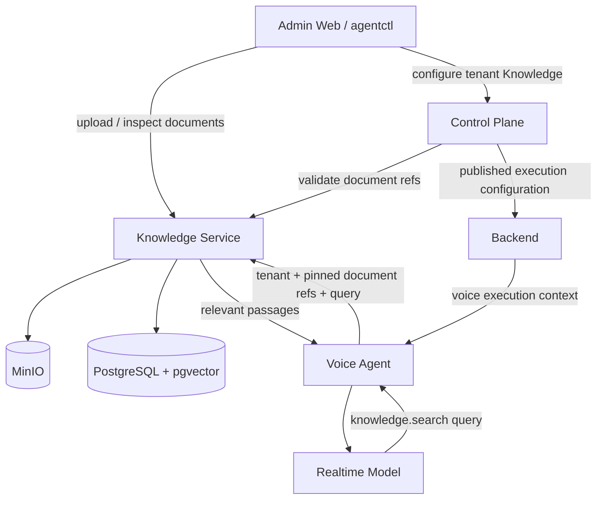
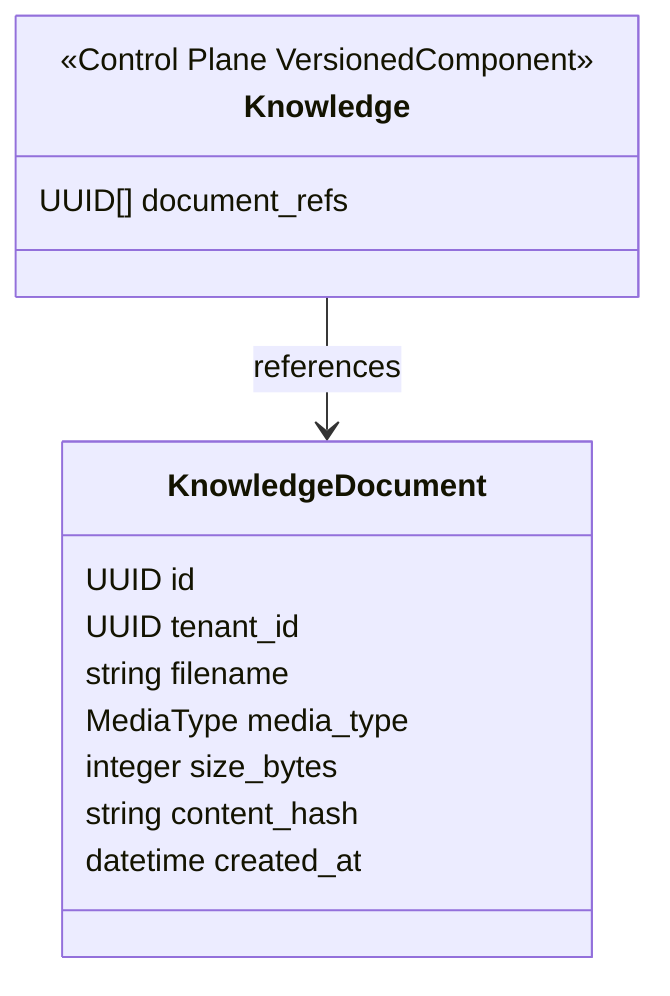
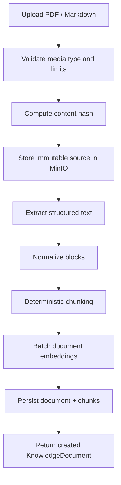
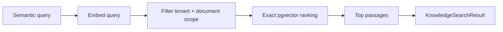

# Knowledge Service Architecture

> Status: **frozen target architecture — Knowledge Service v1**
>
> This document defines the intended target architecture of the Knowledge Service
> and its integration boundary with the Control Plane and Voice Agent.
>
> The Knowledge Service is intentionally narrow. It owns immutable tenant documents
> and retrieval over those documents. It does **not** own the tenant `Knowledge`
> configuration lifecycle.
>
> Exact HTTP payloads, DTOs, error payloads, concurrency semantics, and OpenAPI
> contracts are defined outside this document in `CONTRACTS.md` and `SCHEMAS.md`.
> Non-negotiable rules are defined in `INVARIANTS.md`.

---

## Table of Contents

- [1. Purpose](#1-purpose)
- [2. Scope](#2-scope)
- [3. Architectural principles](#3-architectural-principles)
- [4. System context](#4-system-context)
- [5. Ownership boundaries](#5-ownership-boundaries)
- [6. Domain model](#6-domain-model)
  - [6.1 KnowledgeDocument](#61-knowledgedocument)
  - [6.2 Control Plane Knowledge](#62-control-plane-knowledge)
  - [6.3 Derived retrieval artifacts](#63-derived-retrieval-artifacts)
- [7. Document lifecycle](#7-document-lifecycle)
- [8. Ingestion pipeline](#8-ingestion-pipeline)
  - [8.1 Supported source formats](#81-supported-source-formats)
  - [8.2 Extraction](#82-extraction)
  - [8.3 Normalized extraction model](#83-normalized-extraction-model)
  - [8.4 Chunking](#84-chunking)
  - [8.5 Embeddings](#85-embeddings)
  - [8.6 Persistence](#86-persistence)
- [9. Retrieval model](#9-retrieval-model)
- [10. Multi-tenancy](#10-multi-tenancy)
- [11. Control Plane integration](#11-control-plane-integration)
- [12. Voice Agent integration](#12-voice-agent-integration)
- [13. Application services and ports](#13-application-services-and-ports)
- [14. Persistence boundaries](#14-persistence-boundaries)
- [15. Failure model](#15-failure-model)
- [16. Deliberate v1 exclusions](#16-deliberate-v1-exclusions)

---

## 1. Purpose

The Knowledge Service provides one narrow capability:

> Store immutable tenant knowledge documents and retrieve relevant passages from an
> explicitly authorized document scope.

The service exists so that large tenant knowledge does not need to be materialized
as one static prompt.

The target runtime flow is:

```text
tenant documents
      ↓
Knowledge Service ingestion
      ↓
retrieval-ready immutable documents
      ↓
Control Plane Knowledge references
      ↓
Control Plane publish
      ↓
immutable execution context
      ↓
knowledge.search(query)
      ↓
relevant passages only
```

The Knowledge Service is not a general document-management platform, workflow
engine, AI orchestration service, or second configuration control plane.

---

## 2. Scope

The Knowledge Service owns:

- tenant-owned immutable knowledge documents;
- raw source-file storage coordination;
- Markdown and text-based PDF extraction;
- normalized text block generation;
- deterministic chunking;
- document and query embedding;
- tenant- and document-scoped retrieval;
- retrieval provenance;
- persistence required to reproduce retrieval over existing documents.

The Knowledge Service does not own:

- tenant `Knowledge` draft/publish/revision lifecycle;
- prompt lifecycle;
- tenant configuration lifecycle;
- execution snapshot lifecycle;
- agent identity or business identity;
- conversation state;
- reservation state;
- current availability;
- capability execution;
- response generation;
- generic object-storage administration;
- user-facing knowledge collections or folders.

---

## 3. Architectural principles

### 3.1 One lifecycle owner

The Control Plane remains the only owner of:

```text
Knowledge draft
→ publish
→ immutable revision
→ revision history
→ rollback
```

The Knowledge Service must not duplicate this lifecycle.

### 3.2 Immutable document identity

A `KnowledgeDocument` represents one immutable source artifact.

Changing source content creates another document.

### 3.3 Retrieval artifacts are implementation details

Chunks, embeddings, vector indexes, extracted blocks, token counts, and similarity
scores are not semantic domain objects.

### 3.4 Runtime scope is explicit

Retrieval never means "search whatever is currently active for the tenant".

Every runtime search is constrained by:

```text
trusted tenant identity
+
document references pinned into the execution context
```

### 3.5 Minimal v1

The first version optimizes for:

- small implementation surface;
- deterministic behavior;
- simple operations;
- clear tenant isolation;
- easy debugging;
- fast runtime retrieval.

Features are added only when evaluation data demonstrates a concrete need.

### 3.6 Version and compatibility boundary

The frozen target begins at:

```text
Control Plane Knowledge schema_version = 2
ExecutionSnapshot schema_version = 4
```

Legacy inline Knowledge schema version 1 and execution snapshot schema version 3
are cutover concerns, not supported runtime variants of the target architecture.

The target does not require:

- multi-version Knowledge decoding;
- a dual `content + document_refs` Knowledge representation;
- a schema-3 execution compatibility reader;
- permanent legacy adapters.

The one-time transition is defined in `CUTOVER.md`.

---

## 4. System context



The Knowledge Service has no dependency on Control Plane draft/revision internals.

The Control Plane may depend on a narrow Knowledge Service validation contract for
tenant document references.

---

## 5. Ownership boundaries

### Control Plane owns

```text
TenantConfiguration
└── Knowledge : VersionedComponent
    └── document references
```

Including:

- draft state;
- publish;
- immutable revisions;
- rollback;
- high-level tenant configuration validation;
- execution materialization.

### Knowledge Service owns

```text
KnowledgeDocument
└── derived retrieval representation
```

Including:

- raw source bytes;
- extraction;
- normalized blocks;
- chunks;
- embeddings;
- retrieval.

### Voice Agent owns

- exposing the `knowledge.search` tool to the model;
- taking the model's semantic query;
- supplying trusted execution scope;
- rendering retrieved passages into model-visible tool results.

The model never owns tenant or document scope selection.

---

## 6. Domain model

The Knowledge Service deliberately has one semantic domain entity in v1.



### 6.1 `KnowledgeDocument`

`KnowledgeDocument` identifies one immutable source document belonging to one tenant.

Semantic properties:

```text
KnowledgeDocument
├── id
├── tenant_id
├── filename
├── media_type
├── size_bytes
├── content_hash
└── created_at
```

Properties:

- identity is stable;
- tenant ownership is immutable;
- source bytes are immutable;
- the document is retrieval-ready if it exists as a canonical document;
- there is no semantic update operation;
- replacing source content creates a new document identity.

The domain entity does not expose:

- chunks;
- embeddings;
- chunking settings;
- vector dimensions;
- vector index type;
- similarity thresholds;
- pgvector details.

### 6.2 Control Plane `Knowledge`

`Knowledge` remains a tenant-scoped Control Plane `VersionedComponent`.

Its target RAG-backed semantic value references immutable `KnowledgeDocument`
identities instead of embedding the full tenant knowledge text.

Conceptually:

```text
Knowledge
└── document_refs[]
```

The exact schema belongs in the Control Plane semantic schema documentation.

The Knowledge Service does not model:

```text
KnowledgeDraft
KnowledgeRevision
KnowledgeBase
KnowledgeCollection
```

Those would duplicate existing Control Plane semantics or add concepts not required
by v1.

### 6.3 Derived retrieval artifacts

The implementation may persist records such as:

```text
KnowledgeChunk
├── id
├── tenant_id
├── document_id
├── ordinal
├── text
├── heading_path
├── page_number
└── embedding
```

This is a persistence/retrieval model, not a semantic domain entity.

The same applies to:

- `ExtractedDocument`;
- extracted blocks;
- embedding vectors;
- vector indexes;
- token counts;
- similarity distances.

These may change without changing the semantic Knowledge Service contract.

---

## 7. Document lifecycle

V1 deliberately has no document state machine.

From the external semantic perspective:

```text
document absent
     │
     │ successful synchronous ingestion
     ▼
KnowledgeDocument exists
     │
     └── immutable
```

A document is returned as created only after:

- raw source storage succeeded;
- extraction succeeded;
- chunking succeeded;
- document embeddings succeeded;
- canonical document and retrieval records were persisted successfully.

There is no semantic:

```text
PROCESSING
READY
FAILED
```

state in v1.

If ingestion fails, a canonical `KnowledgeDocument` is not created.

V1 also has no document update or hard-delete workflow.

---

## 8. Ingestion pipeline



The ingestion request is synchronous in v1.

The service may later move ingestion behind asynchronous execution without changing
the semantic identity or immutability model of `KnowledgeDocument`.

### 8.1 Supported source formats

V1 supports:

```text
text/markdown
application/pdf
```

PDF support is limited to documents with a usable embedded text layer.

V1 does not perform OCR.

A scanned/image-only PDF with no usable extracted text is rejected.

### 8.2 Extraction

Extraction is implementation-owned behind a narrow port.

Conceptually:

```text
DocumentExtractor
└── extract(source) -> ExtractedDocument
```

Initial implementations:

```text
MarkdownExtractor
PdfTextExtractor
```

The PDF extractor uses the document's existing text layer rather than image OCR.

### 8.3 Normalized extraction model

All supported formats are normalized before chunking.

Internal representation:

```text
ExtractedDocument
└── blocks[]
    ├── ordinal
    ├── text
    ├── heading_path[]
    └── page_number?
```

The normalized representation is internal and is not part of the public semantic
domain model.

Markdown extraction preserves useful heading hierarchy.

PDF extraction preserves page provenance where possible.

### 8.4 Chunking

Chunking is deterministic and code-defined in v1.

Initial policy:

- prefer heading and paragraph boundaries;
- keep semantically related text together where practical;
- use a moderate target chunk size;
- enforce a bounded maximum chunk size;
- use only small overlap when a block must be split.

Exact chunk-size constants are implementation settings, not tenant configuration.

Embedding input includes useful structural context, for example:

```text
<heading path>

<chunk text>
```

This prevents short passages such as opening hours or prices from losing the
subject they describe.

### 8.5 Embeddings

V1 uses one service-wide embedding profile.

The embedding abstraction is:

```text
EmbeddingProvider
├── embed_documents(texts[])
└── embed_query(text)
```

Document chunks are embedded in batches during ingestion.

A runtime query must use an embedding representation compatible with the stored
document vectors participating in that search.

Embedding model/provider selection is implementation/deployment configuration in
v1, not tenant semantic configuration.

### 8.6 Persistence

The intended order is:

```text
1. validate request
2. store raw source in MinIO
3. extract
4. normalize
5. chunk
6. embed
7. database transaction:
   - persist KnowledgeDocument
   - persist all retrieval records
8. commit
9. return success
```

No database transaction is held open across object-storage or embedding-provider
network calls.

If an external step fails before canonical database commit, no usable
`KnowledgeDocument` exists.

A raw MinIO object left behind by an interrupted request is an orphan infrastructure
artifact and is not canonical semantic state.

---

## 9. Retrieval model

Runtime retrieval is intentionally minimal.



V1 retrieval:

```text
query
→ query embedding
→ exact cosine/vector search
→ tenant filter
→ allowed-document filter
→ small fixed top-k
→ passages with provenance
```

The initial implementation uses PostgreSQL + pgvector exact nearest-neighbor search.

V1 does not require approximate indexing.

A normal relational index over tenant/document ownership supports the restrictive
filtering path.

The result includes source provenance sufficient for diagnostics and evaluation,
for example:

```text
document_id
filename
heading_path?
page_number?
```

Similarity distance may be recorded in telemetry but is not presented as factual
confidence.

The runtime contract supports an empty match set.

A relevance threshold may be calibrated from retrieval evaluations, but a specific
threshold is not part of the semantic architecture.

---

## 10. Multi-tenancy

Tenant isolation is structural.

Every `KnowledgeDocument` belongs to exactly one tenant.

Every retrieval request is scoped by:

```text
tenant_id
document_refs[]
```

The trusted runtime supplies both scope elements.

The model supplies only:

```text
query
```

Search eligibility is equivalent to:

```text
chunk.tenant_id == trusted_tenant_id
AND
chunk.document_id IN trusted_document_refs
```

Filtering is applied as an authorization/scope constraint, not as a preference after
global ranking.

A document reference belonging to a different tenant is invalid.

---

## 11. Control Plane integration

The existing Control Plane remains the authority for tenant `Knowledge`
configuration lifecycle.

Target relationship:

```text
Knowledge Service
    KnowledgeDocument A
    KnowledgeDocument B
    KnowledgeDocument C

             ▲ refs
             │

Control Plane
    Knowledge draft
      [A, B, C]
         │
         │ publish
         ▼
    immutable Knowledge revision
         │
         ▼
    execution materialization
         │
         ▼
    document scope [A, B, C]
```

When Control Plane accepts a `Knowledge` value containing document references, it
validates through a narrow Knowledge Service internal contract that:

- every referenced document exists;
- every referenced document belongs to the configuration tenant.

Because documents are immutable and not hard-deleted in v1, successful references
remain stable.

A later Control Plane publish creates a new immutable Control Plane `Knowledge`
revision using the existing versioned-component lifecycle.

The Knowledge Service does not receive or store Control Plane revision identity as
part of its domain model.

### Tenant identity representation

The canonical cross-service tenant identity is a UUID.

Transport/shared contracts use UUID semantics.

The existing Control Plane may internally represent a tenant scope key as the
canonical string serialization of that UUID. This is a representation detail and
does not create a second tenant identity type.

Cross-service comparison must therefore preserve exact UUID identity regardless of
the Control Plane's internal string representation.

---

## 12. Voice Agent integration

The Voice Agent exposes one model-facing capability:

```text
knowledge.search(query)
```

The model may choose the semantic query only.

The Voice Agent obtains from its immutable execution context:

```text
tenant_id
knowledge.document_refs[]
```

and translates the model tool call into the internal retrieval request:

```text
trusted tenant_id
+
trusted document_refs[]
+
model query
```

The retrieved passages are returned to the model as tenant knowledge.

They do not become operational truth merely because they arrived through a tool.

In particular, knowledge retrieval must not establish:

- current room or resource availability;
- reservation existence;
- operation completion;
- current mutable business state;
- successful handoff or other runtime outcomes.

Those remain owned by their corresponding operational capabilities.

### Semantic and provider-visible tool identity

The semantic capability name is:

```text
knowledge.search
```

A provider/runtime adapter may expose a provider-compatible function identifier,
for example:

knowledge_search

when the selected tool API does not support dotted function names.

This normalization is a transport/runtime concern.

It must not change the semantic capability identity or introduce a tenant Action.

---

## 13. Application services and ports

V1 needs only narrow application surfaces.

### `KnowledgeDocumentService`

Responsibilities:

```text
create_document
get_document
list_documents
resolve_documents
```

`create_document` orchestrates synchronous ingestion.

`resolve_documents` supports trusted cross-service validation of document references.

### `KnowledgeRetrievalService`

Responsibility:

```text
search
```

It validates tenant/document scope, embeds the query, executes retrieval, and maps
persistence records into the internal retrieval contract.

### Infrastructure ports

Initial ports:

```text
ObjectStore
DocumentExtractor
EmbeddingProvider
KnowledgeDocumentRepository
KnowledgeRetriever
```

Concrete implementations may include:

```text
MinioObjectStore
MarkdownExtractor
PdfTextExtractor
PostgresKnowledgeDocumentRepository
PgVectorKnowledgeRetriever
```

Application/domain code must not expose concrete storage/vector technology names in
semantic contracts.

---

## 14. Persistence boundaries

### MinIO

MinIO stores immutable raw source bytes.

Object keys are generated by the Knowledge Service.

Callers do not define authoritative object-storage paths.

### PostgreSQL

PostgreSQL is the canonical store for:

- `KnowledgeDocument` metadata;
- extracted/chunked retrieval records;
- stored embeddings required by the active retrieval implementation.

### pgvector

pgvector provides vector representation and exact similarity search in v1.

An optional future ANN index is derived infrastructure and does not change semantic
document identity or API contracts.

A future alternative retrieval backend, including an in-process/vector-specific
engine, must be replaceable behind `KnowledgeRetriever`.

---

## 15. Failure model

### Invalid source

Unsupported source type, invalid input, oversized input, or a PDF without usable
extractable text fails ingestion.

No canonical document is created.

### Extraction failure

No canonical document is created.

### Embedding failure

No canonical document is created.

### Database failure

No canonical document is created.

A previously uploaded raw object may remain orphaned and may later be garbage
collected.

### Retrieval failure

Retrieval failure does not authorize fallback to another tenant, another document
scope, or operational inference from unrelated context.

The caller receives the defined internal retrieval error.

---

## 16. Deliberate v1 exclusions

The following are explicitly outside v1:

```text
OCR
scanned-PDF support
DOCX ingestion
web-page ingestion
background ingestion jobs
document processing state machine
document mutation
hard delete
knowledge folders
knowledge collections
multiple tenant knowledge bases
tenant-configurable chunking
tenant-configurable embedding models
BM25 / lexical retrieval
hybrid retrieval
reranking
query rewriting
multi-query retrieval
HyDE
speculative retrieval
HNSW / IVFFlat as a requirement
TurboVec
LLM-driven document selection
retrieval-based operational state
```

These exclusions are intentional.

They may be reconsidered only when a concrete product, scale, or evaluation need
justifies the additional complexity.
