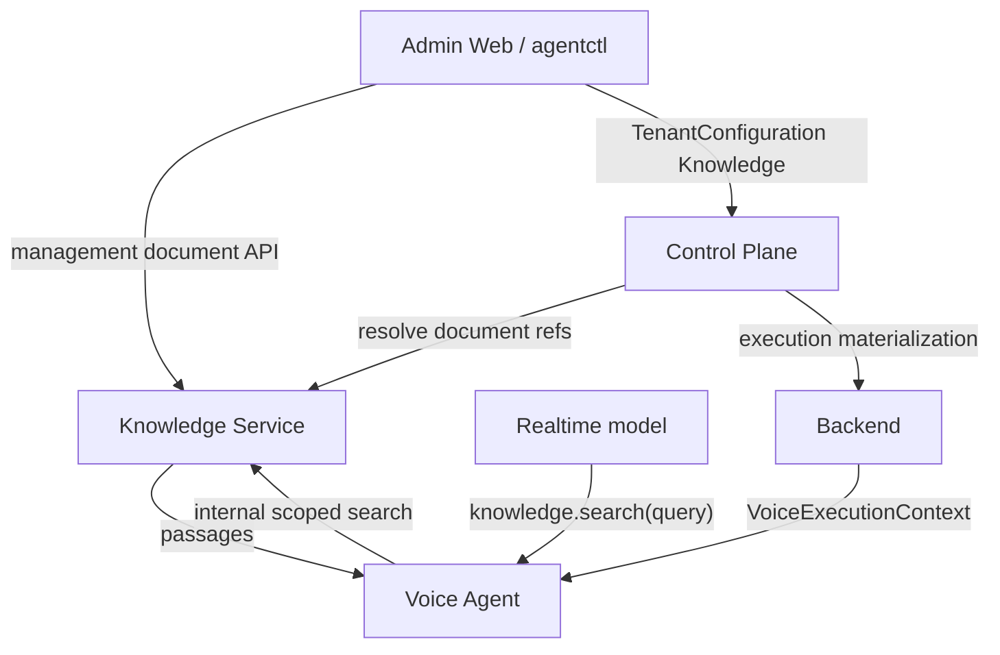

# Knowledge Service Contracts

> Status: **frozen target contracts — Knowledge Service v1**
>
> This document defines the Knowledge Service consumer topology, management and
> internal HTTP interfaces, DTO usage, authorization boundaries, idempotency,
> errors, transactional guarantees, and integration contracts.
>
> Semantic object shapes are defined in [`SCHEMAS.md`](./SCHEMAS.md).
> Architectural ownership is defined in [`ARCHITECTURE.md`](./ARCHITECTURE.md).
> Non-negotiable rules are defined in [`INVARIANTS.md`](./INVARIANTS.md).

---

## Table of Contents

- [1. Contract principles](#1-contract-principles)
- [2. Consumers and interface topology](#2-consumers-and-interface-topology)
- [3. HTTP surfaces](#3-http-surfaces)
- [4. Management API](#4-management-api)
- [5. Internal document-resolution API](#5-internal-document-resolution-api)
- [6. Internal retrieval API](#6-internal-retrieval-api)
- [7. Control Plane integration contract](#7-control-plane-integration-contract)
- [8. Voice Agent integration contract](#8-voice-agent-integration-contract)
- [9. Model-facing tool contract](#9-model-facing-tool-contract)
- [10. Authorization](#10-authorization)
- [11. Idempotency](#11-idempotency)
- [12. Concurrency](#12-concurrency)
- [13. Error model](#13-error-model)
- [14. Transactional guarantees](#14-transactional-guarantees)
- [15. Timeouts and failure behavior](#15-timeouts-and-failure-behavior)
- [16. Observability contract](#16-observability-contract)
- [17. OpenAPI and shared-contract rules](#17-openapi-and-shared-contract-rules)
- [18. V1 endpoint inventory](#18-v1-endpoint-inventory)

---

# 1. Contract principles

1. HTTP handlers are thin adapters over Knowledge Service application services.

2. Management and internal service-to-service APIs are structurally separate.

3. Callers consume transport DTOs, not Knowledge Service persistence models.

4. The Control Plane owns tenant `Knowledge` lifecycle.

5. The Knowledge Service owns immutable documents and retrieval only.

6. Model-facing tool arguments are strictly smaller than internal retrieval requests.

7. Trusted service code supplies tenant and document authorization scope.

8. Retrieval implementation details are not exposed through the API.

9. V1 favors a small explicit API surface over generic CRUD.

---

# 2. Consumers and interface topology



### 2.1 Management clients

Consumers:

```text
Admin Web
agentctl
```

Purpose:

- upload immutable tenant documents;
- inspect tenant document inventory;
- retrieve document metadata.

They do not:

- publish Knowledge Service state;
- mutate documents;
- control retrieval internals.

### 2.2 Control Plane

Purpose:

- validate `Knowledge.document_refs` before accepting tenant Knowledge configuration;
- materialize published document scope into execution projections.

The Control Plane has no Knowledge Service document lifecycle privileges beyond
read/resolve access.

### 2.3 Voice Agent

Purpose:

- receive the execution-scoped document set;
- expose `knowledge.search(query)` to the model;
- perform trusted internal retrieval using execution tenant and document scope.

Voice Agent does not query the latest Control Plane `Knowledge` configuration during
a call.

### 2.4 Backend

Backend transports the immutable voice execution projection from Control Plane to
Voice Agent.

V1 does not require Backend to proxy Knowledge Service search requests.

---

# 3. HTTP surfaces

Knowledge Service exposes:

```text
/management/v1/*
/internal/v1/*
/health
/ready
```

There is no unscoped generic `/v1/*` surface.

## Management boundary

`/management/v1/*`:

- authenticated management principals;
- tenant authorization enforced;
- user/operator-facing document operations.

## Internal boundary

`/internal/v1/*`:

- authenticated service principals;
- service-specific authorization;
- no management operations.

## Operations

```http
GET /health
GET /ready
```

`/health` reports process liveness.

`/ready` reports whether the service can accept normal traffic according to its
required dependency readiness policy.

---

# 4. Management API

## 4.1 Create / ingest document

```http
POST /management/v1/tenants/{tenant_id}/documents
Content-Type: multipart/form-data
Idempotency-Key: <opaque-client-generated-key>

file=<binary>
```

### Semantics

The operation synchronously performs the complete v1 ingestion pipeline:

```text
validate
→ raw source storage
→ extraction
→ normalization/chunking
→ batch embeddings
→ canonical persistence
```

Success means the returned document is immediately retrieval-ready.

### Success

```http
201 Created
Content-Type: application/json
Location: /management/v1/tenants/{tenant_id}/documents/{document_id}
```

Body:

```text
KnowledgeDocument
```

### Request rules

The request:

- contains exactly one uploaded source file;
- supports Markdown and PDF only;
- does not accept caller-selected document IDs;
- does not accept object-store paths;
- does not accept chunking/embedding/search configuration;
- does not accept tenant ID in the body.

The route tenant is authoritative.

### PDF rule

A PDF without usable extractable text fails ingestion.

V1 does not perform OCR.

---

## 4.2 List tenant documents

```http
GET /management/v1/tenants/{tenant_id}/documents
```

Success:

```http
200 OK
```

Body:

```text
KnowledgeDocumentList
```

V1 returns the complete tenant inventory.

No pagination contract is defined in v1.

Ordering is deterministic and implementation-defined; clients must not attach
semantic meaning to list order.

---

## 4.3 Get tenant document

```http
GET /management/v1/tenants/{tenant_id}/documents/{document_id}
```

Success:

```http
200 OK
```

Body:

```text
KnowledgeDocument
```

If the document does not exist **for that tenant**:

```http
404 Not Found
```

Cross-tenant identity must not be disclosed by returning a different error.

---

## 4.4 Deliberately absent management operations

V1 does not expose:

```http
PATCH /documents/{id}
PUT /documents/{id}
DELETE /documents/{id}
POST /documents/{id}/retry
```

A changed source file is uploaded as a new immutable document.

---

# 5. Internal document-resolution API

Used by Control Plane semantic validation.

```http
POST /internal/v1/tenants/{tenant_id}/documents/resolve
Content-Type: application/json
```

Request:

```text
DocumentResolveRequest
```

Success:

```http
200 OK
```

Response:

```text
DocumentResolveResponse
```

## Semantics

Resolution is all-or-none.

For every requested document reference, Knowledge Service validates:

```text
document exists
AND
document belongs to route tenant
```

If all references are valid, metadata is returned.

If any reference is invalid:

```http
422 Unprocessable Entity
```

with:

```text
code = invalid_document_reference
```

The response must not partially resolve only the valid subset.

An empty `document_refs` request succeeds with an empty `documents` response.

## Stability property

Because v1 documents:

- are immutable;
- are not hard-deleted;

a successful reference remains valid after resolution.

Therefore Control Plane publication does not require a second Knowledge Service
validation call for a previously accepted draft.

---

# 6. Internal retrieval API

Used by Voice Agent.

```http
POST /internal/v1/tenants/{tenant_id}/search
Content-Type: application/json
```

Request:

```text
KnowledgeSearchRequest
```

Success:

```http
200 OK
```

Response:

```text
KnowledgeSearchResponse
```

## Trusted inputs

The Voice Agent constructs the internal request from:

```text
tenant_id
  ← immutable execution context

document_refs
  ← immutable execution context

query
  ← model knowledge.search tool call
```

The model never supplies tenant identity or document scope.

## Scope validation

Before a passage can be eligible for retrieval:

```text
document belongs to route tenant
AND
document is included in request.document_refs
```

A document reference from another tenant is an invalid internal request and must not
be searched.

For an execution-produced scope this condition should always hold; detecting a
violation is treated as a contract/integration failure rather than permission to
broaden search.

## Retrieval behavior

V1 service-owned retrieval behavior:

```text
exact pgvector search
small fixed top-k = 4
service-owned relevance policy
```

There are no request fields for tuning these values.

## Empty scope

`document_refs: []` returns:

```json
{
  "matches": []
}
```

without broadening to all tenant documents.

## No relevant result

No relevant result is a normal successful outcome:

```http
200 OK
```

```json
{
  "matches": []
}
```

It is not a transport error.

---

# 7. Control Plane integration contract

The Control Plane target `Knowledge` schema becomes schema version 2:

```text
Knowledge
└── document_refs[]
```

instead of inline knowledge content.

## 7.1 Plan/apply validation

Any Control Plane operation that accepts a new Knowledge semantic value must
validate its references before persisting the draft as valid.

This applies to:

- high-level `TenantConfiguration.plan`;
- high-level `TenantConfiguration.apply`;
- any supported low-level write path for the `Knowledge` VersionedComponent.

Validation uses:

```text
POST /internal/v1/tenants/{tenant_id}/documents/resolve
```

## 7.2 External validation and transactions

Control Plane must not hold its database transaction open while calling Knowledge
Service.

Expected order:

```text
1. validate local schema
2. resolve Knowledge document refs externally
3. perform remaining semantic validation
4. open Control Plane transaction
5. apply/save draft atomically
6. commit
```

If reference validation fails or Knowledge Service is unavailable:

```text
plan/apply does not accept the new Knowledge value
existing Control Plane state remains unchanged
```

## 7.3 Publish

Publish uses the already validated stored draft.

V1 publish does not require re-resolution because document identity and tenant
ownership are immutable and documents cannot be hard-deleted.

The existing Control Plane atomic publish semantics remain unchanged.

## 7.4 Runtime materialization

The Voice execution projection changes from inline knowledge prompt materialization
to an explicit runtime knowledge scope.

Target:

```text
VoiceExecutionContext
├── execution_id
├── tenant_id
├── ...
└── knowledge
    └── document_refs[]
```

Both `tenant_id` and `knowledge.document_refs` are immutable execution-scoped
runtime inputs.

The Voice Agent must receive both values through the execution projection before it
can construct a Knowledge Service retrieval request.

The Voice execution projection must not expose:

- Knowledge draft state;
- Control Plane revision mechanics;
- raw document content;
- retrieval records;
- embedding/vector internals.

The existing immutable execution context pins the document references for the
entire call.

---

# 8. Voice Agent integration contract

The Voice Agent consumes:

```text
VoiceExecutionContext.knowledge.document_refs
```

and constructs one Knowledge Service client scoped by:

```text
execution tenant
execution document refs
```

## Tool exposure

If:

```text
document_refs is non-empty
```

the Voice Agent may expose:

```text
knowledge.search
```

If:

```text
document_refs is empty
```

the Voice Agent should omit the tool because no tenant RAG knowledge is available.

This avoids a model-visible tool that can only return an empty result.

## Tool execution

Conceptually:

```text
knowledge.search({"query": Q})

Voice Agent:
  tenant_id = execution.tenant_id
  refs      = execution.knowledge.document_refs

→ POST /internal/v1/tenants/{tenant_id}/search
  {
    "document_refs": refs,
    "query": Q
  }
```

The returned passages are passed back to the model as retrieved tenant knowledge.

## Authority

Voice Agent/tool-result rendering must preserve this semantic distinction:

```text
knowledge.search result
= tenant knowledge
≠ operational tool result
```

The existence of an HTTP/tool call does not elevate retrieved static knowledge above
runtime operational results or validated structured context.

---

# 9. Model-facing tool contract

Tool:

```text
knowledge.search
```

This is the semantic capability name.

The provider-visible function identifier may be normalized to:

```text
knowledge_search
```

when required by the selected model/tool API.

The provider-visible identifier is not part of tenant configuration and does not
change capability semantics.

Description semantics:

```text
Search the represented business's static tenant knowledge when answering a
business-specific factual question whose answer is not already established by
higher-authority structured/runtime information.

Use it for static facts such as services, facilities, policies, opening hours,
descriptions, static prices, and similar tenant information.

Do not use it as proof of current availability, reservation state, or operation
outcomes.
```

Input:

```text
KnowledgeSearchToolInput
└── query
```

The query should be short and self-contained enough to retrieve the requested fact.

The tool contract intentionally contains no routing or retrieval tuning fields.

---

# 10. Authorization

## 10.1 Management

Knowledge Service v1 assumes a globally trusted platform management principal.

The management principal may operate on any tenant address for which the
management API is exposed.

V1 does not introduce per-operator tenant grants or a new tenant-level management
IAM model.

Suggested semantic scopes remain:

```text
knowledge:documents:read
knowledge:documents:create
```

These scopes authorize the management operation category.

Tenant identity still remains part of resource addressing and persistence
isolation, but v1 does not use it as a per-operator authorization grant.

A future platform-wide tenant-scoped management authorization model may replace
this trust assumption, but that is outside Knowledge Service v1.

## 10.2 Control Plane internal access

Control Plane requires only document-reference resolution access.

Suggested semantic scope:

```text
knowledge:documents:resolve
```

It does not receive document-create privileges through the internal interface.

## 10.3 Voice Agent internal access

Voice Agent requires only runtime retrieval access.

Suggested semantic scope:

```text
knowledge:search
```

It does not receive management privileges.

## 10.4 Tenant identity

Actor authorization is derived from the authenticated principal and route.

Caller-supplied body fields must not be used to override tenant identity.

---

# 11. Idempotency

The document-create operation performs expensive and externally visible work and
must be safe to retry after a lost response.

Therefore:

```http
POST /management/v1/tenants/{tenant_id}/documents
```

requires:

```http
Idempotency-Key: <opaque-client-generated-key>
```

## Scope

Idempotency identity includes at least:

```text
authenticated principal
operation
tenant_id
idempotency key
```

## Semantics

```text
same key + same principal + same tenant + same upload
→ replay same logical KnowledgeDocument result

same key + materially different upload
→ 409 Conflict
→ code = idempotency_key_reused
```

The request fingerprint includes source bytes or their deterministic content hash.

## Duplicate source content

Content equality does not imply idempotent identity.

```text
same source bytes + same logical request + same Idempotency-Key
→ replay the same KnowledgeDocument

same source bytes + different Idempotency-Key / new create command
→ may create a new KnowledgeDocument
```

content_hash must not be used to silently convert a new create command into a
reference to an older document.

V1 therefore defines command idempotency, not content-addressed deduplication.

## Commit rule

Canonical `KnowledgeDocument` persistence and the successful idempotency replay
record commit atomically in the same database transaction.

External source storage, extraction, and embedding occur before that transaction.

A retry after a successful commit therefore returns the original logical result
rather than creating a second document.

Read-only operations do not require idempotency keys.

## Concurrent retries

The canonical persistence layer must prevent one idempotent create command from
producing multiple canonical KnowledgeDocuments.

V1 does not require suppression of all duplicate pre-commit external work.

Two concurrent retries of the same idempotent upload may perform duplicate
temporary MinIO, extraction, or embedding work before one canonical result wins,
provided that:

- at most one canonical KnowledgeDocument is committed;
- retries converge on the same logical result;
- orphan temporary infrastructure state does not become semantically visible.

---

# 12. Concurrency

`KnowledgeDocument` is immutable.

V1 therefore does not define document update concurrency and does not require
`If-Match` for document reads.

There are no mutable Knowledge Service resources requiring optimistic-concurrency
tokens in v1.

Control Plane concurrency for the `Knowledge` VersionedComponent remains governed
by existing Control Plane `ETag` / `If-Match` semantics.

The Knowledge Service must not leak its own persistence generations into Control
Plane configuration contracts.

---

# 13. Error model

Knowledge Service uses the shared structured service error shape:

```text
ErrorResponse
├── code
├── message
├── request_id
└── details?
```

Validation details should use the shared structured validation-issue representation
when available.

## HTTP semantics

| Status | Meaning |
|---|---|
| `400` | malformed request / multipart form |
| `401` | unauthenticated |
| `403` | authenticated principal lacks permission |
| `404` | addressed tenant-scoped document is absent |
| `409` | idempotency/domain conflict |
| `413` | source exceeds configured upload limit |
| `415` | unsupported source media type |
| `422` | semantically invalid source/reference/query |
| `502` | required external dependency failed during the request |
| `503` | service/dependency not ready for normal traffic |
| `500` | unexpected internal failure |

## Stable v1 error codes

```text
unsupported_media_type
source_too_large
pdf_has_no_extractable_text
document_extraction_failed
document_embedding_failed
invalid_document_reference
invalid_search_query
idempotency_key_reused
object_store_unavailable
embedding_provider_unavailable
retrieval_unavailable
```

### Information disclosure

A tenant-scoped document read must not reveal whether a supplied document ID exists
under another tenant.

Cross-tenant access is observed as absence/invalid reference according to the
addressed operation.

---

# 14. Transactional guarantees

## 14.1 Document creation

The canonical database transaction contains:

```text
KnowledgeDocument insert
+
all document retrieval records/chunks
+
successful idempotency replay state
```

and commits all-or-none.

No canonical document may be visible without the complete retrieval representation
required by v1.

## 14.2 External operations

The following occur outside the final database transaction:

```text
MinIO source upload
text extraction
chunking computation
embedding-provider calls
```

The service does not attempt a distributed ACID transaction across MinIO, the
embedding provider, and PostgreSQL.

## 14.3 Orphan source object

If source storage succeeds but later ingestion fails before canonical DB commit, the
raw object may remain as orphan infrastructure state.

This does not constitute a semantic document.

Orphan cleanup may be added as maintenance without changing domain contracts.

## 14.4 Reads

List, get, resolve, and search are read-only from the semantic document perspective.

Retrieval telemetry does not alter document semantics.

---

# 15. Timeouts and failure behavior

Exact timeout numbers are deployment configuration, not semantic API fields.

Required behavioral rules:

- management ingestion returns explicit failure rather than a partially ready
  document;
- Control Plane reference validation failure prevents accepting the new semantic
  Knowledge value;
- Voice Agent retrieval failure does not broaden search scope;
- retrieval failure does not authorize fabrication of tenant facts;
- internal clients should use bounded timeouts;
- automatic retries of document creation are safe only with the same idempotency key.

Runtime search should be optimized for low latency because it sits in the voice
interaction critical path.

Ingestion latency is not part of call latency.

---

# 16. Observability contract

Every request should carry or receive a request identifier suitable for tracing.

Minimum useful document-ingestion telemetry:

```text
tenant_id
document_id when allocated
media_type
source size
extraction duration
chunk count
embedding duration
database commit duration
overall ingestion duration
success/failure code
```

Minimum useful retrieval telemetry:

```text
tenant_id
document scope size
query character/token size
query embedding duration
vector search duration
match count
top internal similarity/distance values
overall retrieval duration
```

Telemetry must not expose raw tenant document text by default.

Similarity values may be logged for retrieval evaluation even though they are not
part of the model-facing response.

---

# 17. OpenAPI and shared-contract rules

1. OpenAPI is the machine-readable source of truth for Knowledge Service HTTP
   contracts.

2. Consumers should use shared/generated DTOs/clients rather than redefining
   transport objects independently.

3. Knowledge Service persistence models are not exported as transport contracts.

4. Control Plane domain objects are not imported into Knowledge Service.

5. Knowledge Service domain objects are not imported into Control Plane as lifecycle
   primitives; only transport/reference contracts are shared.

6. Breaking management/internal HTTP changes require explicit coordinated consumer
   migration.

7. The management/internal authentication boundary must remain visible in OpenAPI
   organization and generated clients.

---

# 18. V1 endpoint inventory

The complete target v1 HTTP inventory is intentionally small.

## Management

```text
POST /management/v1/tenants/{tenant_id}/documents
GET  /management/v1/tenants/{tenant_id}/documents
GET  /management/v1/tenants/{tenant_id}/documents/{document_id}
```

## Internal

```text
POST /internal/v1/tenants/{tenant_id}/documents/resolve
POST /internal/v1/tenants/{tenant_id}/search
```

## Operations

```text
GET /health
GET /ready
```

No other document lifecycle, collection, indexing, or retrieval-configuration
endpoint is part of v1.
